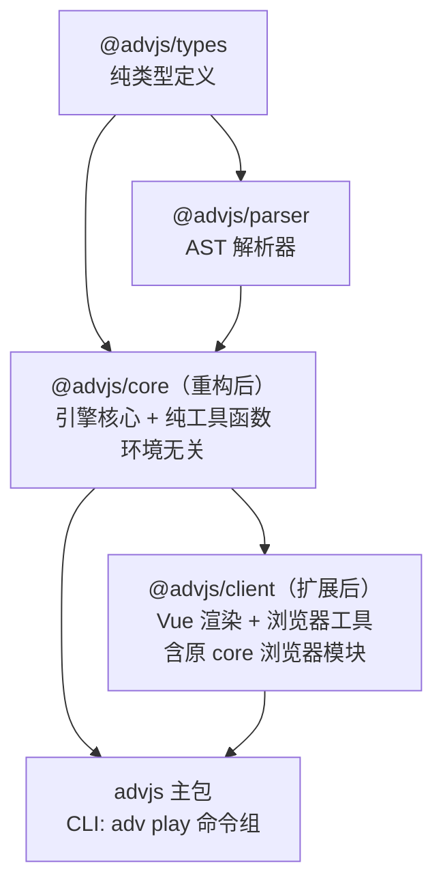
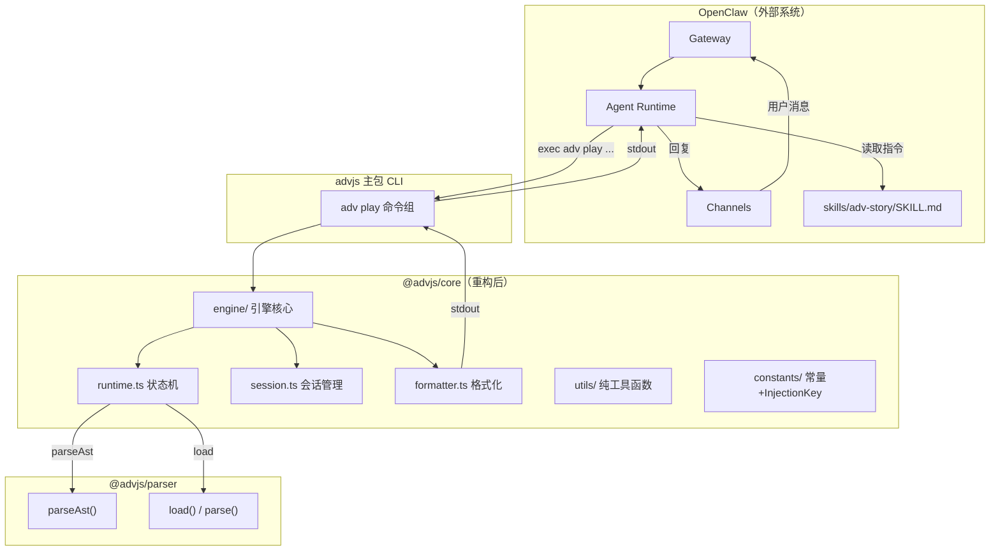

## 产品概述

为 ADV.JS 项目实施最佳实践架构重构，围绕以下核心目标展开：

1. **重构 `@advjs/core`**：将现有的浏览器工具集（暗色模式、音效、截图、PixiJS、设备检测等）迁移至 `@advjs/client`，让 `@advjs/core` 承载真正的 ADV 引擎核心（纯函数状态机，环境无关）
2. **创建 OpenClaw Skills 体系**：在项目根目录新建 `skills/` 文件夹，放置 Skill 定义文件
3. **扩展 CLI**：在现有 `adv` CLI 上新增 `adv play` 命令组（play/next/choose/status/list/reset），调用 `@advjs/core` 引擎
4. **文档站集成**：在 `docs/skills/` 新增 Skills 相关文档页

## 核心特性

### `@advjs/core` 重构为真正的引擎核心

- 将浏览器/Vue 相关模块（composables、pixi、screenshots、storage、device）迁入 `@advjs/client`
- 保留纯工具函数（getBgmSrcUrl、getCharacter、ns、sleep、isVrmModel、END_NODE、InjectionKey symbols）
- 新增引擎核心模块：节点推进状态机、会话管理、AST 格式化输出
- 更新所有外部引用方的 import 路径

### 根目录 `skills/` 文件夹

- 每个 Skill 一个子目录，包含 `SKILL.md`（YAML frontmatter + Markdown 指令）
- 首个 Skill：`skills/adv-story/SKILL.md`，教 OpenClaw agent 通过 `adv play` 命令驱动互动叙事
- 附带示例剧本 `examples/demo.adv.md`

### 扩展 `adv` CLI 命令

- `adv play <script.adv.md>` -- 加载剧本并启动互动叙事
- `adv play next` -- 推进到下一个节点
- `adv play choose <number>` -- 选择分支
- `adv play status` -- 查看当前会话状态
- `adv play list` -- 列出可用剧本
- `adv play reset` -- 重置会话
- 所有输出支持纯文本和 JSON 格式（`--json`），便于 agent 解析

### 文档站集成

- `docs/skills/` 新增 Skills 文档页集成到 VitePress 文档站
- 包含：Skills 介绍、OpenClaw 集成指南、adv-story 用法、未来路线图

## 技术栈

- **运行时**：Node.js ^20.19.0 || >=22.12.0（与项目一致）
- **语言**：TypeScript，ESM（`type: "module"`）
- **构建**：unbuild（复用各包已有的 `build.config.ts`）
- **CLI 框架**：yargs `catalog:cli`（主包已使用）
- **核心依赖**：
- `@advjs/parser`（workspace:\*）：`parseAst()` + `@advjs/parser/fs` 的 `load()` / `parse()`
- `@advjs/types`（workspace:\*）：AST 节点类型
- `unstorage`（`catalog:utils`，core 已有）：会话持久化抽象层
- `consola`（`catalog:cli`）：日志输出
- **文档**：VitePress（docs/.vitepress/config/index.ts 配置扩展）
- **测试**：vitest `catalog:test`（项目根目录已有 vitest.config.ts）

## 实现方案

### 整体策略

分为两个紧密关联的子任务：

**子任务 A：@advjs/core 重构**（让 core 名副其实）

- 将浏览器/Vue 耦合模块迁移到 `@advjs/client`
- 在 `@advjs/core` 中新增引擎核心模块
- 更新所有外部 import 引用

**子任务 B：Skills + CLI + Docs**（功能扩展）

- CLI `adv play` 命令组调用 `@advjs/core` 引擎
- `skills/` 目录放 OpenClaw Skill 定义
- `docs/skills/` 放使用文档

数据流：

```
parser → parseAst() → AdvAst.Root
          ↓
core  → AdvPlayEngine → next()/choose() → FormattedOutput
          ↓                     ↓
client (Vue 薄包装)      advjs CLI (adv play)
          ↓                     ↓
浏览器渲染             stdout → OpenClaw Agent
```

### 关键技术决策

**1. core 浏览器工具迁移策略**

由于 client 已依赖 core（`@advjs/core: workspace:*`），core 无法反向依赖 client 做 re-export 兼容层。因此采用一次性迁移策略：

- 将 core 的浏览器模块直接合并到 client 对应目录（不使用 `legacy/` 前缀）
- 同步更新所有外部引用方（约 12 处）的 import 路径：`@advjs/core` 改为 `@advjs/client` 或本地 import
- `packages/advjs/client/index.ts` 中保留 `export * from '@advjs/core'`（便于消费者同时获取 core 和 client API）

**迁移文件映射：**

| 从 core                          | 迁移到 client                                                      |
| -------------------------------- | ------------------------------------------------------------------ |
| `composables/dark.ts`            | `composables/dark.ts`                                              |
| `composables/sound/`             | `composables/sound/`                                               |
| `composables/useBeforeUnload.ts` | `composables/useBeforeUnload.ts`                                   |
| `composables/useImages.ts`       | `composables/useImages.ts`                                         |
| `composables/useScreenLock.ts`   | `composables/useScreenLock.ts`                                     |
| `app/storage.ts`                 | `utils/storage.ts`（统一放入 utils）                               |
| `pixi/index.ts`                  | ~~删除~~（`PIXI_VERSION` 无外部引用，属于死代码）                  |
| `pixi/assets/`                   | ~~删除~~（`basicManifest` + 内部 `init()` 无外部引用，属于死代码） |
| `utils/screenshots.ts`           | `utils/screenshots.ts`                                             |
| `utils/device.ts`                | `utils/device.ts`                                                  |

**client 目录更新：**

- `composables/index.ts` — 新增 export: `isDark`, `toggleDark`, `useSound`, `useBeforeUnload`, `useImages`, `useScreenLock`
- `utils/index.ts` — 新增 export: `createRecordsStorage`, `screenshot`, `screenshotGame`, `screenshotGameThumb`, `downloadDataUrlAsImage`, `getGameViewDom`, `isMobile`, `isWeChat`

需要更新 import 的文件清单（浏览器模块迁移相关）：

| 文件                                                             | 旧 import                                 | 新 import               |
| ---------------------------------------------------------------- | ----------------------------------------- | ----------------------- |
| `packages/client/components/base/BaseHeader.vue`                 | `isDark, toggleDark` from `@advjs/core`   | 改为 client 本地 import |
| `packages/client/components/menu/RightTools.vue`                 | `isDark, toggleDark` from `@advjs/core`   | 改为 client 本地 import |
| `packages/client/components/menu/AdvMenuPanel.vue`               | `useScreenLock` from `@advjs/core`        | 改为 client 本地 import |
| `packages/client/components/internals/dialog/DialogControls.vue` | `screenshotGame` from `@advjs/core`       | 改为 client 本地 import |
| `packages/client/components/game/AdvGame.vue`                    | `useBeforeUnload` from `@advjs/core`      | 改为 client 本地 import |
| `packages/client/stores/useGameStore.ts`                         | `createRecordsStorage` from `@advjs/core` | 改为 client 本地 import |
| `packages/client/stores/audio.ts`                                | `useSound` from `@advjs/core`             | 改为 client 本地 import |
| `themes/theme-default/layouts/start.vue`                         | `isDark` from `@advjs/core`               | `@advjs/client`         |
| `themes/theme-default/components/save/SavedCard.vue`             | `screenshotGameThumb` from `@advjs/core`  | `@advjs/client`         |
| `themes/theme-default/components/ui/AdvIconButton.vue`           | `useSound` from `@advjs/core`             | `@advjs/client`         |
| `demo/starter/components/BaseFooter.vue`                         | `isDark` from `@advjs/core`               | `@advjs/client`         |

不受影响的引用（保留在 core 中的纯函数/常量）：

| 文件                                           | import 内容                                        | 不需要修改  |
| ---------------------------------------------- | -------------------------------------------------- | ----------- |
| `packages/client/composables/config.ts`        | `advConfigSymbol, advDataSymbol, gameConfigSymbol` | 保留在 core |
| `packages/client/composables/useAdvBgm.ts`     | `getBgmSrcUrl`                                     | 保留在 core |
| `packages/client/composables/useAdvTachies.ts` | `getCharacter`                                     | 保留在 core |
| `packages/client/composables/useAdvNav.ts`     | `END_NODE`                                         | 保留在 core |
| `packages/client/stores/app.ts`                | `ns`                                               | 保留在 core |
| `packages/client/stores/settings/index.ts`     | `ns`                                               | 保留在 core |
| `packages/client/setup/adv.ts`                 | symbols                                            | 保留在 core |
| `editor/`, `playground/`, `themes/`            | symbols, isVrmModel, getBgmSrcUrl, sleep           | 保留在 core |

**2. core 新增引擎核心模块**

新增 `packages/core/src/engine/` 目录，包含：

- `types.ts` -- PlaySession、FormattedOutput、PlayConfig 类型定义
- `runtime.ts` -- AdvPlayEngine 类：loadScript()、next()、choose()、getCurrentNode()、isEnd()
- `session.ts` -- SessionManager：基于 unstorage 的多会话 CRUD，默认 fs driver 持久化到 `~/.advjs/play-sessions/`
- `formatter.ts` -- formatNode()：AST 节点到文本的格式化映射
- `index.ts` -- 导出入口

推进逻辑参考客户端 `useAdvNav` 的 `next()`/`go()` 模式，实现为纯函数状态机：

- 遍历 `ast.children` 数组，`currentIndex` 逐步递增
- Dialog/Narration/Text/Paragraph/SceneInfo -- 可展示节点，格式化输出后暂停
- Choices -- 暂停并输出选项列表，等待 choose 命令
- Code（Camera/Tachie/Background/Go）-- 静默更新状态，自动跳到下一个可展示节点
- `currentIndex >= children.length` -- 结束

**3. 依赖变更**

**core package.json 迁移后移除：**

- `html2canvas`
- `pixi.js`
- `@vueuse/core`

**core package.json 保留：**

- `@advjs/parser`、`@advjs/types`、`@types/mdast`、`consola`、`unstorage`

**client package.json 新增：**

- `html2canvas: catalog:frontend`（截图功能）
- `unstorage: catalog:utils`（localStorage 存档存储）

> 注：client 已有 `howler`、`@vueuse/core`、`pixi.js`，无需重复添加

**4. core build.config.ts 更新**

externals 中移除：`howler`、`dayjs`、`@vueuse/core`、`html2canvas`、`pinia`
externals 中新增：`unstorage`（引擎 session 使用）

**5. CLI 命令注册**

新增 `packages/advjs/node/cli/play.ts` 导出 `installPlayCommand(cli: Argv)`，在 `node/cli/index.ts` 中注册。所有 play 子命令接受 `--session-id <id>` 和 `--json` 参数。advjs 主包 package.json 中已依赖 `@advjs/core`，无需新增依赖。

**6. advjs 主包 re-export 调整**

`packages/advjs/client/index.ts` 当前全量 re-export `@advjs/core`。迁移后需要调整：保留 re-export `@advjs/core` 和 `@advjs/client`（因为消费者可能通过 `advjs/client` 入口同时获取 core 和 client 的 API）。

### 实现要点

- **循环依赖防范**：client 依赖 core，core 绝不能依赖 client。迁移方向只能是 core -> client，不可反向
- **遵循现有 CLI 模式**：`installPlayCommand(cli)` 与现有 `installDevCommand` 等保持一致
- **build.config.ts 无需修改入口**（advjs 主包）：引擎通过 `@advjs/core` 包引入，CLI 入口 `node/cli/index` 不变
- **会话隔离**：每个 `session-id` 对应独立游戏状态
- **增量构建兼容**：core 和 client 都有各自的 build.config.ts，分别构建

## 架构设计

### 重构后的包层次结构



### 系统架构



## 目录结构

```
advjs/（项目根目录）
├── skills/                                         # [NEW] OpenClaw Skills 集合目录
│   ├── README.md                                   # [NEW] Skills 总览说明
│   └── adv-story/                                  # [NEW] ADV 互动叙事 Skill
│       ├── SKILL.md                                # [NEW] OpenClaw Skill 定义文件
│       └── examples/
│           └── demo.adv.md                         # [NEW] 示例剧本
├── packages/core/
│   ├── package.json                                # [MODIFY] 移除 html2canvas/pixi.js/@vueuse/core 依赖
│   ├── build.config.ts                             # [MODIFY] 移除 howler/dayjs/@vueuse/core/html2canvas/pinia externals，新增 unstorage
│   └── src/
│       ├── index.ts                                # [MODIFY] 移除 composables/pixi/app 的 export，新增 engine export
│       ├── composables/                            # [DELETE] 整个目录迁移至 client
│       ├── pixi/                                   # [DELETE] 整个目录删除（PIXI_VERSION + basicManifest 均无外部引用）
│       ├── app/
│       │   ├── index.ts                            # [MODIFY] 移除 storage export
│       │   └── storage.ts                          # [DELETE] 迁移至 client
│       ├── utils/
│       │   ├── index.ts                            # [MODIFY] 移除 device 和 screenshots 的 export
│       │   ├── screenshots.ts                      # [DELETE] 迁移至 client
│       │   └── device.ts                           # [DELETE] 迁移至 client
│       ├── constants/                              # [KEEP] InjectionKey symbols + END_NODE 不变
│       ├── vrm/                                    # [KEEP] isVrmModel 不变
│       └── engine/                                 # [NEW] 引擎核心模块
│           ├── index.ts                            # [NEW] 引擎入口导出
│           ├── types.ts                            # [NEW] PlaySession/FormattedOutput/PlayConfig 类型
│           ├── runtime.ts                          # [NEW] AdvPlayEngine 类：loadScript/next/choose/getCurrentNode/isEnd
│           ├── session.ts                          # [NEW] SessionManager：基于 unstorage 的会话 CRUD
│           └── formatter.ts                        # [NEW] AST 节点到文本格式化
├── packages/client/
│   ├── package.json                                # [MODIFY] 新增 html2canvas + unstorage 依赖
│   ├── index.ts                                    # [KEEP] 保持现有 export
│   ├── composables/
│   │   ├── index.ts                                # [MODIFY] 新增 dark/sound/useBeforeUnload/useImages/useScreenLock 的 export
│   │   ├── dark.ts                                 # [NEW] 从 core 迁移: isDark, toggleDark
│   │   ├── useBeforeUnload.ts                      # [NEW] 从 core 迁移
│   │   ├── useImages.ts                            # [NEW] 从 core 迁移
│   │   ├── useScreenLock.ts                        # [NEW] 从 core 迁移
│   │   └── sound/                                  # [NEW] 从 core 迁移: useSound + 类型
│   ├── utils/
│   │   ├── index.ts                                # [MODIFY] 新增 storage/screenshots/device 的 export
│   │   ├── storage.ts                              # [NEW] 从 core/app/storage.ts 迁移: createRecordsStorage
│   │   ├── screenshots.ts                          # [NEW] 从 core 迁移: screenshot*, downloadDataUrlAsImage, getGameViewDom
│   │   └── device.ts                               # [NEW] 从 core 迁移: isMobile, isWeChat
│   └── pixi/                                       # [KEEP] 保持现有 (game.ts, index.ts, system/)，不新增 core 的 pixi 代码
├── packages/advjs/
│   ├── client/index.ts                             # [MODIFY] 调整 re-export 策略
│   └── node/cli/
│       ├── index.ts                                # [MODIFY] 新增 installPlayCommand(cli) 注册
│       └── play.ts                                 # [NEW] adv play 命令组实现
├── docs/
│   ├── .vitepress/config/index.ts                  # [MODIFY] 新增 nav Skills 项 + sidebar sidebarSkills()
│   └── skills/                                     # [NEW] Skills 文档目录
│       ├── index.md                                # [NEW] Skills 介绍页
│       ├── openclaw.md                             # [NEW] OpenClaw 集成指南
│       ├── adv-story.md                            # [NEW] adv-story Skill 用法
│       └── roadmap.md                              # [NEW] 路线图
├── themes/theme-default/
│   ├── layouts/start.vue                           # [MODIFY] import isDark 改为 from @advjs/client
│   ├── components/save/SavedCard.vue               # [MODIFY] import screenshotGameThumb 改为 from @advjs/client
│   ├── components/ui/AdvIconButton.vue             # [MODIFY] import useSound 改为 from @advjs/client
│   └── composables/config.ts                       # [KEEP] themeConfigSymbol 保留在 core 不变
├── demo/starter/components/BaseFooter.vue          # [MODIFY] import isDark 改为 from @advjs/client
└── packages/core/test/
    └── engine/                                     # [NEW] 引擎单元测试
        ├── runtime.test.ts                         # [NEW] 运行时测试
        └── formatter.test.ts                       # [NEW] 格式化测试
```

## 关键代码结构

```typescript
/** PlaySession - 会话状态 (packages/core/src/engine/types.ts) */
interface PlaySession {
  id: string
  scriptPath: string
  ast: string // 序列化的 AST JSON
  currentIndex: number
  choices: Record<number, number> // {nodeIndex: choiceIndex}
  tachies: Record<string, { status: string }>
  background: string
  status: 'playing' | 'waiting_choice' | 'ended'
  createdAt: number
  updatedAt: number
}

/** FormattedOutput - 格式化输出 (packages/core/src/engine/types.ts) */
type FormattedOutput
  = | { type: 'dialog', text: string, character: string, status?: string }
    | { type: 'narration', text: string }
    | { type: 'choices', text: string, options: { index: number, label: string }[] }
    | { type: 'scene', text: string }
    | { type: 'text', text: string }
    | { type: 'end', text: string }
```

## Agent Extensions

### Skill

- **antfu**
- 用途：确保新增的模块遵循 Anthony Fu 的 JS/TS 项目约定（ESLint、unbuild、ESM）
- 预期成果：代码风格与 monorepo 中现有文件完全一致

- **pnpm**
- 用途：正确配置 package.json 依赖变更，使用 `catalog:` 引用方式
- 预期成果：依赖声明与 workspace catalog 一致

- **yunyoujun**
- 用途：遵循 YunYouJun 的编码偏好和命名风格
- 预期成果：所有新文件命名和代码组织与项目整体一致

- **vitepress**
- 用途：正确创建 docs/skills/ 文档页面并集成到 VitePress 文档站
- 预期成果：文档页面格式规范、sidebar 导航正确

- **skill-creator**
- 用途：按照 AgentSkills 规范创建 OpenClaw SKILL.md
- 预期成果：SKILL.md 格式符合 OpenClaw 加载标准

- **gen-ut-for-js-ts-func**
- 用途：为 runtime.ts 和 formatter.ts 核心函数生成单元测试
- 预期成果：生成覆盖核心逻辑的 vitest 测试

- **vitest**
- 用途：确保单元测试配置正确
- 预期成果：测试可运行通过

### SubAgent

- **code-explorer**
- 用途：实现过程中深入探索 @advjs/parser API 和客户端节点推进逻辑，确保引擎实现对齐
- 预期成果：引擎推进逻辑与现有客户端一致

### MCP

- **fetch**
- 用途：获取 OpenClaw Skills 最新文档规范
- 预期成果：SKILL.md 完全符合 OpenClaw 标准
