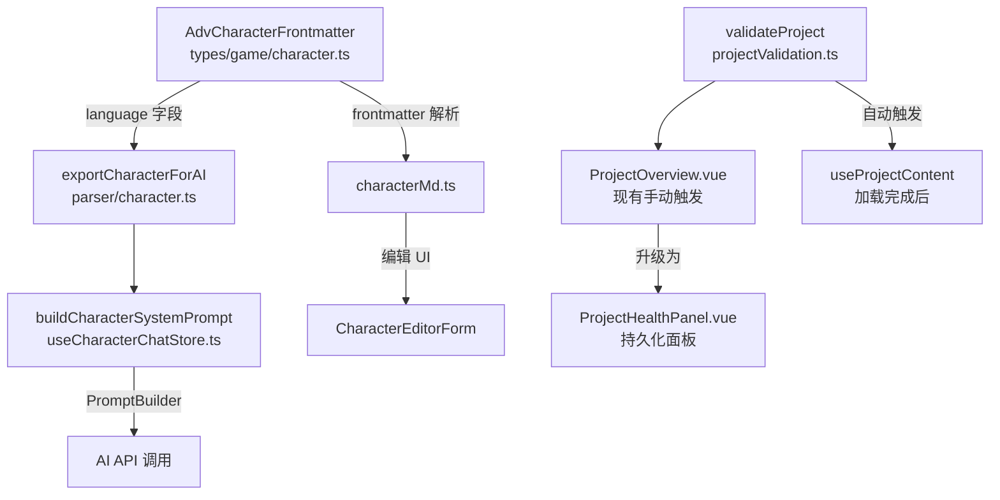

## 产品概述

完善 ADV.JS Studio 文档中 Phase M15 路线图的三个未完成条目，将其细化为与已完成条目同等详细程度的子任务拆分 + 技术方案 + 关键文件路径，使路线规划具体可执行。

## 核心功能

### 1. 多语言对话支持 -- 细化规划

将当前一行描述细化为完整的子任务列表：

- 角色类型新增 `language` 可选字段
- `exportCharacterForAI()` 导出语言信息
- `buildCharacterSystemPrompt()` 动态注入目标语言规则
- 角色编辑表单新增语言选择器
- 知识库关键词提取兼容多语言（当前 `extractKeywords` 仅覆盖中/英文）
- 群聊系统提示词同步支持角色语言
- i18n 新增对话语言相关翻译 key

### 2. 项目健康仪表盘增强 -- 细化规划

将当前一行描述细化为完整的子任务列表：

- 新增 `ProjectHealthPanel.vue` 组件（issue 列表、按类别分组、严重级别图标）
- Dashboard 集成健康面板（替代当前仅 toast 的展示）
- 自动验证触发（项目加载完成时 + 内容保存后）
- Issue 一键跳转（点击跳转到对应编辑页/文件）
- i18n 新增健康面板相关翻译

### 3. E2E 测试补全 -- 细化规划

将当前一行描述细化为按测试文件拆分的具体用例清单：

- 项目管理流程测试（创建、切换、导出/导入）
- 角色管理测试（创建、编辑、批量导入）
- 设置页面测试（AI 配置、语言切换）
- 世界页面测试（角色列表、世界时钟）
- 对话流测试（发消息、消息操作、存档点）
- 群聊测试（创建房间、群聊发言）

## 技术栈

- 文档格式：VitePress Markdown（`:::` 容器语法）
- 修改范围：仅 `docs/guide/studio.md` 文档文件

## 实现方案

本次任务是**文档完善**，将 M15 路线图中三个粗略的未完成条目扩展为与已完成条目同等详细程度的结构化描述。基于对现有代码的探索，确保技术方案中引用的文件路径、API、接口名称全部准确。

### 关键技术决策

**多语言对话支持的技术方案设计**：

经探索发现：

- `AdvCharacterFrontmatter`（`packages/types/src/game/character.ts`）无 `language` 字段，需新增 `language?: string`
- `exportCharacterForAI()`（`packages/parser/src/character.ts` 第 152 行）当前不导出语言信息，meta 区需新增语言行
- `buildCharacterSystemPrompt()`（`useCharacterChatStore.ts` 第 65-97 行）通过 `PromptBuilder` 构建，当前 `ruleUserLanguage` 写死为"回复使用用户的语言"，需改为根据角色 `language` 字段动态切换规则
- 知识库 `extractKeywords()`（`useKnowledgeBase.ts` 第 110 行）仅覆盖中/英文 stop words 和分词，需扩展日/韩语等 CJK 分词支持
- `characterMd.ts` 解析器需支持 `language` frontmatter 字段的序列化/反序列化
- 角色编辑 UI（`CharactersPage.vue` 中的 `CharacterEditorForm`）需新增语言下拉选择器

**项目健康仪表盘的技术方案设计**：

经探索发现：

- `validateProject()` 验证引擎已完整（`projectValidation.ts`），返回 `ValidationResult { issues, passed, stats }`
- `ProjectOverview.vue` 已有手动验证 + toast 展示（第 113-160 行），需升级为持久化面板
- `DashboardSection.vue` 通用分区组件可复用
- `useProjectContent.ts` 的 `loadProjectContent()` 返回后即可触发自动验证
- `ValidationIssue` 已有 `category` 字段（syntax/character/scene/audio/location），可用于分组显示
- Issue 跳转：根据 `category` 和 `file` 字段，router.push 到对应页面（chapters -> editor, characters -> characters 页等）

**E2E 测试的技术方案设计**：

经探索发现：

- Playwright 配置已就绪（`playwright.config.ts`），测试目录 `./tests/e2e`，Chromium，baseURL `http://localhost:5173`
- 当前仅 1 个文件 `test.spec.ts` 含 4 个基础测试（首页重定向、渲染、tab 切换、tab bar）
- 应用使用 Ionic 组件（`ion-tab-button`、`ion-content`），选择器需使用 Ionic 特有标签
- 29 个 Page 文件几乎无覆盖，需按功能域拆分为独立测试文件
- 部分测试需 mock AI API（角色对话流），可通过 Playwright `page.route()` 拦截

## 实现细节

**文档格式约定**（匹配现有风格）：

- 未完成条目保持 `- [ ] **标题** -- 描述` 格式
- 每个条目下按"子任务列表 + 技术实现文件路径"两段组织
- 技术实现段以粗体 `**技术实现**：` 引导，列出具体文件路径和改动说明
- 文件路径使用反引号行内代码格式

**精确文件路径引用**（已验证存在）：

- `packages/types/src/game/character.ts` -- AdvCharacterFrontmatter 接口
- `packages/parser/src/character.ts` -- exportCharacterForAI / serializeCharacterMd
- `apps/studio/src/stores/useCharacterChatStore.ts` -- buildCharacterSystemPrompt
- `apps/studio/src/stores/useGroupChatStore.ts` -- 群聊系统提示词
- `apps/studio/src/composables/useKnowledgeBase.ts` -- extractKeywords / scoreSection
- `apps/studio/src/utils/projectValidation.ts` -- validateProject / ValidationIssue
- `apps/studio/src/components/ProjectOverview.vue` -- 现有验证 UI
- `apps/studio/src/composables/useProjectContent.ts` -- loadProjectContent
- `apps/studio/src/i18n/locales/{en,zh-CN}.json` -- i18n 翻译
- `apps/studio/tests/e2e/test.spec.ts` -- 现有 E2E 测试
- `apps/studio/playwright.config.ts` -- Playwright 配置

## 架构设计

本次为纯文档修改，不涉及架构变更。文档中描述的技术方案需与现有架构保持一致：



## 目录结构

```
docs/guide/
  studio.md  # [MODIFY] Phase M15 三个未完成条目扩展为详细子任务 + 技术方案 + 文件路径
```

## Agent Extensions

### MCP

- **advjs**
- 用途：可用 `adv_validate` 工具验证对文档中技术方案描述的准确性
- 预期结果：确认项目验证相关描述与实际实现一致

### SubAgent

- **code-explorer**
- 用途：前置探索阶段已使用，确认了三个未完成项涉及的所有关键文件路径和现有代码结构
- 预期结果：确保文档中引用的文件路径、接口名、函数签名全部准确
