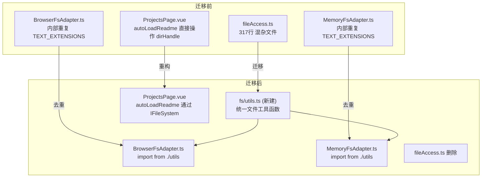

## 用户需求

完成 M17 Phase 消费者迁移：清理 `apps/studio/src` 中剩余的 `FileSystemDirectoryHandle` 直接引用，将 `fileAccess.ts` 中仍在使用的工具函数迁移到 `fs/utils.ts`，清空 `fileAccess.ts`。

## 产品概述

ADV.JS Studio 的文件系统抽象层（IFileSystem）已完成基础设施建设（3个适配器 + 工厂函数），但仍有 10 个消费者文件直接从旧的 `fileAccess.ts` 导入工具函数，1 处代码直接操作 `FileSystemDirectoryHandle` 原生 API。此次迁移旨在统一文件访问入口，为后续 Capacitor 原生打包扫清障碍。

## 核心特性

1. 将 `fileAccess.ts` 中仍被使用的工具函数（`downloadAsFile`、`openProjectDirectory`、`detectAdvProject`、`isAudioFile`、`isImageFile`、`isTextFile`、`AUDIO_EXTENSIONS`、`IMAGE_EXTENSIONS`）迁移到 `fs/utils.ts`
2. 消除 `BrowserFsAdapter.ts` 和 `MemoryFsAdapter.ts` 中与 `fileAccess.ts` 重复的 `TEXT_EXTENSIONS` / `isTextFile` 定义
3. 修复 `ProjectsPage.vue` 中 `autoLoadReadme()` 直接操作 `dirHandle` 原生 API 的代码，改为通过 `IFileSystem` 读取
4. 更新全部 10 个消费者文件的导入路径
5. 删除 `fileAccess.ts` 中已标记 `@deprecated` 的函数，最终清空该文件或仅保留重导出
6. 更新 `docs/guide/studio.md` 路线图文档，标记虚拟滚动已完成、消费者迁移进度

## 技术栈

- 前端框架：Vue 3 + TypeScript + Ionic Vue
- 状态管理：Pinia
- 文件系统：IFileSystem 抽象层（BrowserFsAdapter / CapacitorFsAdapter / MemoryFsAdapter）
- 构建工具：Vite
- 测试：Vitest + Playwright

## 实现方案

**核心策略**：将 `fileAccess.ts` 拆分为两类目标位置，按职责分离：

1. **文件系统相关工具**（`isTextFile`、`isAudioFile`、`isImageFile`、`AUDIO_EXTENSIONS`、`IMAGE_EXTENSIONS`、`TEXT_EXTENSIONS`）→ 迁移到 `fs/utils.ts`，并让 `BrowserFsAdapter.ts` 和 `MemoryFsAdapter.ts` 从该文件导入，消除重复定义
2. **浏览器 API 工具**（`downloadAsFile`、`openProjectDirectory`、`detectAdvProject`）→ 同样迁移到 `fs/utils.ts`，因为它们都是文件操作相关的工具函数

**dirHandle 直接调用修复**：`ProjectsPage.vue` 的 `autoLoadReadme(dirHandle)` 改为接收 `IFileSystem` 参数，通过 `fs.readFile()` 读取 README 内容。调用处从 `useProjectContent().getFs()` 获取 fs 实例，或在 watch 中通过 `createFsForProject()` 创建。

**关键决策**：

- `openProjectDirectory()` 和 `detectAdvProject()` 仍然需要直接操作 `FileSystemDirectoryHandle`，因为它们是获取 dirHandle 的入口点（在用户选择目录时使用），这是 File System Access API 固有的。它们不属于 IFileSystem 抽象范围，但作为文件系统工具函数，放在 `fs/utils.ts` 中合理。
- `fileAccess.ts` 最终保留为空文件或完全删除。选择保留并添加重导出注释指向新位置，避免外部可能的引用断裂（保守策略）；或直接删除（激进但干净）。考虑到这是内部项目，选择直接删除。
- `dirHandleStore.ts` 保持不变 — 它是 dirHandle IDB 持久化的专用工具，已标记为 internal use only，被 `useStudioStore` 消费，职责清晰。

## 实现注意事项

- **消除重复**：`BrowserFsAdapter.ts`（L10-31）和 `MemoryFsAdapter.ts`（L18-39）各自定义了 `TEXT_EXTENSIONS` Set 和 `isTextFile` 函数，与 `fileAccess.ts` 的定义完全重复。迁移后统一从 `fs/utils.ts` 导入。
- **ProjectsPage.vue 的 autoLoadReadme**：当前直接调用 `dir.getDirectoryHandle()` / `dir.getFileHandle()` / `file.text()`。改为使用 `IFileSystem.readFile(path)` 后，逻辑更简单（一个 try-catch + readFile 调用），且自动兼容 MemoryFs/CapacitorFs。
- **ProjectsPage.vue 的 handleImportProject**：当前直接 `new BrowserFsAdapter(dirHandle)`，这是合理的（导入场景需要先获取 dirHandle 再创建 fs），但应改为通过 `createFileSystem({ dirHandle })` 工厂函数创建，保持一致性。
- **向后兼容**：`StudioProject.dirHandle` 字段和 `dirHandleStore.ts` 保持不变，因为 dirHandle 的获取和持久化是 File System Access API 的必要环节，不属于 IFileSystem 抽象层的责任。

## 架构设计



## 目录结构

```
apps/studio/src/utils/
├── fs/
│   ├── utils.ts              # [NEW] 统一的文件系统工具函数。包含：文件类型检测函数（isTextFile/isAudioFile/isImageFile）、扩展名常量（TEXT_EXTENSIONS/AUDIO_EXTENSIONS/IMAGE_EXTENSIONS）、浏览器下载工具（downloadAsFile）、目录选择器（openProjectDirectory）、项目检测（detectAdvProject）。从 fileAccess.ts 迁移而来，消除与 BrowserFsAdapter/MemoryFsAdapter 的重复定义。
│   ├── types.ts              # [不变] IFileSystem 接口定义
│   ├── BrowserFsAdapter.ts   # [MODIFY] 删除内部 TEXT_EXTENSIONS/isTextFile 定义，改为从 ./utils 导入
│   ├── CapacitorFsAdapter.ts # [MODIFY] 删除内部 TEXT_EXTENSIONS/isTextFile 定义，改为从 ./utils 导入
│   ├── MemoryFsAdapter.ts    # [MODIFY] 删除内部 TEXT_EXTENSIONS/isTextFile 定义，改为从 ./utils 导入
│   ├── createFs.ts           # [不变]
│   └── index.ts              # [MODIFY] 新增导出 fs/utils.ts 中的公共函数和常量
├── fileAccess.ts             # [DELETE] 全部内容已迁移到 fs/utils.ts，此文件删除
├── dirHandleStore.ts         # [不变]
├── cloudSync.ts              # [不变]
└── ...

apps/studio/src/views/
├── ProjectsPage.vue          # [MODIFY] 1) autoLoadReadme 改为接收 IFileSystem 参数 2) handleImportProject 使用 createFileSystem 工厂函数 3) 导入路径更新
├── ChatPage.vue              # [MODIFY] 导入路径从 fileAccess 改为 fs/utils 或 fs
├── CharacterChatPage.vue     # [MODIFY] 同上
├── EditorPage.vue            # [MODIFY] 同上
├── GroupChatPage.vue          # [MODIFY] 同上
└── workspace/
    ├── AudioPage.vue          # [MODIFY] 同上
    └── CharactersPage.vue     # [MODIFY] 同上

apps/studio/src/components/
├── ProjectSwitcher.vue        # [MODIFY] 导入路径更新
└── WorldEventsSection.vue     # [MODIFY] 导入路径更新

apps/studio/src/composables/
└── useProjectContent.ts       # [MODIFY] AUDIO_EXTENSIONS 导入路径更新

docs/guide/
└── studio.md                  # [MODIFY] 更新 M17 进度（虚拟滚动已完成标记、消费者迁移进度）
```