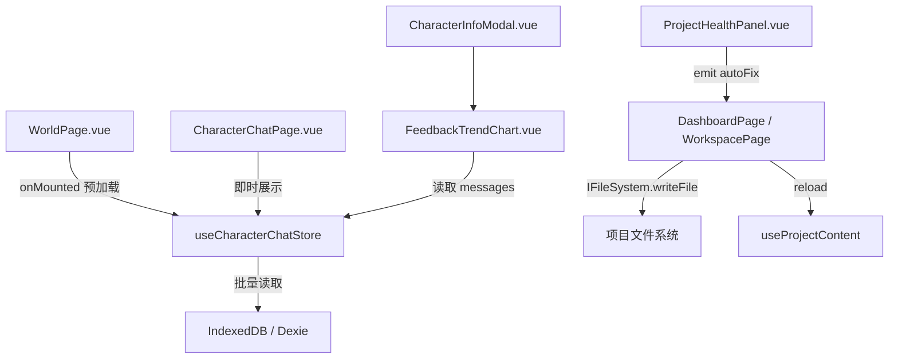

## 产品概述

Phase N1 收尾 + N2 一键体验的混合开发阶段。经代码检查，N1 和 N2 中的多个 TODO 实际已完成，需先更新 roadmap 标记，再实现真正剩余的功能。

## 核心功能

### 1. 更新 roadmap 标记（文档维护）

将代码检查发现的已完成项标记为 done：

- N1：流式输出恢复提示、输入体验优化（RetryButton + handleKeydown + autoGrow + scrollToBottomOnFocus 均已完整实现）
- N2：一键体验模式（QuickStartButton 已完成）、最近对话快捷入口（RecentCharacterPopover 已完成）
- N3：首屏骨架屏（WorldSkeleton/ChatSkeleton/AppSkeleton 已存在）

### 2. 对话预热与懒加载（N1 剩余）

WorldPage 进入时预加载最近有对话的角色的最后 N 条消息，用户点击角色后即时展示对话内容，消除进入 CharacterChatPage 时的 1-2 秒白屏等待。

### 3. 对话质量反馈可视化（N1 剩余）

角色详情页新增好评率折线图。基于现有 feedback 字段（M15 已实现），以滑动窗口方式计算最近 30 轮 AI 回复的好评率并以 SVG 折线图呈现，帮助创作者调优角色人设。

### 4. 项目健康自动修复增强（N2 剩余）

ProjectHealthPanel 已有 dismiss（忽略）逻辑，需增强为真正的自动修复：对可修复类型的问题（缺失 frontmatter 字段、引用不存在的实体），通过 IFileSystem 直接修改源文件，修复后自动重新验证。

## 技术栈

- 前端框架：Vue 3 + TypeScript + Ionic Vue（沿用项目现有栈）
- 状态管理：Pinia（沿用）
- 数据持久化：Dexie（IndexedDB），沿用现有 `db.ts` v12 schema
- 图表渲染：纯 SVG（复用 `EmotionalArcChart.vue` 的模式，零新依赖）
- 文件操作：`IFileSystem` 抽象层（沿用 M17 架构）

## 实现方案

### 2.1 对话预热与懒加载

**策略**：在 `useCharacterChatStore` 中新增 `preloadRecentConversations(characterIds)` 方法，WorldPage `onMounted` 时调用，批量从 IndexedDB 读取角色对话的最后 20 条消息到内存 Map。CharacterChatPage 初始化时检测内存中是否已有数据，命中则跳过 DB 加载。

**关键决策**：

- 复用现有的 `db.transaction('r', ...)` 批量读取模式，不引入新的 DB schema
- 预加载时机选在 WorldPage `onMounted`（当前已有 `void useCharacterChatStore()` 的预加载意图，但只初始化了 Store 实例，未实际加载数据）
- 仅预加载有对话记录的角色（通过 `conversations.value` Map 的 key 列表判断），避免空读
- 预加载条数限制为最后 20 条（足够首屏展示），不影响后续按需加载全量

**性能**：Dexie compound index `[projectId+characterId]` 已建立，单次 `where().equals()` 查询时间 < 5ms。批量预加载 N 个角色使用 `db.transaction` 包裹，避免 N+1 问题。

### 2.2 对话质量反馈折线图

**策略**：新建 `FeedbackTrendChart.vue` 纯 SVG 组件（复用 `EmotionalArcChart.vue` 的 SVG 绘图模式），接收 `CharacterChatMessage[]`，过滤 `role === 'assistant'` 的消息，以窗口大小 5 计算滑动好评率（`thumbs-up / (thumbs-up + thumbs-down)`），X 轴为消息序号，Y 轴为 0-100% 好评率。

**关键决策**：

- 不引入 Chart.js 等图表库，与 `EmotionalArcChart.vue` 保持一致的纯 SVG 方案
- 数据源直接从 `characterChatStore.getMessages(characterId)` 获取，无需新建 DB 表
- 滑动窗口默认 5（可配置），数据量不足时（< 5 条有 feedback 的消息）显示提示文字而非空图表
- 集成位置：`CharacterInfoModal.vue` 的情感弧光图下方，新增「对话质量」section

### 2.3 项目健康自动修复增强

**策略**：`ProjectHealthPanel.vue` 已有 `isFixable()` 和 `dismissIssue()` 机制（目前只是 dismiss 而非真正修复）。增强为：对可自动修复的 issue 类型，调用 `IFileSystem.writeFile()` 修改源文件，然后触发 `re-validate` 事件。

**关键决策**：

- 可修复类型界定：`warning` 级别的 `character`/`scene`/`audio`/`location` 类别问题（已有 `isFixable` 逻辑）
- 修复策略：对于引用断裂（引用了不存在的角色/场景），从 frontmatter 中删除无效引用行；对于缺失字段，补充默认值
- 修复操作通过 `emit('autoFix', issues)` 上传给父组件，由父组件调用 `IFileSystem` 执行文件修改（保持组件职责分离）
- 修复后自动触发 `useProjectContent().reload()` 刷新项目状态

## 实现要点

- **预加载不影响现有加载流程**：`useProjectPersistence` 的 `load()` 已在 `init(pid)` 时全量加载。预加载是在 WorldPage 层面提前触发 Store 的 `init`，确保用户点击角色时数据已就绪。实际上现有代码 `void useCharacterChatStore()` 已有此意图，但 Store `init` 只在 `switchProject` 时被调用。需要确认 WorldPage 进入时 Store 是否已完成 init。
- **FeedbackTrendChart 复用 EmotionalArcChart 的响应式容器宽度模式**（`containerRef` + `ResizeObserver`）
- **ProjectHealthPanel 修复操作需要文件系统访问**：当前组件不持有 `IFileSystem` 引用，需通过事件冒泡到 `DashboardPage` 层处理

## 架构设计



## 目录结构

```
apps/studio/src/
├── stores/
│   └── useCharacterChatStore.ts          # [MODIFY] 新增 preloadRecentConversations() 方法，预加载最近对话
├── views/
│   ├── WorldPage.vue                      # [MODIFY] onMounted 中调用预加载逻辑，确保进入时角色对话数据已就绪
│   └── CharacterChatPage.vue              # [MODIFY] 利用已预加载的数据跳过二次 DB 读取（如果 store 已有数据）
├── components/
│   ├── FeedbackTrendChart.vue             # [NEW] 好评率折线图组件，纯 SVG，接收 messages 数组，滑动窗口计算好评率
│   ├── CharacterInfoModal.vue             # [MODIFY] 新增「对话质量」section，集成 FeedbackTrendChart
│   └── ProjectHealthPanel.vue             # [MODIFY] 增强修复逻辑：从 dismiss 改为真正修改文件，新增 autoFix emit
├── utils/
│   └── projectValidation.ts              # [MODIFY] 新增 autoFixIssues() 函数，接收 issues + IFileSystem，执行文件修复
├── i18n/locales/
│   ├── zh-CN.json                         # [MODIFY] 新增 feedback 图表、自动修复相关翻译 key
│   └── en.json                            # [MODIFY] 同上英文翻译
└── docs/guide/studio/
    └── roadmap.md                         # [MODIFY] 更新已完成项标记，新增当前阶段进展说明
```
