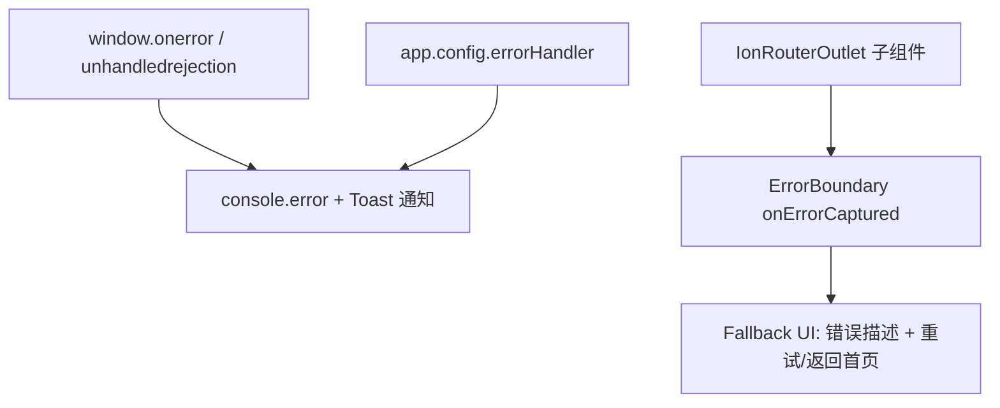

## 产品概述

对 ADV.JS Studio 移动端应用进行核心体验优化（Phase N 冲刺），涵盖 P0 体验阻断修复和 P1 上手门槛降低两个层级。

## 核心功能

### P0 -- 体验阻断修复

1. **全局错误边界 / 白屏兜底**

- 在 main.ts 中添加 `app.config.errorHandler` 全局错误捕获
- 创建 `ErrorBoundary.vue` 组件，使用 `onErrorCaptured` 生命周期
- App.vue 中包裹 ErrorBoundary，捕获子组件渲染错误
- 显示友好的错误恢复 UI：错误描述 + 重试按钮 + 返回首页按钮
- 添加 `window.addEventListener('unhandledrejection')` 捕获未处理的 Promise 异常

2. **离线状态感知 + 操作降级**

- 基于 `@vueuse/core` 的 `useOnline` 创建离线检测 composable
- 在 App.vue / TabsPage.vue 中添加离线提示 Banner（顶部非侵入式横幅）
- 离线时 AI 对话、COS 同步等功能显示不可用提示
- 恢复在线时自动隐藏提示

3. **内容编辑 Undo/Redo**

- 为 EditorPage 创建 `useUndoHistory` composable（基于 `@vueuse/core` 的 `useRefHistory`，参考项目已有的 `packages/flow/composables/useFlowHistory.ts` 实现模式）
- 在编辑器工具栏添加 Undo/Redo 按钮
- 支持 Ctrl+Z / Cmd+Z 和 Ctrl+Shift+Z / Cmd+Shift+Z 快捷键
- 按钮根据 canUndo/canRedo 状态自动禁用

### P1 -- 上手门槛降低

4. **首次使用引导 (Onboarding Tour)**

- 创建轻量 tooltip 引导组件（无第三方依赖），3-5 步引导新用户
- 引导路径：QuickStartButton（创建项目） -> World Tab（角色对话） -> Chat Tab（AI 助手） -> Play Tab（预览） -> Me Tab（设置）
- 使用 localStorage 记录引导完成状态，仅首次展示
- 支持跳过和逐步推进

5. **Marketplace 页面 Coming Soon 标识强化**

- 在 MarketplacePage 页面顶部添加醒目的 Coming Soon 横幅
- 在 ProjectsPage 的 Marketplace 入口卡片上添加 "Coming Soon" 标签
- 添加对应的 i18n 文案

## 技术栈

- 框架：Vue 3 + TypeScript + Ionic Vue（iOS 模式）
- 状态管理：Pinia
- 工具库：`@vueuse/core`（`useOnline`、`useRefHistory`）
- 国际化：vue-i18n（en.json / zh-CN.json 双语）
- 样式：CSS 变量（ADV.JS 设计系统 `--adv-*`）

## 实现方案

### 1. 全局错误边界

**策略**：双层防护 -- 全局 errorHandler 兜底 + ErrorBoundary 组件局部捕获。

- **main.ts**：在 `createApp` 后、`mount` 前，添加 `app.config.errorHandler` 和 `window.addEventListener('unhandledrejection')`，记录错误信息到 `console.error`，并通过 `toastController` 显示用户友好的错误通知
- **ErrorBoundary.vue**：使用 `onErrorCaptured` 钩子捕获子组件树的渲染/生命周期错误，切换到 fallback UI 展示错误信息和恢复操作
- **App.vue**：用 ErrorBoundary 包裹 IonRouterOutlet，确保路由级别的崩溃被捕获



### 2. 离线状态感知

**策略**：基于 `@vueuse/core` 的 `useOnline()`，创建全局离线状态 composable，在 App.vue 中注入离线 Banner。

- **useNetworkStatus.ts**：封装 `useOnline()`，提供 `isOnline` 响应式状态
- **OfflineBanner.vue**：固定在顶部的非侵入式横幅，带过渡动画，使用 `Transition` 组件实现滑入/滑出
- 挂载位置：App.vue 中，在 `<IonApp>` 内、`<IonRouterOutlet>` 之上，确保全局可见

### 3. Undo/Redo

**策略**：使用 `@vueuse/core` 的 `useRefHistory` 自动跟踪 `content` ref 变化。参考项目中 `packages/flow/composables/useFlowHistory.ts` 的模式，但更简化（纯文本无需 JSON 序列化）。

- **useUndoHistory.ts**：封装 `useRefHistory`，设置 `capacity: 50`、`deep: false`（字符串 ref），`debounce: 500`（500ms 内的连续输入合并为一次快照）
- **EditorPage.vue 集成**：工具栏添加 Undo/Redo 按钮，注册 Ctrl+Z / Ctrl+Shift+Z 全局快捷键（`onMounted` / `onUnmounted` 管理 `keydown` 监听器）
- 性能考量：`debounce: 500` 避免每次按键都创建快照，`capacity: 50` 限制内存占用

### 4. 首次引导 Tour

**策略**：轻量自建 tooltip 引导组件，无第三方依赖。使用 `position: fixed` + 计算目标元素位置的方式定位 tooltip。

- **useOnboardingTour.ts**：管理引导步骤、当前步骤索引、完成状态（localStorage 持久化）
- **OnboardingTooltip.vue**：单个 tooltip 气泡组件，接收目标 CSS 选择器、内容、方向等 props
- **OnboardingOverlay.vue**：遮罩 + tooltip 组合，遍历步骤列表依次展示
- 锚点选择器：Tab 按钮使用 `ion-tab-button[tab="xxx"]` 选择器定位，QuickStartButton 使用 `.quick-start-btn` 选择器

### 5. Marketplace Coming Soon 强化

**策略**：在列表页顶部添加 Banner 提示，在 ProjectsPage 入口卡片添加徽章。

- **MarketplacePage.vue**：在 tag-chips 上方添加 Coming Soon Banner（带图标和文案）
- **ProjectsPage.vue**：在 Marketplace action-card 上添加 "Coming Soon" 角标
- **i18n**：添加 `marketplace.comingSoonBanner` 等新文案

## 实现注意事项

- **错误处理性能**：`app.config.errorHandler` 内避免抛出新错误导致无限循环；ErrorBoundary 的 fallback 渲染需足够简单，不依赖可能崩溃的子组件
- **离线 Banner 层级**：使用 `z-index` 确保在 Ionic Modal/Toast 之下但在内容之上
- **Undo/Redo 与 textarea 原生行为**：浏览器原生 textarea 有内置 Ctrl+Z 支持，但 Vue v-model 会导致 undo 栈丢失；自建 undo 栈需在 keydown 中 `preventDefault()` 以覆盖原生行为
- **引导 Tour 响应式适配**：桌面端 sidebar 和移动端 bottom tab bar 定位逻辑不同，tooltip 需根据 `useResponsive()` 动态调整锚点选择器
- **向后兼容**：所有改动不影响现有功能，ErrorBoundary 透传所有子组件渲染，离线 Banner 仅展示不阻断操作

## 目录结构

```
apps/studio/src/
├── main.ts                                    # [MODIFY] 添加 app.config.errorHandler + window unhandledrejection 监听
├── App.vue                                    # [MODIFY] 包裹 ErrorBoundary + 挂载 OfflineBanner + OnboardingOverlay
├── components/
│   ├── ErrorBoundary.vue                      # [NEW] 错误边界组件，onErrorCaptured 捕获子组件错误，展示 fallback UI（错误描述、重试按钮、返回首页按钮）
│   ├── OfflineBanner.vue                      # [NEW] 离线状态提示横幅，固定顶部，带滑入/滑出过渡动画，显示"当前处于离线状态"提示
│   ├── OnboardingOverlay.vue                  # [NEW] 首次引导遮罩层，遍历引导步骤、渲染高亮区域和 tooltip、提供"下一步/跳过"按钮
│   └── OnboardingTooltip.vue                  # [NEW] 引导 tooltip 气泡，接收目标选择器和方向 props，自动计算定位
├── composables/
│   ├── useNetworkStatus.ts                    # [NEW] 封装 @vueuse/core 的 useOnline，提供 isOnline 响应式状态
│   ├── useUndoHistory.ts                      # [NEW] 封装 useRefHistory，提供 undo/redo/canUndo/canRedo，debounce 500ms，capacity 50
│   └── useOnboardingTour.ts                   # [NEW] 管理引导步骤定义、当前步索引、完成标记（localStorage），提供 start/next/skip/isCompleted
├── views/
│   ├── EditorPage.vue                         # [MODIFY] 集成 useUndoHistory，工具栏添加 Undo/Redo 按钮，注册 Ctrl+Z/Ctrl+Shift+Z 快捷键
│   ├── ProjectsPage.vue                       # [MODIFY] Marketplace 入口卡片添加 "Coming Soon" 角标
│   └── workspace/
│       └── MarketplacePage.vue                # [MODIFY] 顶部添加 Coming Soon 横幅提示
├── i18n/locales/
│   ├── en.json                                # [MODIFY] 添加 error boundary、offline、undo/redo、onboarding、marketplace banner 相关文案
│   └── zh-CN.json                             # [MODIFY] 同上中文文案
└── docs/guide/studio/
    └── roadmap.md                             # [MODIFY] 更新已完成项的勾选状态
```