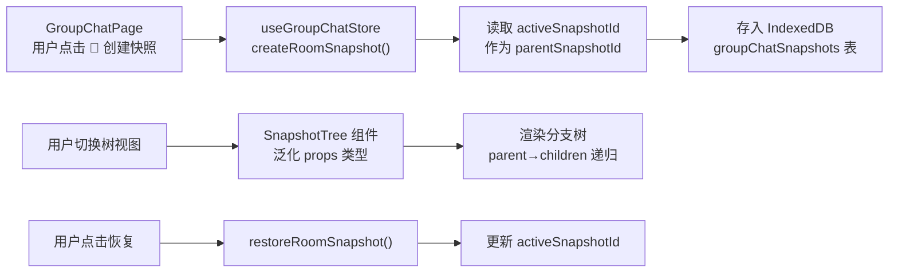

## 用户需求

整理 ADV.JS Studio 已完成的工作与文档，并制定接下来需要完成的 TODO 实施计划。

## 产品概述

ADV.JS Studio 是基于 Ionic Vue + Capacitor 的移动端/Web 端视觉小说创作工具。核心功能（Phase 1-27 + M1-M11 + L1-L3）已全部完成，涵盖项目管理、AI 辅助创作、角色对话记忆、世界事件时间系统、群聊、TTS 语音、知识库 RAG 等。当前代码中仅剩 2 处 TODO 标记，需要制定下一阶段实施路线。

## 核心功能（待实现）

根据文档路线图 Phase M12 和代码 TODO 标记，按优先级排列：

1. **群聊分支树** -- 群聊存档点增加 `parentSnapshotId` 字段，复用已有 `SnapshotTree.vue` 组件实现分支可视化；在 GroupChatPage 中增加列表/树双视图切换
2. **项目模板库** -- 在创建项目时提供多种预设模板（校园恋爱、悬疑推理、奇幻冒险等），每个模板包含完整的世界观、角色、章节示例文件
3. **E2E 测试更新** -- 当前唯一的 E2E 测试已过时（检查 `Tab 1 page`，实际已跳转 workspace），需要重写核心流程测试
4. **文档更新** -- 将已完成工作与新计划同步更新到 `docs/guide/studio.md`

## 技术栈

- 前端框架: Vue 3 + Ionic Vue + TypeScript
- 状态管理: Pinia + IndexedDB (Dexie v6)
- 构建工具: Vite + UnoCSS
- 测试: Vitest (单元) + Playwright (E2E)
- 包管理: pnpm monorepo

## 实现方案

### 任务 1: 群聊分支树

**策略**: 完全复用 1v1 对话的分支树实现模式（`ConversationSnapshot.parentSnapshotId` + `SnapshotTree.vue` + `activeSnapshotId`），最小改动量完成功能对齐。

**关键改动点**:

1. `GroupChatRoomSnapshot` 接口新增 `parentSnapshotId?: string` 字段
2. `useGroupChatStore.ts` 中:

- 新增 `activeSnapshotId: ref<Map<string, string>>()` 状态（roomId -> snapshotId）
- `createRoomSnapshot()` 从 `activeSnapshotId` 读取当前活跃快照作为 parent
- `restoreRoomSnapshot()` 恢复后更新 `activeSnapshotId`
- `clear()` 中重置 `activeSnapshotId`

3. `GroupChatPage.vue` 中:

- 导入 `SnapshotTree` 组件
- 新增 `snapshotView` ref 和列表/树视图切换 pill 按钮（与 CharacterChatPage 完全一致的 UI 模式）
- 树视图传入 `activeSnapshotId` prop

4. `SnapshotTree.vue` 泛化: 当前组件已绑定 `ConversationSnapshot` 类型。需要检查是否兼容 `GroupChatRoomSnapshot`（两者结构几乎一致：id/label/createdAt/parentSnapshotId），如有差异则通过联合类型或 props 适配
5. 数据库层: `DbGroupChatRoomSnapshot` 已有 `projectId` 字段，`groupChatSnapshots` 表无需 schema 迁移，因为 `parentSnapshotId` 是可选字段

**参考实现**: `useCharacterChatStore.ts` L400-441（createSnapshot/restoreSnapshot）+ `CharacterChatPage.vue` L811-846（视图切换 UI）

### 任务 2: 项目模板库

**策略**: 扩展现有的单一模板系统（`projectTemplate.ts` + `CreateProjectModal.vue`），新增多个模板定义，每个模板提供差异化的文件内容。

**关键改动点**:

1. `projectTemplate.ts` -- 当前仅有一套硬编码模板。重构为 `TemplateDefinition` 数据结构，包含 `id/name/description/files[]`，内置 4-5 种模板（通用入门、校园恋爱、悬疑推理、奇幻冒险、现代都市）
2. `createProjectFromTemplate()` -- 接受 `templateId` 参数，根据模板定义写入不同文件
3. `CreateProjectModal.vue` -- 已有模板选择 UI（`templates[]` 数组 + `selectedTemplate` ref），但只有一个 `visual-novel-starter`。扩展模板数组，添加图标和描述
4. i18n 中/英新增各模板的标题和描述 key
5. 每个模板包含: `README.md` / `adv/world.md` / `adv/outline.md` / `adv/chapters/01.adv.md`，内容按类型差异化（校园恋爱有教室场景和青春人物、悬疑有密室和线索等）

### 任务 3: E2E 测试更新

**策略**: 重写 `tests/e2e/test.spec.ts`，覆盖核心用户流程。

**关键改动点**:

1. 删除过时的 `Tab 1 page` 断言
2. 新增基础测试: 应用启动 -> 默认跳转到 `/tabs/workspace` -> 显示欢迎页内容
3. 新增导航测试: Tab 切换（workspace/chat/world/play/me）
4. 新增创建项目流程测试（如环境支持）

### 任务 4: 文档同步更新

在 `docs/guide/studio.md` 的路线图部分:

- Phase M12 中已完成项标记为 `[x]`（群聊分支树、项目模板库）
- 更新测试状态说明
- 确保已完成工作记录一致

## 实现备注

- **群聊分支树零数据库迁移**: `parentSnapshotId` 是可选字段，Dexie 不需要 schema 升级即可存储新字段
- **SnapshotTree 复用**: 组件当前 props 类型为 `ConversationSnapshot[]`，需要泛化为支持 `GroupChatRoomSnapshot`（或抽取公共接口），两者核心字段一致
- **向后兼容**: 已有群聊快照数据 `parentSnapshotId` 为 undefined，树视图中自动作为根节点处理（与 1v1 对话行为一致）
- **模板内容质量**: 每个模板应提供有吸引力的示例内容，让创作者理解 AdvScript 语法

## 架构设计

群聊分支树功能对齐数据流:



## 目录结构

```
apps/studio/src/
├── stores/
│   └── useGroupChatStore.ts          # [MODIFY] GroupChatRoomSnapshot 新增 parentSnapshotId、activeSnapshotId 状态、createRoomSnapshot/restoreRoomSnapshot 方法改造
├── components/
│   └── SnapshotTree.vue              # [MODIFY] 泛化 props 类型，支持 ConversationSnapshot 和 GroupChatRoomSnapshot 共用
├── views/
│   └── GroupChatPage.vue             # [MODIFY] 导入 SnapshotTree，新增列表/树视图切换 UI
├── utils/
│   └── projectTemplate.ts            # [MODIFY] 重构为多模板系统，新增 4 种模板定义和内容
├── components/
│   └── CreateProjectModal.vue        # [MODIFY] 扩展模板选择列表（已有 UI 框架，增加模板条目）
├── i18n/locales/
│   ├── zh-CN.json                    # [MODIFY] 新增模板标题/描述 i18n key
│   └── en.json                       # [MODIFY] 新增模板标题/描述 i18n key
└── tests/e2e/
    └── test.spec.ts                  # [MODIFY] 重写 E2E 测试，覆盖核心导航和页面加载流程

docs/guide/
└── studio.md                         # [MODIFY] 更新路线图中已完成项标记，同步最新状态
```

## Agent Extensions

### SubAgent

- **code-explorer**
- 用途: 在实现群聊分支树时验证 SnapshotTree.vue 的完整 props/emit 接口，确认泛化方案；在扩展模板库时检查 CreateProjectModal 的完整模板选择 UI 结构
- 预期结果: 获取精确的组件接口定义和现有 UI 结构，确保改动最小化

### MCP

- **advjs**
- 用途: 在实现完成后使用 `adv_validate` 工具验证新模板生成的项目结构和脚本语法是否正确
- 预期结果: 确认所有新模板的示例 `.adv.md` 文件语法正确、角色引用完整

### Skill

- **antfu**
- 用途: 确保代码风格和 ESLint 配置符合项目现有规范（Anthony Fu 风格）
- 预期结果: 所有新增/修改代码通过 lint 检查，风格一致