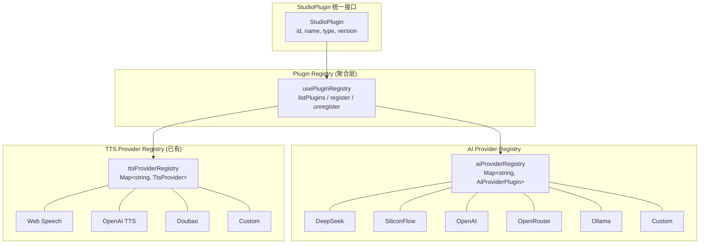
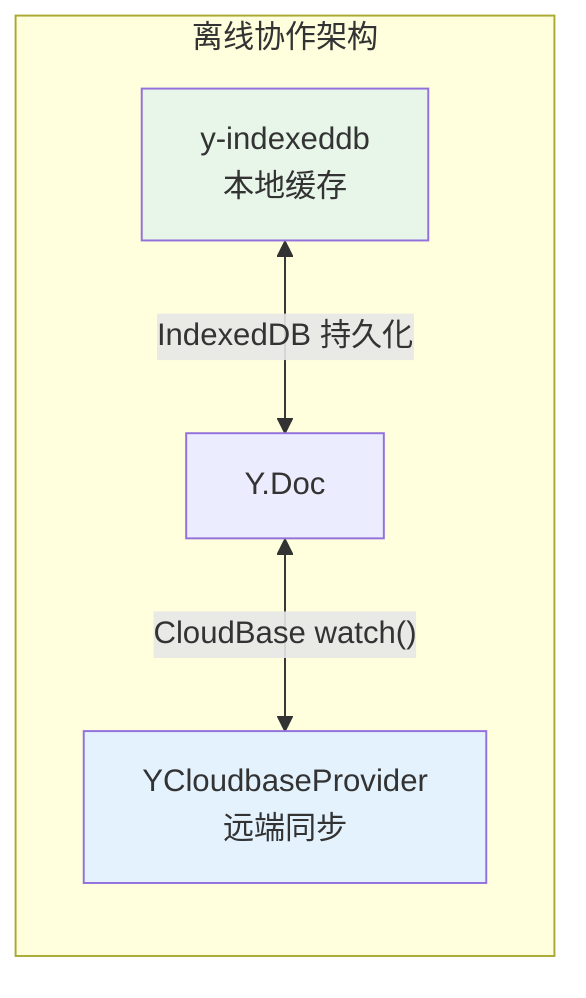

## 产品概述

多方向并行推进 ADV.JS Studio 的功能完善：更新比赛文档反映协作 MVP 状态、启动 Phase 15b 插件系统、强化协作生产化能力、以及补充短链分发与示范作品。

## 核心功能

### 方向一：更新 ai-contest-2026.md

- 更新第 9.4 节后续规划表格中"多人协作/实时同步"的状态描述
- 重写第 9.5 节"技术储备"为"已完成 MVP"的客观描述，保留生产化改进建议表格但更新"当前做法"列

### 方向二：Phase 15b 插件系统

- 定义 `StudioPlugin` 统一运行时接口，支持 AI Provider / TTS Provider / 导出格式三类扩展点
- 创建 `usePluginRegistry` composable 实现插件注册/卸载/列出/配置
- 将现有 4 个 AI Provider preset 和 4 个 TTS Provider 重构为内置插件格式

### 方向三：协作生产化改进

- 集成 `y-indexeddb` 实现 Yjs 文档本地离线缓存，断线后可继续编辑，重连自动同步
- 为心跳集合增加 TTL 过期清理，避免永久脏数据
- viewer 角色只读降级：viewer 进入协作时 Monaco 设为 readonly，Y.Doc 不写入本地变更

### 方向四：Phase M11 短链分发增强

- 在 MarketplacePage 详情 Modal 增加"生成短链"按钮，调用已有 shortlink 云函数生成可分享链接
- 为 training-drill 模板创建一份预生成的示范作品（类似 life-story 的完整项目结构）

## 技术栈

- 前端框架: Vue 3 + Ionic 7 + Pinia
- 协同引擎: Yjs ^13.6.30 + y-indexeddb（新增）
- 同步传输: CloudBase JS SDK + 实时数据库 watch()
- 云函数: CloudBase Node.js 云函数
- 持久化: Dexie (IndexedDB)
- 国际化: vue-i18n

## 实现方案

### 方向一：ai-contest-2026.md 更新

纯文档更新。将第 9.5 节从"底层验证原型"改为"协作 MVP 已可用"，更新"当前做法"列以反映已完成的云函数权限、状态数据协同、协作设置 UI。第 9.4 节表格中"多人协作"行的说明更新为"Phase 15a 协作 MVP 已完成，含设置 UI + 云函数权限 + 状态同步"。

### 方向二：Phase 15b 插件系统

**策略**: TTS Provider 已经实现了完整的插件注册模式（`registerTtsProvider` / `getTtsProvider` / `listTtsProviders`），以此为蓝本，为 AI Provider 建立同样的插件注册架构，然后创建统一的 `StudioPlugin` 包装接口。

**核心设计**:

1. **`StudioPlugin` 接口**: 定义统一的插件元数据（id, name, version, type, description），`type` 为 `'ai-provider' | 'tts-provider' | 'export-format'`
2. **AI Provider 插件化**: 创建 `aiProviderRegistry`（参照 ttsClient.ts 的 `ttsProviderRegistry` 模式），将现有 `AI_PROVIDERS` 数组中的 6 个 preset（deepseek/siliconflow/openai/openrouter/ollama/custom）改为注册式，并添加 `registerAiProvider` / `getAiProvider` / `listAiProviders` API
3. **`usePluginRegistry` composable**: 统一管理层，聚合 AI + TTS 两个领域的注册表，提供 `listPlugins()` / `getPlugin(type, id)` / `registerPlugin()` / `unregisterPlugin()` 统一 API
4. **向后兼容**: `AI_PROVIDERS` 常量导出保持不变（computed from registry），`useAiSettingsStore` 无需修改消费方式

**为何不引入新模式**: TTS 的 `registerTtsProvider` 模式已验证可行且轻量，AI Provider 直接复制此模式，避免过度工程化。

### 方向三：协作生产化

**y-indexeddb 集成**:

1. 在 `pnpm-workspace.yaml` catalog 添加 `y-indexeddb: ^9.0.12`
2. 在 `useCollabRoom.ts` 的 `startSession()` 中，创建 `Y.Doc` 后立即绑定 `IndexeddbPersistence`（key = `advjs-collab-${roomId}`）
3. `IndexeddbPersistence` 的 `synced` 事件先于 `YCloudbaseProvider.connect()` 执行，确保本地缓存优先加载
4. 断线时 Yjs 文档保持存活（不销毁），用户继续编辑，重连后 Provider 自动合并

**Presence TTL 清理**:

1. 在 `startPresence()` 的初始心跳中，顺带清理 `lastSeen < now - 60s` 的过期记录（`db.collection.where().remove()`）
2. 这是轻量级客户端清理，无需新增云函数

**Viewer 只读降级**:

1. `useCollabRoom` 中 `startSession()` 检查 `myRole`，若为 `viewer` 则跳过 `Y.Doc` 的 `on('update')` 本地写入监听
2. `ContentEditorModal` 中 `collabText` 传递时，若 `myRole === 'viewer'` 则 FilePreview 的 `readonly` 设为 true

### 方向四：短链分发 + 示范作品

**短链集成**: MarketplacePage 详情 Modal 已有 Install 按钮，在旁边增加 Share 按钮，调用 `cloudApp.callFunction({ name: 'shortlink', data: { action: 'create', targetUrl } })` 生成短链，展示结果并支持复制。

**training-drill 示范作品**: 参照 `examples/ai-contest/life-story/` 的结构，创建 `examples/ai-contest/training-drill/` 目录，包含 source.txt（销售 SOP 素材）和完整的 adv/ 项目文件。

## 实现注意事项

**y-indexeddb 与 YCloudbaseProvider 的启动顺序**: IndexeddbPersistence 必须先 synced 再连接远端 Provider，否则本地缓存的 update 和远端 update 可能重复应用。通过 `await idbProvider.whenSynced` 后再调用 `cloudProvider.connect()` 解决。

**AI Provider 插件化的兼容性**: `AI_PROVIDERS` 数组仍然导出，通过 `computed(() => listAiProviders())` 实现，确保 `SettingsAiPage.vue` 等消费方无需改动。

**Presence TTL 清理的并发安全**: 多客户端可能同时清理，CloudBase `remove()` 是幂等的，不会造成数据问题。

## 架构设计





## 目录结构

```
apps/studio/
├── src/
│   ├── utils/
│   │   ├── aiProviderRegistry.ts     # [NEW] AI Provider 插件注册表。定义 AiProviderPlugin 接口（扩展 AiProviderPreset + StudioPlugin），实现 registerAiProvider/getAiProvider/listAiProviders，将现有 6 个 preset 重构为注册式。导出兼容的 AI_PROVIDERS 计算属性。
│   │   ├── pluginTypes.ts            # [NEW] StudioPlugin 统一类型定义。定义 StudioPlugin 基础接口（id/name/type/version/description）和 StudioPluginType 联合类型。
│   │   ├── ttsClient.ts              # [MODIFY] 内置 TTS Provider 注册时增加 StudioPlugin 元数据字段（version/description）。
│   │   └── y-cloudbase.ts            # [MODIFY] disconnect() 时不销毁 doc，仅断开远端连接，支持 y-indexeddb 持久化场景。
│   ├── composables/
│   │   ├── useCollabRoom.ts          # [MODIFY] startSession 中集成 y-indexeddb（IndexeddbPersistence），await whenSynced 后再连接远端 Provider。viewer 角色跳过本地写入。
│   │   └── usePluginRegistry.ts      # [NEW] 统一插件管理 composable。聚合 AI + TTS 注册表，暴露 listPlugins/getPlugin/registerPlugin/unregisterPlugin API。
│   ├── stores/
│   │   └── useAiSettingsStore.ts     # [MODIFY] AI_PROVIDERS 改为从 aiProviderRegistry 获取，保持向后兼容导出。
│   │   └── useCollabStore.ts         # [MODIFY] startPresence 中增加 TTL 过期清理逻辑（删除 lastSeen > 60s 的记录）。
│   ├── components/
│   │   └── ContentEditorModal.vue    # [MODIFY] viewer 角色时 FilePreview readonly=true。
│   └── views/
│       └── workspace/
│           └── MarketplacePage.vue   # [MODIFY] 详情 Modal 增加"生成短链"分享按钮。
├── docs/
│   ├── studio/
│   │   └── ai-contest-2026.md        # [MODIFY] 更新 9.4 节和 9.5 节，反映协作 MVP 已完成。
│   └── guide/
│       └── studio/
│           └── roadmap.md            # [MODIFY] Phase 15b 标记第一批完成项。
├── examples/
│   └── ai-contest/
│       └── training-drill/           # [NEW] 企业培训示范作品。包含 source.txt（销售 SOP 素材）+ adv/ 完整项目结构（world.md, outline.md, characters/, chapters/, scenes/）。
│           ├── README.md
│           ├── source.txt
│           └── adv/
│               ├── outline.md
│               ├── world.md
│               ├── characters/
│               ├── chapters/
│               └── scenes/
└── pnpm-workspace.yaml              # [MODIFY] catalog 添加 y-indexeddb: ^9.0.12
```

## 关键代码结构

```typescript
// pluginTypes.ts — 统一插件基础接口
export type StudioPluginType = 'ai-provider' | 'tts-provider' | 'export-format'

export interface StudioPlugin {
  id: string
  name: string
  type: StudioPluginType
  version?: string
  description?: string
}
```

```typescript
// aiProviderRegistry.ts — AI Provider 插件接口
export interface AiProviderPlugin extends StudioPlugin {
  type: 'ai-provider'
  baseURL: string
  models: string[]
  needsKey?: boolean
  registrationUrl?: string
}

export function registerAiProvider(provider: AiProviderPlugin): void
export function getAiProvider(id: string): AiProviderPlugin | undefined
export function listAiProviders(): AiProviderPlugin[]
```

## Agent Extensions

### Skill

- **cloudbase**
- 用途: 部署 collab-auth 云函数更新、验证 shortlink 云函数可用性
- 预期结果: 云函数正确部署到 CloudBase 环境

### SubAgent

- **code-explorer**
- 用途: 在实施过程中深入探索 MarketplacePage.vue、useAiSettingsStore 的完整结构和依赖关系
- 预期结果: 确保修改基于最新代码上下文
