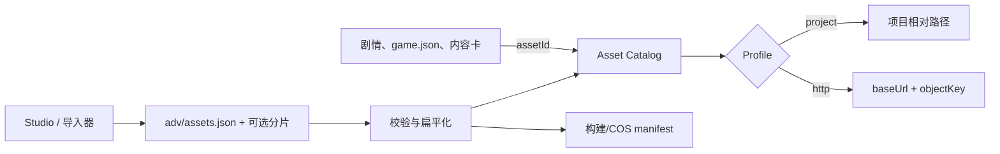

# 资源系统设计

状态：已采纳。适用于 Asset Catalog v2、Studio 本地项目和正式游戏构建。

## 问题

ADV 游戏的剧情、角色、UI 和工具都需要引用图片与音频。如果每个调用方直接保存文件路径或完整 CDN URL，改名、重新压缩、切换环境和发布内容哈希都会扩散成跨模块修改。另一方面，如果源码同时维护 `assets.json` 与 `assets/index.json` 两个根目录，工具无法可靠判断哪一份才是最新事实。

资源元数据本身也有两类：作者需要表达稳定身份、语义和源文件；构建器需要记录哈希、字节数、派生版本与发布位置。把后者都要求作者手写会显得冗余，把它们散落到游戏设置又会破坏可追踪性。

## 决策

ADV.JS 将资源目录实现为一个深模块：调用方只使用较小的 `get`、`list` 和 `resolve(assetId, profile)` 接口，目录内部负责 Profile 回退、路径拼接、变体、Bundle 与旧格式兼容。

源码只有一个根 `adv/assets.json`。小项目在其中内联 `assets`；大项目改用 `includes` 引用 `adv/assets/*.json` 分片。两个字段互斥，分片不拥有 Profile 或发布入口。工具把两种源形式规范化为同一个内存目录，并把扁平发布清单写到构建输出，而不是写回源码形成第二个事实源。

旧 `adv/assets/index.json` 仅作为迁移输入：Studio 可以读取它，下一次资源写入会生成新的根文件并删除旧索引。新项目、示例和文档不再创建该路径。

## 路径边界

路径不是资源系统中的禁用数据，而是位置 Adapter 的私有输入：

- `path` 是项目相对源坐标，受 `project` Profile 的 `root` 约束；
- `objectKey` 是对象存储坐标，受 `http` Profile 的 `baseUrl` 约束；
- `url` 只保留给无法拆分的旧地址兼容；
- 剧情、`settings/game.json`、场景卡、音频卡和画廊项目不保存上述字段。

因此，移动一个源文件只影响 catalog entry；切换 COS 域名只影响 Profile；重新发布只影响对象键与构建清单。稳定 `assetId` 是跨模块 Interface，物理位置留在 Adapter 背后。

## 源数据与派生数据

| 数据                         | 所属阶段 | 推荐维护者      |
| ---------------------------- | -------- | --------------- |
| `id`、`kind`、`type`         | 创作     | Studio 或作者   |
| `path`、`bundle`、语义标签   | 创作     | Studio 或导入器 |
| 来源与许可                   | 创作     | 作者与素材流程  |
| MIME、尺寸、时长             | 导入     | 工具探测        |
| SHA-256、字节数、`objectKey` | 构建发布 | 构建器          |
| 扁平 manifest                | 构建发布 | 构建器，不手改  |

JSON 是协议和审计边界，不是要求作者逐字段手写的表单。Studio 应以素材库 UI 隐藏机械字段，并通过导入、重命名和发布操作维护它们。

## 被拒绝的方案

### 把路径放进 `settings/game.json`

这会让游戏语义依赖部署结构，同一资源的标题、路径和哈希容易在设置、角色卡与场景卡中重复。它也使 Studio 本地 Blob URL、开发服务器路径和生产 CDN URL难以共享同一游戏配置。

### 同时维护两个根清单

读取优先级不能解决双写、过期文件和合并冲突。一个根加可选分片能保留多人协作能力，同时保持唯一入口。

### 只扫描目录并从文件名推导所有信息

自动扫描适合导入，但无法稳定表达重命名后的 ID、许可、来源、Bundle、动画帧和变体关系。扫描器可以生成或更新目录，不能取代目录契约。

### 每项保存完整 URL

这会重复域名和版本前缀，并把环境切换变成全量改写。只有不可分解的兼容资源才使用绝对 `url`。

## 不变量与验证

- `adv/assets.json` 必须且只能声明 `assets` 或 `includes` 之一；
- `includes` 只能进入 `adv/assets/`，不能包含绝对路径、`.`、`..` 或重复项；
- 所有资源 ID 全局唯一，所有 Bundle 引用存在；
- 项目路径不能逃出 Profile root，HTTP 对象键不能逃出发布前缀；
- Runtime 快照与玩家存档只保存资源 ID，不保存 Blob URL 或图片二进制；
- 构建 manifest 是派生产物，先生成后校验，并在不可变素材上传完成后最后发布。

这些不变量由类型、Studio 资源加载测试和文档检查共同约束。协议细节见[资源目录协议](/guide/assets/catalog)。
