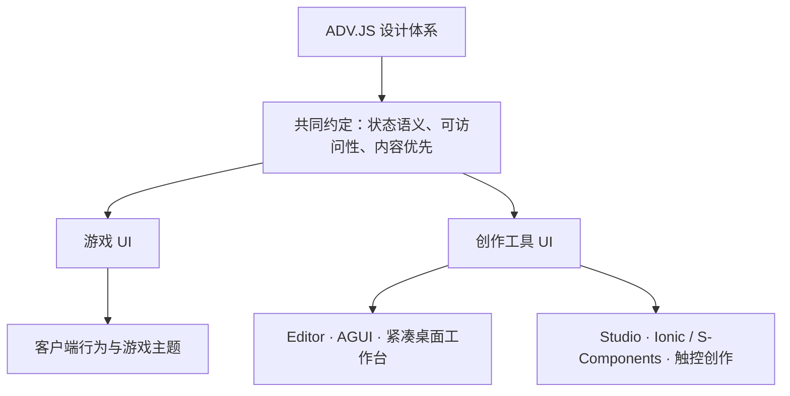

# ADV.JS 设计体系

ADV.JS 按使用目的划分为 **游戏 UI** 与 **创作工具 UI**。游戏 UI 面向玩家；创作工具 UI 面向作者，包含桌面 Editor 和移动优先的 Studio。设备、路由和所在应用不决定 UI 归属：嵌入编辑器的游戏画面仍属于游戏 UI。

## 规范入口

| 体系              | 负责内容                                      | 权威规范                                                           | 实现入口                       |
| ----------------- | --------------------------------------------- | ------------------------------------------------------------------ | ------------------------------ |
| 游戏 UI           | 对话、选项、标题页、存读档、设置、历史、画廊  | [游戏 UI](./game-ui)                                               | `packages/client/`、`themes/*` |
| 创作工具 · Editor | 菜单、工具栏、停靠面板、属性、资源、AI 工作台 | [AGUI 桌面编辑器](/agui/design)                                    | `packages/gui/`、`editor/`     |
| 创作工具 · Studio | 移动创作、角色管理、内容编辑、项目管理        | [Studio 视觉](./studio-design)、[Studio 组件](./studio-components) | `apps/studio/`                 |

## 共享约定与独立视觉

共享的是语义和质量要求：焦点可见，操作有名称，禁用与加载行为明确，错误可恢复，状态不只依赖颜色，动效尊重用户偏好，中文长文本与窄布局可读。

各体系独立定义配色、字体、密度、圆角、动画和布局。游戏主题决定作品的美术方向；Editor 采用中性灰与克制的蓝色交互态；Studio 的紫金品牌表达见其专属规范。共享引擎、类型、解析器和无头交互原语，不要求三种界面共用有皮肤的按钮。

| 决策       | 游戏 UI                              | Editor             | Studio                                              |
| ---------- | ------------------------------------ | ------------------ | --------------------------------------------------- |
| 首要目标   | 叙事阅读与沉浸                       | 持续创作与信息密度 | 触控操作与随时创作                                  |
| 控件       | `Adv*` 与项目/主题覆盖               | `AGUI*`            | Ionic 与 `S*`                                       |
| token      | 游戏 token 表及 `--adv-theme-*` 扩展 | `--agui-*`         | Studio 自己的 `--adv-color-*`、`--adv-surface-*` 等 |
| 主题配置   | `theme.config.ts` / `ThemeConfig.ui` | 编辑器界面偏好     | Studio 界面偏好                                     |
| 美术自由度 | 随作品变化                           | 遵循 AGUI 统一规范 | 遵循 Studio 品牌规范                                |

历史上的 `--adv-*` 前缀覆盖多个用途，不能仅凭前缀认定可跨体系复用。游戏配置只接收公开游戏 token 和 `--adv-theme-*` 扩展；不接收 `--agui-*` 或 Studio 的品牌 token。未来新增跨域样式前，先明确实际消费方。

## 预览与插件

- `AdvContainer` 标记 `data-adv-ui="game"`，把游戏主题 token 和可选亮暗模式限制在自身 DOM 子树。`AdvGame` 从运行上下文传入主题。
- 未配置 `ui.colorScheme` 时沿用宿主已有亮暗模式；明确指定 `light` / `dark` 时只改变该游戏容器。游戏主题不会修改宿主 `html.dark` 或编辑器偏好。
- 编辑器预览的外部播放工具栏、诊断、属性面板使用 AGUI；游戏内部的对话、选项与菜单使用游戏主题。Studio 的作者操作栏同理。
- 编辑器 UI 插件通过 [Editor SDK](/guide/editor/ui-plugins) 注册，复用 AGUI。游戏活动/主题扩展遵循 [运行时插件协议](/guide/runtime/plugins-and-activities) 与游戏 UI 规范。
- DOM 子树是主题配置的作用范围，不是 CSS 沙箱。主题包仍须约束 CSS 选择器；需要任意第三方样式隔离时使用独立文档/iframe。Portal 必须留在游戏主题范围内，或显式传递主题，不能默认传送到编辑器 `body`。

## 类型与实现责任

`@advjs/types` 定义 `ThemeConfig`、`GameUiTheme`、`GameUiTokens` 和公开 token 名单；主题包扩展自己的字段。`AdvThemeConfig` 保留为兼容名称。主题无关代码读取扩展字段时得到 `unknown`，由主题类型或运行时检查收窄。

`@advjs/client` 负责将配置转换为容器样式，以及对话、选项等默认消费点。`@advjs/gui` 负责编辑器 token 和控件。Studio 保留自己的组件与 token 实现。当前不新增一个横跨所有界面的有皮肤 UI 包，也不在类型层复制 CSS 默认色值。

## 规范维护与验收

- `AGENTS.md` 只负责路由到对应规范和强调边界，详细规则放在规范文档。
- 公共接口、token 或组件变体变化时，同步修改实现、文档示例和相关测试。
- 游戏 UI 验证对话、选择、设置/存档、键盘焦点、主题切换，以及宿主与游戏使用不同主题时的隔离。
- Editor 验证正常工作台与约 320px 面板、亮暗色、长标签和键盘操作；Studio 按其移动布局规则验收。
- 配置与规范的抽象完成不等于历史界面全部迁移。组件当前的硬编码、无名称图标和未完成的焦点管理，应按所属体系继续修复，不能作为新实现的先例。

原总文档中的品牌色、字号、圆角及移动布局表已归入 [Studio 设计规范](./studio-design)。
