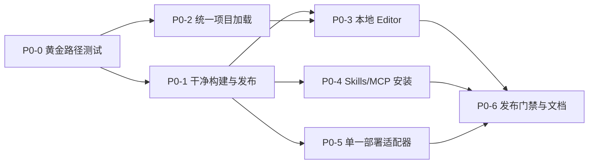

# ADV.JS 首发能力补齐计划

> 状态：已确认，执行清单 Ready
> 审计日期：2026-08-11
> 首发部署目标：Cloudflare Pages
> 上游决策：[ADV.JS 产品定位](/about/product-positioning)
> 执行清单：[ADV.JS 首发 P0 执行清单](/superpowers/plans/2026-08-11-launch-readiness-p0)

## 目标

本计划服务于 ADV.JS 第一个可对外重复验证的完整创作闭环：

```text
一句需求或一份素材
  → Agent 按 Skill 调用 CLI 与 MCP
  → 生成标准 ADV.JS 项目，并使用用户提供或模板占位资产
  → adv check
  → adv editor .
  → 人工精修与试玩
  → adv build
  → 单一目标部署
  → 返回可公开访问、可追溯版本的游玩 URL
```

“正式上线”在本文中指：外部用户无需克隆 ADV.JS monorepo，即可在受支持的干净环境中完成上述闭环。具体采用 `0.x`、Beta 或稳定版标签，由发布决策另行确定。

Studio、自动图片生成、视频导出、内容社区、复杂团队协作和精细积分系统不进入本次首发范围。首发只要求生成结果使用可合法分发的模板占位资产或用户提供的资产；基于 `imagePrompt` 的自动资产生成属于 P1-1。

## 上线门槛

满足以下条件后，才能宣布首发闭环正式可用：

1. 用户可从公开分发渠道安装 Engine/CLI、MCP Server 与核心 Skills；
2. 从空目录生成的标准项目能够通过校验、在 Editor 打开和修改、完成生产构建；
3. 本地 Editor 与现有在线模式消费同一种标准项目格式；首发只承诺 `adv editor .` 的本地闭环，不承诺在线文件托管或 Studio；
4. 一个首发部署适配器能够返回公开 URL，并将部署追溯到项目版本；
5. 上述路径在 CI 的干净环境端到端执行，而不是只在 monorepo 内运行；
6. 安装、生成、编辑、构建和部署失败时具有稳定退出码与可操作错误信息；
7. 文档只描述已经通过发布门禁的能力，未上线能力明确标注状态。

## 现状审计

| 环节            | 当前证据                                                                                                                                                             | 判断                                     |
| --------------- | -------------------------------------------------------------------------------------------------------------------------------------------------------------------- | ---------------------------------------- |
| 项目生成与校验  | `adv init`、`adv check`、MCP builders/bulk/resources 和 Skills 合同的 33 项定向测试通过                                                                              | 已有可用基础                             |
| MCP 构建        | `@advjs/mcp-server` 本地构建通过                                                                                                                                     | 实现存在，但公开安装链未闭合             |
| Skills          | 仓库已有 7 个 Skills                                                                                                                                                 | 缺统一元数据、完整发现信息和一键安装路径 |
| 标准项目构建    | 临时空目录中 `adv init` 与 `adv check` 通过，`adv build` 因 `/@advjs/locales` 无法解析 `defu` 失败                                                                   | 阻断上线                                 |
| Editor 项目格式 | Editor 打开与预览主链仍要求 `adv/index.adv.json`，而标准模板以 `.adv.md` 章节为入口                                                                                  | 阻断 AI 生成后精修                       |
| Editor 可发布性 | `@advjs/editor` 生产构建失败，类型检查存在大量错误；没有 Editor 单元或 E2E 测试                                                                                      | 阻断上线                                 |
| 本地 Editor     | 仓库脚本只能从 monorepo 启动 Nuxt；`adv editor .` 尚不存在                                                                                                           | 阻断首发闭环                             |
| 部署            | 有 `adv build` 与 COS 素材发布能力，但没有返回游戏 URL 的统一部署命令                                                                                                | 阻断首发闭环                             |
| 官方 Pages 托管 | Cloudflare `advjs` 与 `advjs-studio` 项目均已 GitHub 绑定到 `YunYouJun/advjs`；Editor Pages 的仓库内构建与输出目录合同已修复，等待下一次 `dev` push 验证远端 preview | 绑定已存在；旧生产未被本轮本地验证改动   |
| 发布门禁        | 主 CI 的 unit test job 被注释；Editor 未进入 CI；通用 release workflow 调用了不存在的 `ci:publish` script                                                            | 阻断可信发布                             |
| 首次使用文档    | README 仍标记 WIP，Quick Start 写着“尚未发布”，Editor 文档为 TODO，部分 AI 文档仍以旧 JSON 入口为中心                                                                | 阻断外部用户理解                         |

本次审计基于 commit `ef196252079d` 上包含未提交改动的工作区，环境为 Node.js `24.18.0`、pnpm `10.34.1`。后续必须在干净分支重新运行审计，且每个 P0 完成时应以自动化测试替代这里的人工判断。

主要审计命令：

```bash
pnpm vitest run tests/unit/init-galgame.test.ts tests/unit/check-runtime.test.ts tests/unit/check-fix.test.ts tests/unit/mcp-builders.test.ts tests/unit/mcp-bulk.test.ts tests/unit/mcp-resources.test.ts tests/unit/content-skills.test.ts
pnpm --filter @advjs/mcp-server build
pnpm --filter @advjs/editor typecheck
pnpm --filter @advjs/editor build
# 另在临时空目录执行 adv init、adv check 和 adv build
```

## 分支与环境策略

首发前采用 `dev → main` 的单向晋级模型：

- 功能分支通过 PR 合入 `dev`，所有日常修改、集成和修复只在 `dev` 迭代；
- `dev` 是唯一集成分支，对应 Cloudflare Pages 预览环境，不发布正式 npm dist-tag，也不代表正式上线；
- `main` 是受保护的生产分支，禁止直接提交和未经门禁的功能 PR；`editor.advjs.org` 继续由现有 `advjs` Pages 项目的 `main` 生产分支驱动；除有记录且被锁定的发布事务外，`main` 的 tree 必须对应最后一次正式发布；
- 达到 M5 后冻结 `dev`，从其精确 commit 生成不可变 RC；全部 required checks、registry smoke 和人工试玩通过后，才允许将 `main` fast-forward 到该 commit 并创建正式 tag；
- RC 后发现问题必须回到 `dev` 修复并重新生成 RC，不能直接修补 `main`；
- `advjs-studio` 当前仍以 `dev` 作为 Pages 生产分支，因此 `studio.advjs.org` 在 Studio 正式上线前明确视为 Beta。Studio 进入正式发布阶段时，再将其生产分支切换为 `main`。

这样 `dev` 可以保持高频交付和公开预览；发布事务结束后，`main`、npm 包、Cloudflare 生产部署和 release tag 必须收敛到同一源版本。事务执行中若短暂不一致，发布锁会阻止新的合并、RC、tag、release 和公告。

## 优先级定义

- **P0：上线阻断。** 缺失时，首发闭环无法在干净环境完成，或存在数据、凭据和发布安全风险。
- **P1：首发后立即补齐。** 不阻断首次完成闭环，但明显影响成品质量、兼容性或重复使用效率。
- **P2：明确延期。** 属于后续产品扩展，不得挤占 P0 资源。

## 首发支持矩阵与固定契约

P0 issue 创建前先固定以下默认值；若需要改变，必须更新本计划和黄金路径 fixture：

| 项目             | 首发契约                                                                                                                                                                   |
| ---------------- | -------------------------------------------------------------------------------------------------------------------------------------------------------------------------- |
| Node.js          | 支持仍处于维护期的 `22.x` 与 `24.x` LTS；根据 [Node.js 官方发布计划](https://github.com/nodejs/Release#release-schedule)，当前已 EOL 的 Node.js 20 从 `engines` 和文档移除 |
| 操作系统         | Ubuntu 执行完整 launch journey；macOS 与 Windows 执行公开包安装、CLI、Editor 启停和构建 smoke                                                                              |
| 包管理器         | npm/npx 与 pnpm/pnpm dlx；项目内部锁定 pnpm 10                                                                                                                             |
| 浏览器           | 本地 Editor 首发支持最新稳定版 Chromium；Firefox 与 Safari 不作首发承诺                                                                                                    |
| 模板             | `default` 与 `galgame`                                                                                                                                                     |
| 用户入口包       | `advjs`、`@advjs/editor`、`@advjs/mcp-server`；其他 `@advjs/*` 作为依赖发布                                                                                                |
| 默认公开 Skills  | `adv-create`、`adv-debug`、`adv-review`、`adv-art`                                                                                                                         |
| 可选公开 Skills  | `adv-story`、`adv-adapt`                                                                                                                                                   |
| 仓库专用 Skill   | `adv-hamster-demo`，不进入默认公共安装集合                                                                                                                                 |
| Agent/MCP 客户端 | Codex、Claude Code、Cursor                                                                                                                                                 |
| 内容版本         | 对排序后的项目源文件、资产清单和本地登记资产哈希生成 canonical manifest，再计算 SHA-256 `contentRevision`                                                                  |
| 关键部署资源     | `index.html`、HTML 引用的全部 JS/CSS、构建清单声明的入口资源和 SPA fallback                                                                                                |

结构化 CLI 输出统一使用带版本号的 envelope，至少包含 `schemaVersion`、`command`、`ok`、`data`、`warnings` 和 `errors`。P0-0 必须为每个命令建立 JSON Schema，并固定错误码：`ADV_USAGE`、`ADV_VALIDATION`、`ADV_BUILD`、`ADV_EDITOR`、`ADV_AUTH`、`ADV_DEPLOY`、`ADV_NETWORK`、`ADV_INTERNAL`。

## P0：上线阻断能力

### P0-0 建立黄金路径与端到端门禁

先把最终验收路径写成自动化测试契约，再继续增加产品功能。测试从临时空目录开始，不允许引用 monorepo 的隐式依赖。P0-0 交付可运行的测试骨架、固定 fixture 和断言契约；尚未实现的环节不能立即设为真实 required check，P0-6 在 P0-1～P0-5 完成后启用完整门禁。

任务：

- 准备一个最小生成需求和固定的黄金项目断言；
- 将首发支持矩阵、结构化输出 Schema、错误码、`contentRevision` 算法和关键资源清单固化为测试 fixture；
- 从待发布 tarball 或 registry 安装，而不是直接导入源码；
- 执行安装、项目生成、MCP 写入、`adv check`、Editor 修改、`adv build` 和部署；
- 校验发布 URL、项目版本标识、资源请求和 SPA 回退；
- 保存失败日志和构建产物，禁止只靠人工截图验收。

验收标准：

- CI 中存在一条名为 launch journey 的独立任务；
- 测试骨架覆盖本节列出的每一个任务断言，不以人工步骤代替；
- P0-1～P0-5 完成后，任一环节失败都会阻止 release candidate 提升为正式发布；
- 测试可在全新临时目录重复运行，不读取开发仓库的 `node_modules`。

### P0-1 修复干净安装、构建与发布链

当前生成和校验可以通过，但干净项目无法完成 `adv build`，发布 workflow 也不能可靠发布整个依赖链。这是最先修复的产品能力。

任务：

- 修正 `advjs`、`@advjs/client` 等包的运行时依赖声明与虚拟模块解析；
- 从 `engines` 移除已经 EOL 的 Node.js 20，并与首发支持矩阵保持一致；
- 为 `adv init → adv check → adv build` 增加基于 packed tarball 的测试；
- 统一需要公开发布的包版本和 workspace 依赖替换规则；
- 产出 packed tarball 或发布到隔离的 prerelease channel，验证 `npx`/`pnpm dlx` 实际可执行；正式 registry 发布由 P0-6 执行；
- 替换失效的 `ci:publish` 步骤，增加 tag 与 package version 一致性检查；
- 为 Agent 使用的命令补齐稳定退出码和 `--json` 结果，至少覆盖 `init`、`check`、`build` 与后续 `deploy`。

验收标准：

- 在不含 monorepo 依赖的目录中安装 release candidate；
- 两个内置模板均能完成 `init → check → build`；
- `dist/index.html` 可在静态 HTTP server 中打开；HTML 引用的全部 JS/CSS、构建清单入口资源与 SPA fallback 返回 200 且 MIME 正确；
- MCP Server 可从 release candidate 包启动并完成 initialize、resource read 和一次受控写入；
- `init`、`check`、`build` 的 `--json` 输出通过 P0-0 固定的 Schema，失败退出码与错误码表一致；
- 发布 workflow 不包含不存在的 script；RC 发布与 dist-tag 提升以 release manifest 中的完整包清单和 integrity 为准，支持幂等续跑，任一失败都不能进入创建 tag、release 或公告的步骤。

### P0-2 统一标准项目加载与 Editor 往返编辑

Editor 不应继续维护以 `index.adv.json` 为中心的独立加载链。项目解析、编译和诊断必须来自 Platform 的共享 API。

任务：

- 在 Platform 提供稳定的 `loadProject` / `compileProject` 类 API，统一读取配置、Markdown 章节、角色、场景、插件和资产清单；
- 让 CLI 与 Editor 消费同一编译结果；
- Editor 直接打开 `adv init` 和 `adv-create` 生成的目录，不再要求 `adv/index.adv.json`；
- Editor 编辑 `.adv.md`、`.character.md`、scene Markdown 和配置文件时保留未知字段；
- 外部 Agent 修改文件后，Editor 能检测变更、重新编译并刷新试玩；

验收标准：

- `adv init` 生成的两个模板可被 Editor 直接打开；
- 固定 fixture 修改章节后，保存文件的预期 diff 与 SHA-256 完全匹配，重新预览成功，并再次通过 `adv check`；
- Editor 不理解的配置字段经过打开和保存后保持不变；
- 同一 fixture 经 CLI 和 Editor 编译后，移除时间戳等非确定性字段的 normalized compiled project 必须深度相等；
- 标准项目往返测试进入 CI。

### P0-3 交付可构建且安全的本地 Editor

任务：

- 修复 Editor 当前生产构建和类型检查错误；
- 将 Feishu、GitHub、COS 等非首发集成移出核心启动链，缺少配置时不能阻塞本地 Editor；
- 实现 `adv editor [root]`，默认打开当前项目并启动浏览器；为自动化提供 `--no-open --host 127.0.0.1 --port 0 --json`；
- 在线与本地模式共享核心编辑 UI，本地模式通过平台适配层访问文件系统和 CLI；
- 本地桥接只允许访问启动时指定的项目根目录，校验 realpath，拒绝路径穿越和越界符号链接；
- 仅接受本机可信 origin；命令执行只允许 `check`、`build` 等显式 allowlist 操作，不提供任意 shell 入口；
- 关闭 Editor 时释放端口和子进程，不在项目内写入无声明状态。

验收标准：

- 从公开 CLI 执行 `adv editor .` 能打开当前标准项目；
- 自动化模式启动后输出 `ready` 事件及实际 `url`、`pid`、`projectRoot`，Playwright 据此完成 fixture 修改与保存；收到 `SIGTERM` 后输出 `stopped` 事件并以 0 退出；
- 用户可编辑固定 fixture 的章节、角色和场景，保存后的预期 diff 与 SHA-256 完全匹配；
- 试玩使用当前未构建的项目内容，并能响应 Agent 的外部文件修改；
- 越界路径、任意命令注入和非本机请求具有自动化拒绝测试；
- 非法项目根、端口占用、项目解析失败和保存失败均以非 0 退出；`--json` 输出通过统一 Schema，并返回 `ADV_EDITOR`；
- 正常退出和中断退出后端口可立即重新绑定，子进程数量归零；项目内除文档声明的状态目录外不产生新增文件；
- Editor build、typecheck、核心单测和至少一条 Chromium E2E 全部进入 CI。

### P0-4 补齐 Skills 与 MCP 的安装和发现

任务：

- 将 7 个 `SKILL.md` 的 frontmatter 统一为公开兼容的最小字段；
- 为全部公开 Skills 补齐 `agents/openai.yaml` 或等价发现元数据；
- 区分通用公开 Skills 与仅服务仓库 Demo 的组合 Skill；
- 为默认公开 Skills 生成带 revision 和完整性哈希的版本化 release artifact，并提供一条官方安装路径，将它们与 MCP 配置安装到兼容 Agent；
- 实现该路径的规范命令 `adv agent install --client <client> --skills default --mcp --json`，由适配层写入目标客户端配置，并支持 dry-run 和幂等重复执行；
- 提供 `doctor` 检查：Node 版本、CLI、MCP 启动、项目根、写权限和可选生成工具；
- 在 Codex、Claude Code 和 Cursor 上运行安装冒烟测试；
- 明确 Skills 负责编排，文件写入、校验和构建由 CLI/MCP/Engine 执行。

验收标准：

- 新用户不克隆 monorepo 即可安装默认公开集合 `adv-create`、`adv-debug`、`adv-review` 和 `adv-art`；`adv-story`、`adv-adapt` 作为可选公开 Skills；
- `adv agent install` 的 dry-run 能列出将写入的 Skill revision、MCP command 和配置路径；正式执行两次不产生重复条目，且不会覆盖无关用户配置；
- Agent 能发现 Skill、启动 MCP、创建最小项目并运行 `adv_validate`；
- `doctor --json` 检查 Node、CLI、MCP、项目根、写权限和可选生成工具，并通过固定 Schema 与错误码断言；
- 安装文档中的每一条命令都由 CI 或发布 smoke test 执行；
- 仓库专用 Skill 不出现在公共首发默认安装集合中。

### P0-5 实现一个部署适配器

首发部署目标已确认为 **Cloudflare Pages**，不同时实现 Vercel 或 COS。这里必须区分两条链路：

- ADV.JS 官方 Editor/Studio 站点继续使用现有 [Cloudflare Pages Git integration](https://developers.cloudflare.com/pages/configuration/git-integration/)，由 GitHub push 触发构建；
- 用户在本地通过 Agent 生成的独立游戏不应被迫先创建 GitHub 仓库，`adv deploy` 首发采用 [Cloudflare Pages Direct Upload](https://developers.cloudflare.com/pages/get-started/direct-upload/)，自动上传 `adv build` 产生的 `dist/` 并返回 `pages.dev` URL。

因此 P0-5 的 Direct Upload 不是手动维护 ADV.JS 官方站点，而是面向本地用户项目的一键发布适配器。

任务：

- 定义 provider-neutral 的 deploy adapter 接口，但首发只实现 Cloudflare Pages Direct Upload；
- 提供 `adv deploy`，默认先运行 `adv check` 与 `adv build`；
- 支持首次登录/建项目与后续重复部署；
- 输出人类可读结果和稳定 JSON，其中包含 URL、provider、project、deployment ID、项目版本与时间；
- 按首发契约计算 `contentRevision`，并写入部署元数据；
- 在声明过的 `.advjs/deploy.json` 中保存不含凭据的 provider project ID，使后续部署复用同一项目；
- 每次上传前将 `dist/`、canonical manifest、校验和及 `contentRevision` 归档到 `.advjs/releases/<contentRevision>.tar.gz`；同时生成不可变的 `<contentRevision>.release.json` artifact receipt，只记录 archive SHA-256、内部 manifest hash、`contentRevision` 和不含凭据的 provider/project 标识；两者默认不进入 Git；
- 上传成功后另行追加 `.advjs/deployments/<contentRevision>.<safeDeploymentId>.deployment.json` deployment receipt；`safeDeploymentId` 是 provider deployment ID 的无歧义文件名编码，文件内保留原始 ID，并记录 URL、时间和 artifact receipt SHA-256；同一内容重复部署只新增 receipt，不覆盖既有记录；
- 部署后主动请求入口和关键资源，验证状态码、MIME 与 SPA 回退；
- 凭据仅交给 provider CLI/SDK，不写入项目、日志、Skill 或部署清单。

验收标准：

- `adv deploy --json` 成功时退出码为 0，并返回可公开访问的 HTTPS URL；
- JSON 中的 `contentRevision` 必须等于 P0-0 算法对当前 fixture 的计算结果，入口和首发关键资源清单验证通过；
- 无登录或权限不足返回 `ADV_AUTH`，构建失败返回 `ADV_BUILD`，网络失败返回 `ADV_NETWORK`，provider 失败返回 `ADV_DEPLOY`；
- 同一 fixture 连续部署两次复用 `.advjs/deploy.json` 中相同的 provider project ID，并产生两个不同 deployment ID 和两份分别关联同一 artifact receipt 的 deployment receipt；
- 将上一份 archive 与 receipt 复制到新的空目录后，`adv deploy --artifact <archive> --receipt <receipt> --json` 能比对 archive SHA-256、校验内部文件清单、跳过重新构建，向同一 provider project 重新部署该 `contentRevision`，并重新验证公开 URL；
- token 不出现在 stdout、stderr、构建产物或项目文件中。

### P0-6 建立正式发布门禁与可信文档

任务：

- 恢复主 CI 的 unit test job；
- 为支持的 Node 版本运行 package build、unit、typecheck 和 packed-install smoke test；
- 将 Editor build/typecheck/E2E 与 launch journey 加入 required checks；
- 修复现有 `advjs` Pages 项目的 `dev` Git 预览构建，保持 `main` 为 Editor 生产分支，并将相同构建命令纳入仓库 CI；
- 保护 `main`：正常晋级只允许通过 P0 门禁的 `dev` 精确 commit 进行 fast-forward；唯一非快进例外是未创建正式 tag/release 前，由受控发布机器人按 release manifest 中的旧 SHA 执行失败恢复；
- 建立跨 Git、npm 与 Cloudflare 的发布事务锁；release manifest 除目标状态外，还必须记录旧 `main` SHA/tree hash、旧正式 dist-tag 映射和旧 Cloudflare 生产 deployment ID；
- 在正式发布前生成 changelog、包清单和已知限制；
- 重写根 README、Quick Start、Editor 指南、MCP 安装和 Skills 安装页；
- 移除“尚未发布”、旧 JSON 默认入口和无法执行的安装命令；
- 提供一个从提示词到公开 URL 的完整教程与参考项目。
- 以最终版本号 `X.Y.Z` 将不可变 release candidate 发布到 `rc` dist-tag，在第二个干净环境运行 registry smoke；全绿后依次将 `main` fast-forward 到同一 commit、验证 Cloudflare 生产部署、把同一批 `X.Y.Z` 包提升到正式 dist-tag，再创建 `vX.Y.Z` tag 和正式 release，全程不重新构建或发布包；
- 为 RC 发布和正式 dist-tag 提升生成 release manifest，记录全部包名、版本、integrity、变更前正式 dist-tag 和目标 dist-tag；流程必须可幂等续跑；若提升部分失败，自动恢复已变更的正式 dist-tag，或持续阻止 tag、release 和公告，直到所有包与 manifest 一致；
- `main` 晋级后的任一步骤失败时，优先在同一发布锁内幂等续跑同一 RC；若决定中止，则恢复旧 npm dist-tag，通过 [Cloudflare Pages Rollbacks](https://developers.cloudflare.com/pages/configuration/rollbacks/) 恢复旧生产 deployment，并由受控发布机器人将 `main` ref 非快进恢复到 manifest 记录的旧 SHA。机器人必须以“当前 `main` 仍等于本次 RC SHA”为 compare-and-swap 前置条件，否则拒绝操作；审计记录保存在不可变 release manifest 与事务日志中，不向 `main` 添加 abort commit。三者未恢复并验证前不得解除发布锁；

验收标准：

- required checks 全绿才允许创建 release tag；
- release candidate 发布后在第二个干净环境执行 registry smoke test，失败时不得提升正式 dist-tag；
- `rc` 与正式 dist-tag 解析到完全相同的包版本及 integrity，Git tag、package version 和 release 版本一致；
- `main`、正式 tag、release manifest 的 source commit 与通过门禁的 `dev` RC commit 完全一致；合并后 `editor.advjs.org` 的 Cloudflare 生产部署成功且引用该 commit；
- 故障注入测试证明 RC 发布失败不改变正式 dist-tag；正式提升中途失败时，要么恢复 manifest 记录的旧映射，要么保持发布流程失败且不创建 tag/release，重跑后可收敛到完整目标清单；
- 对 `main` 晋级后 Cloudflare 失败、npm 正式提升部分失败分别做故障注入：流程必须收敛到同一 RC，或将 `main` SHA、Cloudflare production deployment 与 npm 正式 dist-tag 全部恢复到 release manifest 记录的旧状态；恢复后 `main` 仍是 `dev` 的祖先，下一次通过门禁的 `dev` commit 可继续 fast-forward 晋级；期间不能创建正式 tag/release 或发布公告；
- Quick Start 的命令块进入可执行 docs journey，不允许依赖正文未声明的手工步骤；
- 文档中的版本、命令和输出与发布包一致。

## P1：首发后立即补齐

### P1-1 基础资产自动化

- 将现有 `adv-art` 清单、哈希、许可和远程审计串成一条更短的参考流程；
- 接入一个参考图片生成适配器，但不把模型供应商写入项目格式；
- 从场景和角色 `imagePrompt` 生成最小可用的封面、背景和角色资产；
- 在 Editor 中展示资产缺失、哈希不符、跨域和许可诊断；
- 将素材视觉检查保留为人工发布门槛。

### P1-2 Editor 专业创作基本盘

- 旧 `index.adv.json` 项目的显式兼容适配器；
- Undo/Redo 与文件级变更历史；
- AI patch diff 与逐项接受/拒绝；
- 分支图、覆盖率和问题定位联动；
- 资产浏览、引用定位和批量操作；
- Git 状态与发布前检查，但不在首发阶段建设完整团队平台。

### P1-3 部署可靠性与第二适配器

- 预览/生产环境区分、回滚、别名与自定义域名；
- 部署记录和内容哈希对比；
- 为已经托管在 GitHub 的用户游戏提供可选 Git integration 模式；
- 根据主要用户地域选择 COS/EdgeOne 或 Vercel 作为第二适配器；
- 远程资产可用性与 CORS 的部署前审计。

### P1-4 兼容性与诊断

- 将 Windows、macOS 的 smoke 扩展为完整 launch journey；
- Firefox、Safari 的在线模式兼容与降级说明；
- `adv doctor` 的依赖、端口、权限、主题和部署诊断；
- 可选择加入、默认关闭且不采集项目内容的错误遥测。

## P2：明确延期

- 视频导出与分支路径录制；
- Studio 账号、托管 AI 和积分扣费；
- 内容发现、社区、推荐与 UGC 治理；
- 多人实时协作、企业审计和私有部署；
- 多部署供应商同时维护；
- 音频、配音和完整多媒体自动生成。

现有 `adv export` 的硬编码录制实验不作为本次首发能力宣传。

## 实施顺序与依赖



推荐按以下里程碑收敛：

1. **M0：可测。** 建立 launch journey，固定项目格式和最终验收契约；
2. **M1：可构建。** packed install、`adv build`、包发布链和结构化 CLI 结果稳定；
3. **M2：可精修。** Editor 统一加载 Markdown 项目，`adv editor .` 可构建、可保存、可试玩；
4. **M3：可被 Agent 使用。** 核心 Skills 和 MCP 可安装、可发现、可诊断；
5. **M4：可分享。** 单一部署适配器返回经验证的公开 URL；
6. **M5：可宣布上线。** required checks、registry smoke、Quick Start 和已知限制同时完成。

## 首发 Definition of Done

以下是首发必须实现并由 CI 在干净环境执行的规范化 journey。`X.Y.Z` 是 P0-6 的最终版本号；P0-4 在实现时固定 `adv agent install` 的客户端配置写入协议，不得把下面的安装与生成步骤继续留作人工注释：

```bash
npm install --global "advjs@X.Y.Z" "@advjs/mcp-server@X.Y.Z"
adv agent install --client codex --skills default --mcp --json
adv init launch-game --template default --name "Launch Game" --json
cd launch-game
adv check --json
adv editor . --no-open --host 127.0.0.1 --port 0 --json
adv build --json
adv deploy --json
```

Editor 命令是长驻进程：journey 等待 `ready` 事件后，由 Playwright 修改并保存固定 fixture、验证试玩，再发送 `SIGTERM`，等待 `stopped` 事件和 0 退出码后继续构建。另有一条受支持 Agent smoke：从固定的一句话需求调用 `adv-create` 和 MCP 写入项目，并以 `adv check --json` 作为确定性结果；它不能用 `adv init` 冒充 AI/Agent 生成验收。

最终验收记录必须包含：

- 安装的精确包版本和 Skill revision；
- `adv check` 的机器可读结果；
- Editor 修改前后的文件 diff；
- 构建产物摘要与内容版本；
- 部署 provider、deployment ID 和公开 URL；
- 浏览器试玩通过记录；
- 已知限制和人工恢复方式。P0 的恢复来源固定为 `.advjs/releases/<contentRevision>.tar.gz` 及同名 `.release.json` artifact receipt；验收记录必须另附对应的 `.deployment.json` receipt，并给出 archive hash、deployment ID，以及在干净环境执行 `adv deploy --artifact <archive> --receipt <artifact-receipt> --json` 的结果；`adv rollback`、远端归档、别名切换等产品化能力属于 P1-3。

## 已确认决策

### 首发部署目标

已确认选择 **Cloudflare Pages**。官方 Editor/Studio 使用现有 GitHub 集成；用户本地项目的 `adv deploy` 首发使用 Direct Upload。两者共享部署后的 URL、关键资源和可追溯性验收，但不复用同一个 Pages project。

2026-08-11 只读核查结果：Cloudflare 项目 `advjs` 已绑定 GitHub `YunYouJun/advjs`，生产分支为 `main`，构建命令为 `npm run editor:build`，输出目录为 `editor/core/dist`，域名为 `editor.advjs.org`；`advjs-studio` 绑定同一仓库，生产分支为 `dev`，域名为 `studio.advjs.org`。

2026-08-12 仓库侧复现合同：Cloudflare Pages 使用 Node `24`、pnpm `10.34.1`，在仓库根目录运行 `npm run editor:build`，输出 `editor/core/dist`。相同命令已由 `editor-pages-build` CI job 固定，并在本地确认生成 `editor/core/dist/index.html` 与 `_nuxt/` 静态资源。此前 npm 包专用的 `dist/public` 层级已移除，使 `@advjs/editor` 本地静态服务与 Pages 共用同一产物根目录。远端 `dev` preview URL、GitHub PR check 和 commit 对应关系必须在该改动 push 到 `dev` 后只读核验；本轮没有修改 `main` 或 `editor.advjs.org` 的生产 deployment。

### 代码晋级策略

已确认所有首发前迭代都进入 `dev`，最后一次通过完整门禁的 RC 才 fast-forward 到 `main` 并触发正式部署。`main` 不承担日常集成职责。

发布版本采用 `0.x`、Beta 或稳定标签不阻塞能力实施，只影响 P0-6 的 dist-tag 与公告措辞，可在 release candidate 前确定。
