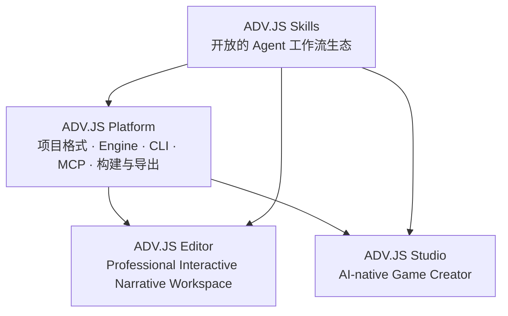

# ADV.JS 产品定位

> 状态：目标定位已确认
> 更新日期：2026-08-11

本文确认的是目标产品结构和能力边界，不代表所述功能均已上线。除明确标注为现状的内容外，能力描述均表示目标态要求；实现状态以各产品路线图为准。

ADV.JS 的产品结构不是四条彼此独立的产品线，而是：**一个平台、两个创作产品、一个 Skills 生态**。



## 核心定位

| 层级            | 定位                        | 主要用户                            | 核心价值                                               |
| --------------- | --------------------------- | ----------------------------------- | ------------------------------------------------------ |
| ADV.JS Platform | 交互叙事的开放技术底座      | 开发者、工具作者、平台集成方        | 用统一格式创建、校验、运行、构建和导出可玩内容         |
| ADV.JS Editor   | PC 优先的专业生产工作台     | 重度创作者、工作室和企业团队        | 对复杂项目进行精确编辑、资产管理、协作和生产交付       |
| ADV.JS Studio   | 移动优先的个人 AI 创作 SaaS | 希望快速创作和分享的个人用户        | 从一句想法或一份素材快速生成、轻量修改、试玩和发布游戏 |
| ADV.JS Skills   | 开放的 Agent 工作流生态     | AI Agent 使用者、Skill 作者和集成方 | 将游戏、资产、视频和部署能力组织为可复用工作流         |

真正面向终端用户的创作产品是 Editor 和 Studio。Platform 是共同底座，Skills 是贯穿平台与两个产品的开放生态。

## ADV.JS Platform

ADV.JS Platform 是项目格式和确定性能力的所有者，包括：

- Markdown 为主的标准项目格式；
- parser、runtime 和 client；
- `adv` CLI 与 MCP 能力；
- 项目创建、解析、校验、构建和导出；
- 素材、视频和部署输出所需的扩展接口。

Platform 不负责某个特定 AI Agent 的交互方式，也不要求项目托管在 ADV.JS 的云端。

## ADV.JS Editor

**产品描述：Professional Interactive Narrative Workspace。**

Editor 是 PC 优先的专业生产工作台，服务复杂项目、团队生产和可控交付。它应提供在线与本地两种运行模式。两种模式共享产品定义、项目格式和核心编辑代码，平台适配层、权限实现与部署代码可以不同：

- 在线模式适合导入、预览、常规编辑和连接云端 Agent；
- 本地模式通过类似 `adv editor .` 的命令从项目目录启动，解锁完整文件系统、CLI、MCP、Skills、本地 Agent 和 BYOK；
- 未来如需原生桌面体验，可以增加桌面壳，但不形成另一套编辑器产品。

Editor 可以接入 Codex、Claude Code、其他 AI Agent、本地模型或用户自有模型服务。AI 接入保持开放，不与单一供应商绑定。

### 能力边界

Editor 负责：

- 复杂分支与流程编辑；
- 源码级和可视化精确编辑；
- 批量资产管线与插件开发；
- Git、审阅、团队协作与生产级导出；
- AI 生成内容的深度定制和最终交付。

Editor 不以消费级 AI 积分为核心收费模式。本地单机能力保持开放：源码按项目许可证公开，无需 Studio 账号即可免费运行，允许自托管，并支持 BYOK 与兼容的本地工具。企业付费价值来自团队权限、审计、私有部署、共享资产库、品牌模板、批量发布和技术支持。

## ADV.JS Studio

**产品描述：AI-native Game Creator。**

Studio 是移动优先、同时可在 Web 使用的个人 AI 创作 SaaS。它的首要任务是帮助个人用户用 AI 创作和分享可玩的内容，而不是优先成为游戏发现与消费平台。

Studio 将开放的 Skills 和底层工具能力包装成消费级流程，提供账号、托管模型和统一 AI 积分。用户无需理解模型接入、命令行或 Skill 的执行细节。

### 能力边界

Studio 负责：

- 从一句想法或一份素材生成标准 ADV.JS 项目；
- 对话式修改和变更确认；
- 角色、章节、场景等内容的轻量表单编辑；
- 试玩、分享和一键发布；
- 个人项目、账号和 AI 积分管理。

Studio 不发展成完整 IDE。复杂分支图、源码级编辑、插件开发、Git、批量资产生产和团队审阅应引导用户进入 Editor。

### 本地所有权与云服务

- 无账号模式使用设备本地存储，支持手工创建或导入、轻量编辑、试玩和导出；
- 登录用于托管 AI、积分、云同步、发布与分享；
- 项目源文件默认归用户所有，并可随时完整导出；
- 云同步是可选服务，不是打开项目或迁移到 Editor 的前置条件；
- 使用托管 AI 时，只发送用户为当前任务确认选中的文件、片段和引用资产；数据保留期、第三方处理方与训练用途由隐私政策明确；
- AI 生成资产的使用权取决于所用模型、输入素材和生成适配器的条款。

Studio 的商业模式是托管 AI 与便利性：订阅、AI 积分、云存储和发布服务。

## ADV.JS Skills

Skills 是开放、可下载、可在不同 Agent 中执行的工作流协议，不是新的运行时。这里的“开放”指规范公开、Skill 文件可下载和自托管，并且无需 Studio 账号即可由兼容 Agent 执行。

- Skill 描述生成策略、任务顺序、判断标准和验收规则；
- 确定性文件操作、解析、校验和构建下沉到 `adv` CLI、MCP 与 Engine API；
- 图片、语音和视频由独立生成适配器执行；
- Cloudflare、Vercel、COS 等部署目标由部署适配器执行；
- Editor 可以直接运行或组合 Skills；
- Studio 可以将相同 Skills 包装成托管按钮和引导流程。

Skills 本身保持开放。Studio 对模型推理、图片、语音、视频、云存储、部署和其他托管执行成本收费，而不是锁定 Skill 文件。

## 共同产品原则

### 一种项目格式

Studio 和 Editor 必须读写同一种标准 ADV.JS 项目格式：

- Studio 生成的项目可以由本地 Editor 直接打开和精修；
- Editor 写入的高级配置即使 Studio 暂时不能编辑，也必须原样保留；
- 不创建“移动版项目格式”或仅能在 Studio 中运行的私有格式。

Studio 导出的标准项目必须包含源文件、资产清单、未知扩展字段和用户本地持有的已登记二进制资产，并可由 Editor 在项目结构层面无损打开。仅存在于外部服务的资产必须保留稳定 URI、内容哈希、来源和授权信息；其可用性取决于外部服务，不属于无损迁移承诺。账号、积分、AI 对话、云同步历史、发布记录和密钥属于服务状态，也不在项目迁移范围内。

### 项目是唯一事实源

标准 ADV.JS 项目中的源文件、资产清单、内容引用和生成元数据是唯一内容事实源。二进制资产可以存放在本地或对象存储，但必须在项目中通过稳定 URI 和内容哈希登记。游戏构建、视频成品和部署副本均从确定版本的项目派生。

```text
想法或素材
  → ADV.JS 项目
    → 生成并登记资产
    → 构建可玩游戏
    → 渲染宣传片或剧情视频
    → 部署到 Web 或对象存储
```

视频不是平行的创作格式。部署平台可以保存域名、密钥、日志和运行状态，但不得成为内容编辑源；部署内容必须可追溯到一个确定的项目版本。所有输出都应尽量可校验、可复现。

### 开放迁移

用户可以从 Studio 导出完整项目，并在 Editor、CLI 或第三方工具中继续工作。使用云端功能不改变项目所有权；迁出时可完整保留项目结构与外部资产登记信息，外部资产本体的可迁移性和持续可用性取决于相应服务条款与访问权限。

## 产品协作路径

### 个人创作者

```text
在 Studio 输入想法或素材
  → 使用托管 AI 生成项目
  → 轻量修改与试玩
  → 直接发布
  → 必要时导出到 Editor 深度制作
```

### 专业创作者与团队

```text
在本地创建或打开项目
  → 用 Editor、Agent 和 Skills 协作
  → 精确编辑、校验和审阅
  → 构建并部署到目标平台
```

## 命名约定

现阶段保留 **ADV.JS Studio**，不改名为 Creator 或 Create：

- **ADV.JS Editor**：专业创作产品；
- **ADV.JS Studio**：个人 AI 创作产品；
- **Create with AI**：Studio 内的核心生成流程名称；
- **ADV.JS Creator**：创作者用户身份，而非产品名。

Editor 和 Studio 必须始终配合产品描述出现，避免仅凭名称判断二者能力层级。

## 下一阶段主闭环

下一阶段只优先跑通一条端到端路径：

```text
一句需求或一份素材
  → Agent 按 Skill 编排调用 CLI、MCP、Engine API 和生成适配器
  → 生成标准项目与基础资产
  → adv check 验证
  → 本地 Editor 精修
  → 一键部署
  → 获得可分享的游玩链接
```

这条主闭环有意以本地 Agent 与 Editor 为首发入口，不包含 Studio。Studio 在底层链路稳定后，将同一工作流包装为托管 SaaS 体验。

首发实现必须只选择一个部署适配器；具体供应商由独立实施决策确定，不在本文中同时承诺 Cloudflare、Vercel、COS 等多个目标。闭环验收标准是：`adv check` 通过、Editor 修改可持久化，并返回一个可公开访问且可追溯到确定项目版本的游玩 URL。

视频导出、内容社区、复杂协作和精细积分系统不进入这条主闭环；它们应在项目格式、生成、精修和部署链路稳定后继续建设。

## 非目标

- 不让 Editor 与 Studio 分别发展不兼容的项目格式；
- 不让 Studio 演变成移动端完整 IDE；
- 不把 Skills 实现为脱离 Engine、CLI 和 MCP 的第二套运行时；
- 不以强制云托管换取 Studio 的商业化；
- 不把视频或部署结果当作独立内容事实源；
- 不在下一阶段同时推进所有远期能力。
