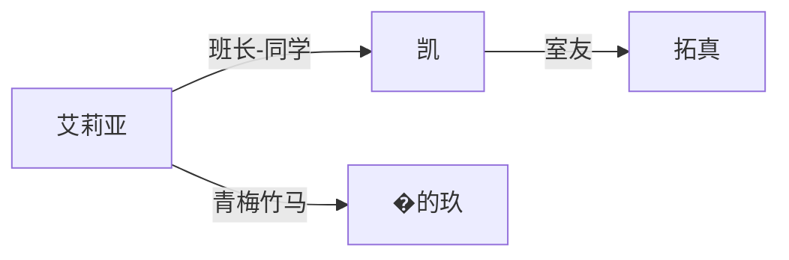

# AI 优先战略

ADV.JS 从「编辑器优先」转向「AI 优先」的完整战略文档。

本文档定义了 ADV.JS 如何拥抱 AI 时代，将创作工作流从传统的可视化编辑器转向以 AI + Markdown 为核心的新范式。

> **目标读者**：ADV.JS 核心开发者、插件作者、希望用 AI 创作视觉小说的创作者。

---

## 一、理念转变：为什么是 AI 优先而非编辑器优先

### 1.1 传统编辑器的投入产出困境

ADV.JS 的 `editor/core` 是一个非常复杂的 Nuxt 应用：

- **53 个 Vue 组件**：从 Monaco 代码编辑器到 Flow 节点编辑器，功能覆盖面极广
- **14 个 Pinia stores**：状态管理复杂度高，涵盖游戏状态、编辑器状态、用户偏好等
- **多平台集成**：GitHub OAuth、飞书登录、微信集成 —— 每个都需要独立维护
- **持续的维护成本**：Nuxt 版本升级、依赖更新、跨浏览器兼容性

然而，这些投入的实际回报正在递减：

| 维度     | 传统编辑器                     | AI + 代码编辑器             |
| -------- | ------------------------------ | --------------------------- |
| 学习成本 | 需要学习专用 UI                | 用自然语言描述即可          |
| 开发成本 | 每个功能需要设计 UI + 实现交互 | 暴露 Markdown 格式即可      |
| 灵活性   | 受限于预设的 UI 组件           | AI 可以完成任意创作需求     |
| 迭代速度 | 改一个表单字段需要前后端联动   | 修改 Markdown 格式定义即可  |
| 协作能力 | 依赖编辑器的实时协作功能       | Git + Markdown 天然支持协作 |

### 1.2 AI 天然擅长读写 Markdown

ADV.JS 已经具备了 AI 优先的基础条件：

**`.adv.md` 剧本格式** — 基于 Markdown 的剧本脚本语言，LLM 可以直接读取和生成：

```md
---
plotSummary: 主角在校门口遇见转学生
---

> 清晨的阳光洒在校门口的樱花树上。

@aria
早上好！你是新来的转学生吧？

@kai
嗯……请多关照。
```

**`.character.md` 角色卡** — YAML frontmatter + Markdown 正文的设计，天然适合 AI 理解和生成：

```md
---
id: aria
name: 艾莉亚
tags: [主角, 女性]
---

## 性格

好奇心旺盛，勇于探索未知……
```

这些格式不需要任何适配就能被现代 LLM 完美处理。AI 理解 Markdown 的能力已经远超理解自定义 JSON schema 的能力。

### 1.3 结论：纯 Markdown 方案胜出

在 [`docs/ai/strategy.md`](/ai/strategy) 中，我们曾讨论过三种生成策略：

1. **JSON 方案**：嵌套深、Token 消耗大、AI 难以生成正确结构
2. **Markdown 方案**：易读易写，但需要解析
3. **混合方案**：JSON 外壳 + Markdown 内容，折中但复杂

**如今的结论是：纯 Markdown 方案胜出。**

原因：

- 现代 LLM（Claude、GPT-4o 等）处理 Markdown 的能力已经成熟，不再需要 JSON 外壳来约束结构
- ADV.JS 的 `@advjs/parser` 已经基于 unified/remark 生态构建了完整的 Markdown 解析链路
- `.adv.md` + `.character.md` 的组合已经覆盖了剧本创作的核心需求
- 纯文本文件天然支持 Git 版本管理、diff 审查、协作编辑

**不再需要设计额外的 AI 专用 JSON 格式** —— `.adv.md` 本身就是 AI 最友好的格式。

---

## 二、Markdown 世界观组织体系

### 2.1 扩展后的项目结构

在已有的 `adv/` 游戏内容根目录约定（参见 [项目结构](/guide/project-structure)）基础上，我们为 AI 创作工作流扩展以下文件：

```
my-game/
├── adv.config.json               # 工程配置（编辑器识别锚点，root 指向 adv/）
├── package.json                  # 项目元信息
│
├── public/                       # 静态资源（直接 serve）
│   └── favicon.svg
│
├── adv/                          # 游戏内容根目录
│   ├── index.adv.json            # 游戏入口（章节、剧情索引）
│   │
│   ├── world.md                  # 🆕 世界观圣经
│   ├── outline.md                # 🆕 故事大纲
│   ├── glossary.md               # 🆕 术语表（可选）
│   │
│   ├── chapters/                 # 剧本脚本（按章节拆分）
│   │   ├── README.md             # 🆕 AI 上下文摘要
│   │   ├── chapter_01.adv.md
│   │   ├── chapter_02.adv.md
│   │   └── ...
│   │
│   ├── characters/               # 角色卡片库
│   │   ├── README.md             # 🆕 AI 上下文摘要
│   │   ├── aria.character.md
│   │   └── kai.character.md
│   │
│   ├── scenes/                   # 场景定义
│   │   ├── README.md             # 🆕 场景总览
│   │   └── school.md             # 🆕 场景描述
│   │
│   ├── bgm/                      # 背景音乐（引用路径）
│   │
│   ├── assets/                   # 素材资源
│   │   ├── backgrounds/          # 场景背景图
│   │   ├── tachies/              # 角色立绘
│   │   ├── sfx/                  # 音效
│   │   └── ui/                   # UI 素材
│   │
│   └── settings/                 # 游戏运行时设置
│       └── game.json
│
├── .adv/                         # ADV.JS 专属目录（可 .gitignore）
│   ├── editor/                   # 编辑器配置
│   └── temp/                     # 临时文件
│
└── README.md
```

**设计原则**：完全遵循已有的 `adv/` 约定，新增文件自然融入现有结构，不破坏任何已有功能。

### 2.2 README.md 模式 — AI 上下文分层

> 每个子目录都有 `README.md` 上下文摘要，既是 AI 高效扫描的入口，也在 GitHub 上自动渲染方便人类浏览。

这借鉴了 `CLAUDE.md` 对代码仓库的作用：一个放在显眼位置的、AI 天然会优先读取的上下文文件。不同之处在于，游戏项目的上下文是**分层**的：

```
adv/
├── world.md          → 全局上下文（世界观、基调、规则）
├── outline.md        → 叙事层上下文（故事结构、情节走向）
├── chapters/
│   └── README.md     → 章节层上下文（各章概要、创作状态、TODO）
├── characters/
│   └── README.md     → 角色层上下文（角色关系图谱、阵营概览）
└── scenes/
    └── README.md     → 场景层上下文（场景清单、关联关系）
```

**AI 读取策略**：

1. **快速扫描**：只读 `world.md` + 各目录 `README.md` → 理解全局上下文
2. **深入创作**：读取具体的 `.adv.md` / `.character.md` 文件 → 获取细节信息
3. **一致性检查**：对比 `glossary.md` 中的术语定义 → 确保世界观一致性

### 2.3 新增文件格式定义

#### `adv/world.md` — 世界观圣经

整个游戏的基础设定文档，AI 创作时的首要参考。

```md
# 世界观

## 基本设定

- **时代**：现代日本，202X 年
- **主要地点**：星见市 —— 一座靠海的中型城市
- **基调**：温暖治愈，略带忧伤

## 核心规则

- 每个角色都有一个「星之记忆」—— 一段被封印的关键记忆
- 只有在特定的场景触发条件下，记忆才会解锁
- 解锁记忆会改变角色的对话选项和故事走向

## 美术风格

- **整体风格**：水彩淡雅风，类似新海诚早期作品的色调
- **色彩基调**：以蓝色和暖黄色为主，夕阳场景强调橙红渐变
- **角色设计**：写实比例，服装注重季节感和生活感

## 叙事原则

- 避免过度戏剧化，注重日常生活中的小感动
- 对话应自然流畅，贴合角色性格
- 分支选择不应有明显的「正确答案」
```

#### `adv/outline.md` — 故事大纲

多幕结构的故事骨架，AI 扩写新章节时的结构参考。

```md
# 故事大纲

## 故事概要

讲述转学生凯在星见市的一年，与同学们一起追寻「星之记忆」的青春故事。

## 结构

### 第一幕：相遇（春）

- **CH01 — 转学第一天**：凯来到新学校，遇见班长艾莉亚
  - 状态：✅ 完成
  - 关键事件：初次见面、班级介绍
  - 分支点：选择加入文学社 / 天文社

- **CH02 — 屋顶的午后**：与艾莉亚在天台的第一次深入对话
  - 状态：📝 草稿
  - 关键事件：发现艾莉亚的秘密笔记本
  - 分支点：追问笔记本内容 / 假装没看见

### 第二幕：羁绊（夏）

- **CH03 — 夏日祭**：全员参加星见市的夏日祭典
  - 状态：⏳ 待创作
  - 关键事件：凯的「星之记忆」首次闪回

### 第三幕：真相（秋）

- （待规划）

### 第四幕：抉择（冬）

- （待规划）

## 结局分支

- **TRUE END**：所有角色的记忆解锁，星之记忆的真相揭晓
- **NORMAL END**：部分记忆解锁，温馨收尾但留有悬念
- **BAD END**：关键选择失误导致记忆永久封印
```

#### `adv/chapters/README.md` — 章节上下文摘要

```md
# 章节总览

> 本文件供 AI 快速了解各章节状态，引擎不会读取此文件。

## 创作进度

| 章节            | 文件              | 状态      | 字数  | 最后更新   |
| --------------- | ----------------- | --------- | ----- | ---------- |
| CH01 转学第一天 | chapter_01.adv.md | ✅ 完成   | ~2000 | 2025-03-15 |
| CH02 屋顶的午后 | chapter_02.adv.md | 📝 草稿   | ~800  | 2025-03-20 |
| CH03 夏日祭     | —                 | ⏳ 待创作 | —     | —          |

## 章节关联

- CH01 → CH02：艾莉亚对凯的初始印象影响 CH02 对话选项
- CH02 分支 A（追问）→ CH03 提前解锁「图书馆场景」
- CH02 分支 B（假装没看见）→ CH03 增加「偶遇」事件

## 创作备注

- CH02 的屋顶对话需要参照 `aria.character.md` 中的性格描述
- CH03 需要先完成 `scenes/festival.md` 场景定义
```

#### `adv/characters/README.md` — 角色关系图谱

````md
# 角色总览

> 本文件供 AI 快速了解角色关系，引擎不会读取此文件。

## 主要角色

| 角色   | 文件              | 身份           | 一句话描述                     |
| ------ | ----------------- | -------------- | ------------------------------ |
| 艾莉亚 | aria.character.md | 班长           | 外表开朗实则隐藏秘密的银发少女 |
| 凯     | kai.character.md  | 转学生（主角） | 沉默寡言但观察力敏锐           |

## 关系网络


````

## 角色设计原则

- 每个角色都有「表面性格」和「深层性格」的反差
- 角色关系应随剧情推进而自然变化
- 避免脸谱化，每个配角都有自己的故事线

````

#### `adv/scenes/*.md` — 场景描述

利用已有的 `AdvBaseScene.imagePrompt` 类型，以 Markdown 形式定义场景：

```md
---
id: school-rooftop
name: 学校天台
imagePrompt: >
  Anime style school rooftop at sunset, warm orange light,
  chain-link fence, distant ocean view, cherry blossom petals
  floating in the wind, watercolor aesthetic
tags: [学校, 户外, 日落]
---

# 学校天台

## 描述

位于教学楼顶层的开放天台，被铁丝网围栏环绕。
傍晚时分可以看到远处的海面在夕阳下闪烁。
是艾莉亚最喜欢的秘密场所。

## 氛围

- **白天**：安静、空旷，偶尔有风声
- **傍晚**：温暖、感伤，夕阳余晖
- **夜晚**：清冷、浪漫，可以看星星

## 出现章节

- CH02（屋顶的午后）—— 主要场景
- CH08（告白）—— 关键场景

## 关联音乐

- 日常：`渚 (calm_piano_gentle)`
- 情感高潮：`小さな手のひら (emotional_warm_touching)`
````

### `adv/glossary.md` — 术语表（可选）

大型世界观项目使用，确保 AI 创作时术语一致：

```md
# 术语表

> 供 AI 创作时参考，确保世界观一致性。

| 术语     | 定义                         | 备注                             |
| -------- | ---------------------------- | -------------------------------- |
| 星之记忆 | 每个角色被封印的关键记忆     | 不要用「星的记忆」或「星辰记忆」 |
| 星见市   | 故事发生的主要城市           | 虚构城市，原型为�的�的海         |
| 解锁     | 触发条件使封印记忆显现的过程 | 不是「觉醒」也不是「释放」       |
| 闪回     | 记忆片段短暂浮现但未完全解锁 | 通常伴随画面变白的视觉效果       |
```

### 2.4 设计理念总结

| 设计决策                          | 理由                                       |
| --------------------------------- | ------------------------------------------ |
| 所有新增文件都是 `.md`            | AI 天然理解 Markdown，无需额外解析器       |
| 使用 `README.md` 而非 `_index.md` | GitHub 自动渲染、AI 优先读取的约定         |
| 分层上下文                        | AI 可按需加载，避免 Token 浪费             |
| 引擎可忽略 README                 | 向后兼容，不影响现有运行时                 |
| YAML frontmatter                  | 结构化字段（id、tags）+ 自由正文的最佳平衡 |
| 保留 `index.adv.json`             | 引擎入口文件不变，纯增量扩展               |

---

## 三、AI 创作工作流

### 3.1 工作流一：从零创建

**场景**：用户打开 Claude Code / Cursor，想从一个想法开始创建一个完整的视觉小说项目。

#### 步骤

**第一步：描述想法**

用户用自然语言描述：

```
我想做一个校园恋爱 AVG，背景是一个靠海的小城市。
主角是一个转学生，班上有一个外表开朗但其实有秘密的班长。
整体风格偏治愈系，类似 CLANNAD。
大概 4-5 章的短篇。
```

**第二步：AI 生成项目骨架**

AI 读取 ADV.JS 的项目结构约定，自动生成：

```bash
my-game/
├── adv.config.json          # 基础工程配置
├── package.json             # 项目元信息
├── adv/
│   ├── world.md             # 从用户描述提炼的世界观设定
│   ├── outline.md           # 4-5 章的故事大纲
│   ├── chapters/
│   │   └── README.md        # 章节状态追踪
│   ├── characters/
│   │   ├── README.md        # 角色关系概览
│   │   ├── kai.character.md # 主角
│   │   └── aria.character.md # 班长
│   └── scenes/
│       ├── README.md        # 场景清单
│       ├── school.md        # 学校场景
│       └── seaside.md       # 海边场景
└── README.md
```

**第三步：AI 生成第一章剧本**

AI 参考 `world.md`（世界观）+ `characters/`（角色卡）+ `outline.md`（大纲），生成 `chapters/chapter_01.adv.md`。

**第四步：预览与调整**

```bash
adv dev
# 启动本地预览服务器，实时查看效果
```

用户在预览中发现需要调整的地方，继续用自然语言告诉 AI：

```
第一章的对话节奏太快了，在艾莉亚自我介绍之后加一段班级同学的反应。
另外「星之记忆」这个设定不要在第一章就提到，留到第二章。
```

### 3.2 工作流二：迭代扩展

**场景**：已有一个进行中的项目，需要扩写新章节或深化已有内容。

#### 步骤

**第一步：AI 读取上下文**

AI 按照分层策略读取项目上下文：

```
1. adv/world.md         → 理解世界观
2. adv/outline.md       → 理解故事结构
3. adv/chapters/README.md → 了解各章进度和关联
4. 相关的 .character.md  → 获取涉及角色的详细设定
```

**第二步：扩写新章节**

用户：

```
请帮我写第三章「夏日祭」。
根据大纲，这一章的关键事件是凯的「星之记忆」首次闪回。
场景主要在夏日祭的神社和河边。
```

AI 基于上下文生成剧本，同时：

- 参照 `glossary.md` 确保术语一致
- 更新 `chapters/README.md` 的进度表
- 如需新场景，同步创建 `scenes/shrine.md`
- 如需新角色，同步创建对应的 `.character.md` 并更新角色 README

**第三步：一致性检查**

```bash
adv check
# 检查角色名引用一致性
# 检查场景引用完整性
# 检查分支逻辑连通性
```

### 3.3 工作流三：资源生成

**场景**：剧本完成后，需要生成匹配的视觉资源。

#### 步骤

**第一步：AI 从场景文件提取图片 Prompt**

每个 `scenes/*.md` 文件的 frontmatter 中包含 `imagePrompt` 字段：

```yaml
imagePrompt: >
  Anime style summer festival at shrine, paper lanterns,
  crowded stalls, evening sky with first stars appearing,
  warm golden lighting, watercolor aesthetic
```

**第二步：批量生成背景图**

通过 ADV.JS 的资源生成工具（基于 `plugin-runware` 或其他图片 API）：

```bash
adv generate backgrounds
# 读取所有 scenes/*.md 的 imagePrompt
# 调用图片生成 API
# 输出到 adv/assets/backgrounds/
```

**第三步：生成角色立绘**

角色卡的 `## 外貌` 描述段落可用于生成立绘 Prompt：

```bash
adv generate tachies
# 读取 characters/*.character.md 的外貌描述
# 结合 world.md 的美术风格设定
# 生成各角色的立绘
```

**第四步：组织资源目录**

生成的资源自动按照约定的目录结构存放：

```
adv/assets/
├── backgrounds/
│   ├── school-rooftop.png
│   ├── shrine-evening.png
│   └── seaside-sunset.png
├── tachies/
│   ├── aria/
│   │   ├── default.png
│   │   ├── happy.png
│   │   └── sad.png
│   └── kai/
│       └── default.png
└── sfx/
    └── ...
```

---

## 四、需要构建的工具

### 4.1 MCP Server — `@advjs/mcp`

MCP（Model Context Protocol）Server 是 AI 工具与 ADV.JS 深度集成的标准接口。让 Claude、Cursor 等 AI 编辑器能以结构化方式访问和操作游戏项目。

#### Resources（只读资源暴露）

| Resource URI             | 描述               | 用途                 |
| ------------------------ | ------------------ | -------------------- |
| `adv://project/overview` | 项目全局信息       | AI 快速了解项目概况  |
| `adv://world`            | 世界观设定         | AI 创作的基础参考    |
| `adv://outline`          | 故事大纲           | AI 了解故事结构      |
| `adv://characters`       | 所有角色列表及概要 | AI 了解角色关系      |
| `adv://characters/{id}`  | 特定角色的完整卡片 | AI 深入了解单个角色  |
| `adv://chapters`         | 章节列表及状态     | AI 了解创作进度      |
| `adv://chapters/{id}`    | 特定章节的剧本内容 | AI 读取/编辑具体章节 |
| `adv://scenes`           | 场景列表           | AI 了解可用场景      |
| `adv://glossary`         | 术语表             | AI 保持术语一致      |

#### Tools（可执行操作）

```typescript
// 项目管理
adv_create_project(name, description, genre)
// → 根据描述生成完整项目骨架

adv_validate()
// → 验证剧本语法正确性，返回错误列表

adv_check_consistency()
// → 检查角色名引用一致性、场景引用完整性、分支逻辑连通性

adv_preview_chapter(chapterId)
// → 启动本地预览服务器，打开指定章节

// 内容操作
adv_create_character(id, name, description)
// → 创建角色卡片文件

adv_create_scene(id, name, description, imagePrompt)
// → 创建场景描述文件

adv_update_readme(directory)
// → 重新生成指定目录的 README.md 上下文摘要
```

#### Prompts（预置提示模板）

| Prompt 名称        | 描述                     | 参数                    |
| ------------------ | ------------------------ | ----------------------- |
| `write-chapter`    | 编写新章节               | chapterId, summary      |
| `create-character` | 创建角色卡片             | name, role, personality |
| `review-script`    | 审查剧本质量             | chapterId               |
| `expand-scene`     | 扩展场景描述             | sceneId                 |
| `check-dialogue`   | 检查对话是否符合角色性格 | chapterId, characterId  |

### 4.2 新 CLI 命令

基于现有的 `adv` CLI（`packages/advjs` 中的二进制文件），扩展以下命令：

#### `adv check` — 项目验证

```bash
adv check
# ✓ 剧本语法检查 (3 files, 0 errors)
# ✓ 角色引用一致性 (all references valid)
# ✓ 场景引用完整性 (2 scenes referenced, 2 defined)
# ⚠ 分支覆盖检查 (chapter_02: branch B has no continuation)
```

检查内容：

- **语法检查**：`.adv.md` 文件是否符合 AdvScript 语法
- **角色引用**：剧本中 `@角色名` 是否都有对应的 `.character.md`
- **场景引用**：剧本中引用的场景是否都有对应的 `scenes/*.md`
- **分支连通**：所有分支路径是否都有后续内容（检测死路径）
- **术语一致**：如有 `glossary.md`，检查剧本中的术语是否一致

#### `adv context` — 导出 AI 上下文

```bash
adv context
# 输出合并后的项目上下文摘要（适合粘贴给 AI）

adv context --full
# 输出包含所有文件内容的完整上下文

adv context --chapter 2
# 只输出第二章相关的上下文
```

将所有 `README.md` + `world.md` + `outline.md` 合并为一份结构化文档，方便在不支持 MCP 的环境中给 AI 提供上下文。

#### `adv sync` / `adv push` / `adv pull` — 云端同步

```bash
adv sync
# 双向同步项目到云端存储

adv push
# 推送本地变更到云端

adv pull
# 拉取云端最新内容
```

基于 `plugin-cos`（腾讯云 COS）等存储插件，实现项目的云端同步。这为移动端 Studio 和跨设备协作提供了基础。

### 4.3 Claude Code Skills / Plugins

#### `adv-create` — 游戏创建技能

完整的游戏创建引导流程：

```
用户：/adv-create

AI：好的，让我们开始创建你的视觉小说！

    请描述你的游戏想法：
    - 什么类型？（校园、奇幻、悬疑……）
    - 什么基调？（治愈、热血、暗黑……）
    - 大概多少章节？
    - 有什么灵感来源吗？

用户：校园恋爱，治愈风格，类似 CLANNAD，大概 5 章

AI：[生成 world.md → characters/ → outline.md → chapter_01.adv.md]
    项目已创建！结构如下：
    ...
    运行 `adv dev` 即可预览第一章。
```

#### `adv-debug` — 调试技能

```
用户：/adv-debug

AI：正在分析项目分支结构…

    分支覆盖报告：
    ┌──────────┬────────┬──────────┐
    │ 章节     │ 分支数  │ 覆盖率   │
    ├──────────┼────────┼──────────┤
    │ CH01     │ 2/2    │ 100%     │
    │ CH02     │ 2/3    │ 67%     │
    │ CH03     │ 0/2    │ 0%      │
    └──────────┴────────┴──────────┘

    ⚠ 问题发现：
    1. CH02 分支 B → CH03 缺少过渡段落
    2. CH03 两个分支均未实现
    3. BAD END 路径未定义

    建议优先处理 CH02 分支 B 的过渡段落。需要我来写吗？
```

#### 升级现有 `adv-story`

增强已有的 `adv-story` 技能（参见 [Skills 路线图](/ai/skills/roadmap)）：

- **多章节导航**：支持跨 flow node 的章节跳转
- **上下文感知**：自动读取 `README.md` 摘要，了解当前进度
- **角色一致性**：基于 `.character.md` 确保角色对话符合人设
- **存档/读档**：保存和恢复游戏进度状态

---

## 五、编辑器的新定位

### 5.1 理念转变

编辑器从「全能创作工具」转型为「预览器 + 项目管理器」。

**核心认知**：创作由 AI 完成（在 Claude Code / Cursor 等编辑器中），ADV.JS 编辑器专注于 AI 不擅长的部分 —— 视觉预览、实时调试和项目管理。

### 5.2 桌面端 editor/core 改造

#### 保留并加强

| 功能                 | 说明                    | 原因                             |
| -------------------- | ----------------------- | -------------------------------- |
| **预览/播放**        | 实时预览游戏效果        | 核心功能，AI 无法替代视觉反馈    |
| **角色查看器**       | 浏览角色卡片、立绘预览  | 可视化展示 AI 生成的角色资源     |
| **只读 Flow 可视化** | 以流程图展示分支结构    | 帮助人类理解 AI 生成的复杂剧情线 |
| **云端同步**         | 一键 push/pull 到云存储 | 连接桌面端和移动端的桥梁         |
| **项目上下文面板**   | 显示 world.md、进度等   | 快速总览 AI 创作成果             |

#### 降优先级

| 功能                 | 说明                   | 原因                                  |
| -------------------- | ---------------------- | ------------------------------------- |
| Monaco 代码编辑器    | 在编辑器内编辑代码     | AI 编辑器（Claude Code/Cursor）更擅长 |
| 复杂表单式 UI        | 通过表单编辑角色属性等 | AI 直接编辑 Markdown 更高效           |
| GitHub/飞书/微信集成 | 第三方平台登录和同步   | 维护成本高，使用率低                  |
| Flow 节点编辑        | 拖拽式编辑分支结构     | 改为只读可视化，编辑交给 AI           |

#### 新增功能

| 功能                 | 说明                                    |
| -------------------- | --------------------------------------- |
| **一键预览 AI 成果** | 检测文件变更，自动刷新预览              |
| **项目上下文面板**   | 聚合展示 world.md + 各 README.md 的信息 |
| **AI 创作状态看板**  | 章节完成度、角色关系图、场景覆盖率      |

### 5.3 架构瘦身方向

```
当前 editor/core:
  53 个 Vue 组件 + 14 个 Pinia stores
  ↓ 改造后
精简 editor/core:
  ~25 个 Vue 组件 + ~6 个 Pinia stores

移除/降级:
  - 代码编辑器相关组件和 stores
  - 表单式编辑器 UI
  - 第三方登录集成模块
  - Flow 节点编辑交互（保留只读渲染）

保留/增强:
  - 游戏预览和播放引擎
  - 角色/场景资源浏览
  - 项目结构导航
  - 云同步管理
```

---

## 六、移动端 AI 创作 — Studio

### 6.1 定位

**Studio** 是一个独立的移动端应用，定位为**轻量 AI 创作入口**。位于 `apps/studio`。

核心理念：**随时随地，用对话创作游戏。**

不同于桌面端的深度编辑，移动端聚焦于：

- 通过自然语言与 AI 对话来创作
- 快速预览游戏效果
- 轻量级文本微调

### 6.2 技术方案

| 维度    | 选择                         | 理由                                        |
| ------- | ---------------------------- | ------------------------------------------- |
| 框架    | Ionic + Capacitor            | Vue 3 生态，复用现有组件能力                |
| 位置    | `apps/studio`                | `apps/` 存放独立应用，与 `packages/` 库区分 |
| 复用    | `@advjs/core` + `@advjs/gui` | parser、engine、UI 组件全部复用             |
| AI 接口 | `@advjs/mcp` 或 `adv` CLI    | 标准化的 AI 交互接口                        |

### 6.3 核心功能

#### 对话式创作

用户通过自然语言描述想法，AI 读取 `world.md` 和 `README.md` 理解上下文，生成或修改剧本。

```
用户：帮我给第三章加一段凯在神社祈愿的独白

AI：（读取 world.md、kai.character.md、outline.md）

    已添加独白段落到 chapter_03.adv.md：

    > 神社的铃声在耳边回荡。

    @kai（内心）
    如果愿望真的能实现的话……
    我想记住这个夏天的一切。

    预览已更新，要查看吗？
```

#### 快速微调

提供简洁的文本编辑界面（非 Monaco），用于：

- 修改对话内容
- 调整选项文字
- 修正错别字

#### 即时预览

在移动端直接预览游戏效果，复用 `@advjs/client` 的渲染引擎。

#### 同步协作

通过云端同步（`plugin-cos` 等），实现跨设备无缝协作：

```
桌面端（Claude Code / Cursor）
        ↕ adv push/pull
      云端存储（COS）
        ↕ 自动同步
移动端（Studio App）
```

### 6.4 功能优先级

| 优先级 | 功能        | 说明                   |
| ------ | ----------- | ---------------------- |
| P0     | AI 对话创作 | 核心功能               |
| P0     | 游戏预览    | 查看 AI 创作成果       |
| P1     | 云端同步    | 跨设备协作             |
| P1     | 文本微调    | 简单编辑能力           |
| P2     | 推送通知    | AI 任务完成通知        |
| P2     | 离线缓存    | 离线查看已同步的项目   |
| P3     | 资源浏览    | 浏览角色立绘、场景背景 |

---

## 七、实施路线图

### Phase 1：基础规范（1-2 周） ✅ 已完成

**目标**：定义 Markdown 组织规范，让 AI 创作有据可依。

- [x] 定义 `world.md` 格式规范和示例模板 → [`docs/ai/formats.md`](/ai/formats)
- [x] 定义 `outline.md` 格式规范和示例模板 → [`docs/ai/formats.md`](/ai/formats)
- [x] 定义 `README.md` 上下文摘要格式 → [`docs/ai/formats.md`](/ai/formats)
- [x] 定义 `scenes/*.md` 场景描述格式 → [`docs/ai/formats.md`](/ai/formats)
- [x] 定义 `glossary.md` 术语表格式 → [`docs/ai/formats.md`](/ai/formats)
- [x] 实现 `adv check` CLI 命令（语法检查 + 角色引用检查 + 场景引用检查）
- [x] 创建项目模板（`packages/advjs/template/`），包含所有新增文件
- [x] 更新 `docs/guide/project-structure.md` 文档

**验收结果**：`adv check` 能检测语法错误、角色引用不一致和场景引用缺失。项目模板包含完整的 world.md / outline.md / README.md / scenes/\*.md 结构。

### Phase 2：MCP + CLI（2-4 周）

**目标**：构建标准化的 AI 交互接口。

- [x] 创建 `packages/mcp-server`（`@advjs/mcp-server`）包
- [x] 实现 MCP Resources（project/overview、characters、chapters 等）
- [x] 实现 MCP Tools（adv_validate）
- [x] 实现 MCP Prompts（write-chapter、create-character、review-script）
- [x] 实现 `adv context` CLI 命令
- [x] 实现 `adv sync` / `adv push` / `adv pull`（基于 plugin-cos）
- [x] 编写 MCP Server 接入文档

**验收标准**：在 Claude Code 中配置 MCP Server 后，AI 能通过标准接口读取和操作 ADV.JS 项目。

### Phase 3：Skills & 工作流（2-3 周） ✅ 已完成

**目标**：打通 AI 创作的完整工作流。

- [x] 开发 `adv-create` Claude Code 技能
- [x] 开发 `adv-debug` Claude Code 技能
- [x] 升级 `adv-story` 支持多章节和上下文感知
- [x] 实现 `adv init` CLI 命令（项目初始化）
- [x] 创建示例项目（完整的 3 章短篇视觉小说模板）
- [x] 编写 AI 创作工作流文档

**验收结果**：用户可以通过 `adv init` 创建项目骨架，使用 `adv-create` skill 从概念生成完整项目，使用 `adv-debug` skill 检查分支覆盖和一致性。模板项目包含 3 章完整示例故事。

### Phase 4：Editor 改造（3-4 周） ✅ 已完成

**目标**：精简编辑器，聚焦预览和项目管理。

- [x] 清理死代码/demo 组件（Counter、Logos、InputEntry、SceneCanvas、SceneToolbar、MapEditor、BrushTool）
- [x] 增强预览功能（文件变更检测 + 刷新按钮）
- [x] 新增项目上下文面板（ProjectContextView + useProjectContextStore）
- [x] 新增 AI 创作状态看板（AIDashboardView）
- [x] Flow 编辑器改为只读可视化（禁用拖拽/连线/选择）
- [x] PanelInspector 新增 Context 标签页
- [x] PanelScene 新增 Dashboard 标签页

**验收结果**：删除 8 个死代码文件，新增 2 个面板视图和 1 个 Pinia store。编辑器聚焦预览 + 项目管理，Flow Editor 改为只读展示。

### Phase 5：Mobile Studio（4-6 周）

**目标**：推出移动端 AI 创作应用。

- [x] 搭建 `apps/studio` Ionic + Capacitor 项目
- [x] 实现 AI 对话式创作界面
- [x] 集成 `@advjs/parser` 预览引擎（ChapterReader 文本预览）
- [x] 实现云同步（COS）骨架
- [x] 简单文本编辑功能
- [ ] iOS / Android 打包和测试

**验收结果**：完成 4 个页面（Projects / AI Chat / Preview / Settings）、Pinia 状态管理、基础 AI 对话界面、章节阅读预览（ChapterReader）、简单文本编辑、云同步骨架。原生打包待后续完成。

---

## 附录

### A. 与现有文档的关系

| 文档                                                          | 状态             | 说明                                                                         |
| ------------------------------------------------------------- | ---------------- | ---------------------------------------------------------------------------- |
| [`docs/ai/strategy.md`](/ai/strategy)                         | 保留作为历史参考 | 早期的 JSON vs Markdown 讨论，本文的「纯 Markdown 方案」是其最终结论         |
| [`docs/ai/formats.md`](/ai/formats)                           | ✅ 已完成        | Phase 1 产出：AI 创作文件格式规范（world.md / outline.md / scenes/\*.md 等） |
| [`docs/ai/mcp.md`](/ai/mcp)                                   | 待扩展           | 本文第四章的 MCP 设计实现后，补充到该文档                                    |
| [`docs/ai/skills/roadmap.md`](/ai/skills/roadmap)             | 继续有效         | 本文第四章的 Skills 设计与 roadmap 互补                                      |
| [`docs/guide/project-structure.md`](/guide/project-structure) | ✅ 已更新        | Phase 1 已同步添加 world.md / outline.md / README.md / scenes/\*.md 等新文件 |

### B. 核心类型参考

已有的相关类型定义（位于 `@advjs/types`）：

- `AdvBaseScene.imagePrompt` — 场景图片提示词字段
- `AdvCharacterConfig` — 角色配置类型
- `AdvConfig` — 游戏全局配置

### C. 参考项目

- **Ink**（Inkle Studios）：基于 Markdown-like 语法的互动叙事引擎
- **Twine**：网页端互动小说创作工具
- **Ren'Py**：Python 生态的视觉小说引擎
- **Claude Code**：AI 编码助手，`CLAUDE.md` 的上下文模式是 `README.md` 模式的灵感来源
