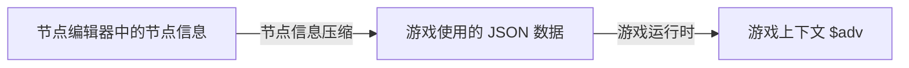

# 节点编辑器

::: tip

🧪 Working in Progress

:::

> 基于 [Vue Flow](https://vueflow.dev/) 定制。

节点编辑器是一个新的设想，通过编辑节点来搭建游戏流程。

而 Fountain/AdvScript 用于描述每个节点中的内容。

## 计划

- [ ] 节点会话流程

## 功能

- 自动布局
- 操作节点
  - 拖拽
  - 缩放
  - 选择
  - 复制
  - 删除
  - 连接
- 修改节点
  - 节点类型
  - 节点内容

## Flow 格式

Flow 是一个节点与边的集合，可在节点编辑器中描述节点信息。

对于最终的游戏来说，会对节点编辑中的 Flow 数据进行简化。

<<< @/../packages/types/src/flow/index.ts

## 节点格式

一组节点构成一个流程，作为一个游戏场景。

一个游戏章节可包含多个场景。

场景即将结束时，根据选择预加载下一个场景。

### 基础节点格式

<<< @/../packages/types/src/flow/node.ts

所有节点继承自基础节点格式。

### 会话节点

- 自动 TTS
- Fountain 文本包含多段人物对话

### 选择节点

- 选项
- 跳转不同节点

### 事件节点

- 设置/修改背景图片
- 设置/修改背景音乐

### 代码节点

- 执行自定义代码

### 其他节点

未来扩展

## Edge 格式

<<< @/../packages/types/src/flow/edge.ts

## 设计想法

我们希望最终的节点信息可以通过节点编辑器编辑与定制。

对于，[xyflow](https://xyflow.com/) 节点库来说，他们将 `nodes` 与 `edges` 分开描述。

```ts
export const initialNodes = [
  {
    id: '1',
    type: 'input',
    data: { label: 'Input Node' },
    position: { x: 250, y: 25 },
  },
  {
    id: '2',
    // you can also pass a React component as a label
    data: { label: 'Default Node' },
    position: { x: 100, y: 125 },
  },
  {
    id: '3',
    type: 'output',
    data: { label: 'Output Node' },
    position: { x: 250, y: 250 },
  },
]

export const initialEdges = [
  { id: 'e1-2', source: '1', target: '2' },
  { id: 'e2-3', source: '2', target: '3', animated: true },
]
```

对于 Flow 的复杂案例，他们需要满足多对多的情况。
且还可能包含节点的位置、缩放、样式等信息，而这部分信息在最终的游戏数据（JSON）中通常是不需要的。

在我们的场景中，节点流通常是一对一的，从 A 节点跳转到 B 节点，而不会从 A 节点同时跳转至 B 和 C 节点。
存在特殊的选择节点，它可能因不同选择而跳转至不同节点，但跳转的目标节点仍是单个。

因此必然仍旧存在一个从节点信息转化为最终游戏 JSON 的过程，以对数据进行压缩。
类似于 `PSD` 到 `JPG` 的转化。



在拿到 JSON 后我们还需一个运行时函数处理，读取 JSON 加载上下文（节点列表），生成相关 Map 和操作函数，方便直接跳转映射节点。

也就是会有三种格式。

1. 原始节点数据
2. 游戏 JSON 数据
3. 游戏运行时节点树（上下文）

对于用户来说，需要关心的通常只有 `2`。

格式 `1`(节点编辑器生成) 与 `3`(游戏运行时生成) 通常是不可见的。

> 可使用 AI 生成数据格式 `2`，在需要编辑时转化成 `1`，运行时会转化成 `3`。
