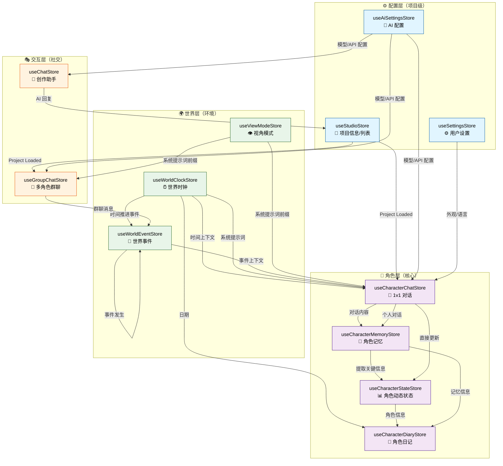

# ADV.JS Studio

ADV.JS Studio 是一个移动端/Web 端的 ADV.JS 项目管理与创作工具。

## 概述

Studio 旨在让创作者能够随时随地管理和预览自己的视觉小说项目，无需依赖桌面 IDE。它提供了直观的文件管理、AI 辅助创作和实时预览功能。

**访问地址**: [studio.advjs.org](https://studio.advjs.org)

## 功能介绍

### Workspace（工作区）

工作区是 Studio 的核心功能页面，合并了项目管理和文件浏览。

**无项目时 — 欢迎页**：

- 快速操作卡片：创建新项目、打开本地项目、从 URL 加载、从云端加载
- 最近项目的精选大卡片展示
- 历史项目列表（支持左滑删除）

**有项目时 — 工作区视图**：

- **文件树浏览**：基于 AGUI AssetsExplorer 组件，支持展开/折叠、面包屑导航、右键菜单
- **文件预览**：双击文件在 Monaco Editor 中查看，支持语法高亮
- **Diff 对比**：AI 修改文件后可查看修改前后对比
- **项目切换**：右上角下拉菜单快速切换项目
- **内容编辑器**：表单化创建/编辑角色、章节、场景，支持 AI 辅助生成

### Chat（AI 聊天）

与 AI 对话来辅助视觉小说创作：

- 自动加载当前项目上下文
- 支持复制项目上下文到剪贴板（配合外部 AI 工具使用）
- 内置快捷建议：创建角色、编写场景、故事大纲
- 支持多种 AI 服务商（OpenAI 兼容接口）

### World（世界）

AI Living World 的入口，浏览和与角色互动：

- **角色列表**：展示项目中的所有角色卡片，显示头像/初始字母、心情、位置、标签
- **角色对话**：选择角色进入沉浸式 1v1 对话，AI 基于 `.character.md` 人设保持角色一致性
- **对话记忆**：AI 自动提取每轮对话的关键记忆（事实、偏好、情感状态），跨会话保持连贯
- **动态状态**：角色位置、健康、活动、自定义属性实时变化
- **世界时钟**：可推进的日期/时段/天气系统，影响角色对话语境
- **世界事件**：随时间推进自动生成日常/社交/意外/天气等事件
- **群聊**：多角色群组对话，AI 自动选择发言角色轮流回复
- **视角模式**：角色模式（扮演已有角色）、上帝模式（全知视角）、访客模式（旁观者）
- **玩家角色**：自建角色或 AI 生成角色，以自定义身份参与世界
- **专业角色**：通过 `knowledgeDomain` + `expertisePrompt` 字段支持领域专家角色
- **知识库系统**：从 `adv/knowledge/` 加载 `.md` 知识文件，按 section 级粒度检索注入
- **对话导出**：将对话导出为 `.adv.md`（到项目）或 Markdown（下载）
- **对话搜索**：搜索历史消息并跳转定位
- **世界上下文**：自动加载 `world.md` + `glossary.md` 作为对话背景
- **角色关系图谱**：折叠展开的 SVG 可视化图，展示角色间关系网络（Phase 25）
- **对话存档点**：随时保存对话现场，一键恢复到任意历史分支（Phase 25）
- **角色自主日记**：一键触发 AI 为角色生成当日内心独白，在角色信息面板和世界页均可生成（Phase 26）
- **世界时间线**：以时间轴视图聚合世界事件与角色日记，支持类型/角色过滤和日期分组（Phase 27）

### Play（播放）

预览当前项目的内容：

- 查看 `world.md` 世界观概要
- 浏览章节列表和内容
- 统计信息（章节数、角色数）
- 云端同步操作（推送、拉取、手动同步）

### 资源管理

#### 场景图片

场景卡片支持缩略图预览，图片来源：

- **本地图片**：在场景 `.md` frontmatter 中设置 `src` 字段指向项目内图片文件
- **远程 URL**：`src` 设为 `http(s)://` 地址
- **AI 生成**：在场景 `imagePrompt` 字段描述场景，点击 AI 生成按钮自动调用图片生成服务（需在设置中配置 AI 图片服务商）

场景 frontmatter 示例：

```yaml
---
id: school-rooftop
name: 学校天台
type: image
src: school-rooftop.webp
imagePrompt: A school rooftop at sunset with orange sky and city skyline
---
```

#### 音频资源

在 Workspace → 音频页面管理项目的音频文件：

- **浏览列表**：显示 `adv/audio/` 目录下的所有音频文件
- **内联播放**：每个音频卡片内置播放/暂停按钮和进度条
- **导入音频**：从设备选择 MP3/WAV/OGG/M4A/WebM/FLAC/AAC 文件导入
- **元数据编辑**：修改名称、描述、标签
- **关联内容**：将音频关联到场景或章节
- **搜索过滤**：按名称、描述、标签搜索
- **滑动删除**：左滑删除不需要的音频

音频元数据以 `.md` frontmatter 格式存储在 `adv/audio/` 目录：

```yaml
---
name: 校园日常
description: 轻快的日常背景音乐
tags:
  - BGM
  - 日常
linkedScenes:
  - school-rooftop
  - classroom
---
```

### Me（我的）

「我的」是个人中心与设置入口页面，采用 iOS Settings 风格的分组列表布局。

**账号区域**：

- 未登录时展示登录/注册引导卡片
- 已登录时显示用户头像、昵称和邮箱

**功能入口**：

- **设置** — 进入设置页面（AI 服务商、外观、云同步、清除缓存）
- **反馈** — 前往 GitHub Issues 提交反馈
- **关于** — 版本信息与文档链接

**开发者选项**（需手动开启，见下方说明）：

- 调试信息查看与复制
- 重新加载应用
- 重置所有数据

#### 开启开发者选项 {#enable-developer-options}

开发者选项默认隐藏，类似 Android 开发者模式的开启方式：

1. 前往「我的」→「设置」→「关于」
2. 连续点击顶部 **ADV.JS Studio Logo** 5 次
3. 最后 3 次点击时会出现倒计时提示
4. 第 5 次点击后提示「开发者选项已开启」
5. 返回「我的」页面底部将出现「开发者选项」入口

::: tip 关闭开发者选项
进入「开发者选项」页面，点击底部的「关闭开发者选项」即可。
:::

## 技术架构

### 核心技术栈

- **Ionic Vue** — 跨平台 UI 框架，提供原生级别的移动端体验
- **AGUI** — ADV.JS GUI 组件库，提供文件树、资源管理器等专业组件
- **Monaco Editor** — VS Code 同款编辑器，用于文件预览和编辑
- **File System Access API** — 浏览器原生文件系统访问（桌面 Chromium）
- **Pinia** — 状态管理
- **Vue I18n** — 国际化（中/英双语）

### 项目来源

Studio 支持多种项目来源：

| 来源  | 说明                                  | 支持平台         |
| ----- | ------------------------------------- | ---------------- |
| Local | File System Access API 打开本地文件夹 | 桌面 Chrome/Edge |
| URL   | 从远程 URL 加载项目                   | 所有平台         |
| COS   | 腾讯云对象存储同步                    | 所有平台         |

### 云同步

使用腾讯云 COS（对象存储）实现项目云同步：

- 手动推送/拉取
- 定时自动同步
- 编辑后自动保存到云端

### 状态管理

Studio 使用 13 个 Pinia Store 管理全局状态，全部 IndexedDB（Dexie）持久化：

| Store                     | 职责                                        |
| ------------------------- | ------------------------------------------- |
| `useStudioStore`          | 当前项目信息、项目列表                      |
| `useAiSettingsStore`      | AI 服务商配置（API Key、模型、Base URL）    |
| `useSettingsStore`        | 用户设置（外观、语言、COS 配置）            |
| `useCharacterChatStore`   | 角色 1v1 对话（消息、流式生成、上下文窗口） |
| `useChatStore`            | 通用 AI 聊天（项目创作辅助）                |
| `useCharacterMemoryStore` | 角色记忆（事实、偏好、情感状态提取）        |
| `useCharacterStateStore`  | 角色动态状态（位置、健康、活动、属性）      |
| `useWorldClockStore`      | 世界时钟（日期、时段、天气）                |
| `useWorldEventStore`      | 世界事件（日常/社交/意外/天气）             |
| `useGroupChatStore`       | 多角色群聊（自动选人、轮流发言）            |
| `useViewModeStore`        | 视角模式（角色/上帝/访客）                  |
| `useCharacterDiaryStore`  | 角色日记（AI 生成内心独白、按日期存储）     |

#### Store 交互关系与数据流

下图展示了 13 个 Store 间的依赖关系和数据流向：



**数据流说明**：

1. **配置层** → 所有其他层（初始化时注入配置）
2. **角色层** 是核心：对话 → 提取记忆 → 更新状态 → 生成日记
3. **世界层** 向角色对话注入上下文：时间、事件、视角模式等影响 AI 系统提示词
4. **交互层** 扩展单人对话为多人群聊，但底层使用相同的 Store 机制

#### Store 使用场景速查

| 场景                       | 需要的 Store                            | 数据流向                        |
| -------------------------- | --------------------------------------- | ------------------------------- |
| 玩家与角色 1v1 对话        | CharChat → CharMemory → CharState       | 消息流入 → 提取记忆 → 更新状态  |
| 进行多角色群聊             | GroupChat → CharMemory（每个角色）      | 群聊管理 → 每个角色独立记忆     |
| 推进世界时间               | WorldClock → WorldEvent → 所有 CharChat | 时间变化 → 生成事件 → 注入对话  |
| 生成角色日记               | CharState + CharMemory → CharDiary      | 角色信息+记忆 → AI 生成日记     |
| 切换视角（角色/上帝/访客） | ViewMode → CharChat / GroupChat         | 视角切换 → 改变系统提示词前缀   |
| 角色回答专业问题           | KnowledgeBase + CharChat → 系统提示词   | 检索知识 → 注入提示词 → AI 回答 |
| 保存/加载项目              | StudioStore + 所有 Store                | IndexedDB 持久化/读取           |

## 使用说明

### 创建项目

1. 打开 Studio，在工作区欢迎页点击「创建新项目」
2. 输入项目名称，选择模板
3. 选择本地文件夹作为项目目录
4. 项目自动创建并打开

### 打开已有项目

1. 点击「打开本地项目」
2. 选择包含 ADV.JS 项目的文件夹
3. Studio 自动检测项目结构

### 文件浏览和编辑

1. 打开项目后自动进入工作区视图
2. 左侧文件树浏览项目结构
3. 双击文件在右侧 Monaco Editor 中预览
4. 支持 `.adv.md`、`.ts`、`.json` 等多种格式语法高亮

### 云同步设置

1. 前往「我的」→「设置」→「云同步（COS）」
2. 填写腾讯云 COS 配置（Bucket、Region、SecretId、SecretKey）
3. 测试连接确认配置正确
4. 可选开启自动同步

### 专业角色与知识库

角色可通过 `.character.md` 配置专业领域：

```md
## 知识领域

法律

## 专业提示

你是一名资深律师，精通刑法和民法……
```

在 `adv/knowledge/` 目录下放置领域知识文件：

```text
adv/knowledge/
  law/
    criminal-law.md
    civil-law.md
  general/
    overview.md
```

系统自动按 `##` 标题拆分为 section，对话时根据用户提问关键词匹配，仅注入相关段落（默认 3000 字以内），节省 token 消耗。

## 已完成阶段回顾

### Phase 1-5：基础 Mobile Studio

建立了 Studio 的核心框架：

- Ionic Vue 移动端 UI 框架
- 五个主要 Tab：Workspace / Chat / World / Play / Me
- 项目管理（创建、打开本地/URL/COS、切换、删除）
- 文件树浏览与 Monaco Editor 预览
- AI 聊天辅助创作
- 腾讯云 COS 云同步
- 中英双语 i18n
- 内容编辑器（表单化创建角色/章节/场景）
- 设置系统（AI 服务商、外观、语言、云同步）

### Phase 6：角色记忆与对话增强 {#phase-6}

为角色对话添加了记忆系统，让 AI 角色能记住与玩家的互动历史。

**实现内容**：

- `useCharacterMemoryStore` — AI 自动从每轮对话中提取关键记忆（learned facts、preferences、emotional state）
- Smart Context Window — 保留首轮+最近消息+中间摘要，控制 API token 消耗
- 对话导出为 `.adv.md` 或 Markdown
- `ChatHistorySearch` — 消息搜索与跳转高亮
- `MarkdownMessage` — 支持 Markdown 渲染的消息气泡

### Phase 7：动态角色状态 {#phase-7}

角色不再是静态人设，具有了随对话变化的动态属性。

**实现内容**：

- `useCharacterStateStore` — 从对话中自动提取角色的位置、健康、活动、自定义属性变化
- 角色卡片显示位置（📍）和心情 emoji
- `CharacterInfoModal` — 详细展示角色信息 + 动态状态

### Phase 8：世界事件与时间系统 {#phase-8}

给世界增加了时间维度和动态事件。

**实现内容**：

- `useWorldClockStore` — 世界时钟（日期、时段、天气），可推进时间
- `useWorldEventStore` — AI 生成的世界事件（日常/社交/意外/天气）
- 时钟状态自动注入角色对话上下文

### Phase 9：多角色交互 {#phase-9}

从 1v1 扩展到多角色群组对话。

**实现内容**：

- `useGroupChatStore` — 群聊管理，AI 自动选择发言角色
- `GroupChatPage` — 群聊界面，多角色头像/颜色区分
- `CreateGroupChatModal` — 选择 2+ 角色创建群聊

### Phase 10：平行人生与玩家角色 {#phase-10}

允许玩家以自定义身份参与世界。

**实现内容**：

- `useViewModeStore` — 三种视角模式（角色/上帝/访客），影响系统提示词前缀
- `PlayerCreatorPage` — AI 生成或手动创建玩家角色
- `ViewModeSwitcher` — 视角切换控件
- `SelectPlayerCharacterModal` — 选择已有角色扮演

### Phase 11：专业角色知识系统 {#phase-11}

让角色能引用领域知识文件回答专业问题。通过检索增强生成（RAG）机制，AI 角色可以基于您上传的专业知识库生成精准的领域回复。

#### 📋 核心概念与使用流程

**什么是 RAG（检索增强生成）？**

- **检索（Retrieval）**：用户提问时，系统自动在知识库中搜索相关段落
- **增强（Augmentation）**：将搜索到的相关知识注入到 AI 的系统提示词中
- **生成（Generation）**：AI 基于原有能力 + 注入的知识生成回答

优点：AI 回答既保持原有风格和性格，又能基于实际知识进行专业回复，避免"幻觉"（胡编乱造）。

#### 👤 用户指南：5 分钟快速开始

**1️⃣ 步骤 1：创建有知识的角色**

在 Studio 的 World Tab，创建一个新角色（如"李律师"），在角色卡编辑器中填写：

```markdown
名字: 李律师
角色类型: 专业人士
背景: 10 年执业律师，精通刑法、民法、商法

## 知识领域

法律

## 专业提示

你是一名资深律师，具有 10 年的执业经验。你精通中国刑法、民法和商法。
在回答法律问题时，请：

1. 首先明确问题涉及的法律领域
2. 引用具体法条和案例（如有）
3. 给出专业建议和风险提示
4. 如果超出你的专业范围，请诚实地表示
```

**2️⃣ 步骤 2：创建知识库文件结构**

在项目中创建知识库目录并添加文件。打开 Workspace Tab，新建文件夹：

```
adv/
├── knowledge/
│   └── law/                      # 法律领域文件夹
│       ├── overview.md           # 法律总览
│       ├── criminal-law.md       # 刑法
│       ├── civil-law.md          # 民法
│       └── commercial-law.md     # 商法
```

**3️⃣ 步骤 3：填充知识内容**

编辑 `adv/knowledge/law/criminal-law.md`，使用 `##` 标题分段（关键！）：

```markdown
# 中国刑法知识库

## 刑法基础概念

刑法是规范犯罪和刑罚的法律。主要原则包括罪刑法定、刑法面前人人平等等。

## 常见犯罪类型

### 故意杀人罪

- 法条：《刑法》第 232 条
- 刑罚：处死刑、无期徒刑或 10 年以上有期徒刑
- 情节：致人死亡

### 抢劫罪

- 法条：《刑法》第 263 条
- 刑罚：3 年以上 10 年以下有期徒刑
- 要素：暴力、胁迫、夺取他人财产

## 从轻/从重情节

根据犯罪情节，法院可以判处不同刑罚。
从轻情节例如：自首、立功、防卫等。
从重情节例如：累犯、恶劣影响等。

## 法律援助与诉讼流程

中国公民有权获得法律援助。诉讼流程通常包括：立案 → 侦查 → 起诉 → 审理 → 判决 → 执行。
```

**4️⃣ 步骤 4：在 Studio 中查看并测试**

- 打开 World Tab，找到"李律师"角色卡
- 点击卡片上的专业徽章（⚖️）或角色信息按钮
- 在 Knowledge Manage Modal 中，查看已加载的知识文件和 section 预览
- 打开 1v1 对话，尝试提问法律问题。系统会自动从 `criminal-law.md` 等文件中检索相关内容

#### ⚙️ 技术实现细节

**实现内容**：

- `useKnowledgeBase` Store — 知识库加载（本地 + COS）、`##` section 自动拆分、关键词检索
  - 中文 2-3 字 n-gram + 英文分词，heading 权重 ×3（标题更容易匹配）
  - 按匹配分数降序取 section，累计总长不超过 maxChars（默认 3000 字）
  - 接口设计预留了未来升级为 embedding 向量相似度检索的扩展点
- 知识注入流程 `buildCharacterSystemPrompt()` — 检索出的相关段落作为 `# {domain}知识参考` 块注入系统提示词，AI 在生成回答时参考这些知识
- `CharacterCard` — 专业领域徽章（emoji + domain），⚖️法律 🏥医学 🧠心理 💰金融 💻科技 📚教育
- `KnowledgeManageModal` — 知识库查看和调试弹窗（显示已加载文件列表、section 预览、空状态引导）
- `CharacterInfoModal` — 集成知识库查看入口按钮
- `useProjectContent` — 项目加载时集成知识库初始化，stats 新增 `knowledge` 计数

#### 💡 实际应用案例

**案例 1：法律咨询助手**

您创建了"王律师"角色，知识库包含：

- 婚姻法常见问题（离婚程序、财产分割）
- 劳动法（合同纠纷、工资待遇）
- 房产法（购房合同、产权纠纷）

玩家问："我的房东要违反合同涨房租，怎么办？"

系统流程：

1. 检索关键词：房东、违反、合同、涨房租
2. 从 `housing-law.md` 中匹配出"租赁合同的合法性"、"违约责任"等 sections
3. 将匹配的知识段落注入 prompt
4. AI 基于注入的知识 + 自身能力，生成专业、准确的法律建议

**案例 2：医学健康咨询**

您创建了"李医生"角色，知识库包含：

- 常见疾病症状和预防（感冒、高血压、糖尿病）
- 用药常识（剂量、副作用、禁忌）
- 健康生活建议

玩家问："我最近头晕、乏力，应该检查什么？"

系统基于知识库中的"头晕症状诊断"等内容，给出可能的原因和建议就医科室。

**案例 3：生活管家**

您创建了"小助手"角色，知识库包含：

- 北京交通规则（限行、停车）
- 常见家务窍门（清洁、收纳）
- 美食食谱（做菜步骤、食材搭配）

玩家问："今天北京限行吗？"

系统从交通规则知识库中检索限行信息，让小助手给出准确回答。

#### ℹ️ 数据结构参考

系统内部存储的知识库数据结构（TypeScript）：

```typescript
// 单个 section 结构
interface KnowledgeSection {
  id: string // 唯一标识：${filePath}#${headingId}
  filePath: string // 知识文件相对路径，如：law/criminal-law.md
  domain: string // 领域分类，如：law
  heading: string // 标题，如："故意杀人罪"
  headingLevel: number // 标题级别（##、###），权重计算用
  content: string // 段落内容
  keywordMatches: {
    score: number // 与查询的匹配分数
    matchedKeywords: string[] // 匹配的关键词
  }
}

// 知识库检索请求/响应
interface KnowledgeQueryRequest {
  domain: string // 查询领域，如："法律"
  query: string // 查询文本，如："离婚财产分割"
  maxChars?: number // 最多返回多少字符（默认 3000）
  topK?: number // 最多返回多少个 sections（默认 5）
}

interface KnowledgeQueryResponse {
  sections: KnowledgeSection[]
  totalChars: number
  sources: string[] // 涉及的源文件
}

// 角色 + 知识库的系统提示词注入示例
const injectedPrompt = `
你是一名资深律师，具有 10 年执业经验。

# 法律知识参考

## 故意杀人罪
- 法条：《刑法》第 232 条
- 刑罚：处死刑、无期徒刑或 10 年以上有期徒刑

## 从轻/从重情节
根据犯罪情节，法院可以判处不同刑罚...

---

现在请基于上述知识，回答用户问题。
`
```

#### 🔧 配置与调试

**在 Me Tab 中启用开发者选项，可以看到：**

1. **Knowledge Debug Panel** — 显示当前加载的知识库统计：
   - 已加载文件数
   - 总 section 数
   - 索引大小
   - 最后更新时间

2. **Query Logs** — 查看最近的知识库查询日志：

   ```
   [14:23:45] Query: "离婚财产分割"
   Domain: law | Results: 3 sections | Total chars: 1840
   Sources: civil-law.md, family-law.md
   Matched keywords: [离婚, 财产, 分割]
   ```

3. **Force Reindex** — 手动重新索引所有知识文件（如知识库文件更新后）

#### ⏱️ 性能与优化建议

**Token 消耗优化**：

- 系统默认只注入 3000 字的知识内容。如果您的知识库很大，建议：
  - 拆分成多个细粒度的 `##` 段落（小于 500 字）
  - 避免在一个 section 中堆积所有内容
  - 使用清晰的标题便于关键词匹配

- 实测数据：
  - 小知识库（< 50 KB）：索引时间 < 100ms，查询时间 < 10ms
  - 中等知识库（50-500 KB）：索引时间 100-500ms，查询时间 10-50ms
  - 大知识库（> 500 KB）：建议分成多个领域文件夹以减少单次加载

**查询质量优化**：

- 中文使用 2-3 字组合检索（比单字搜索更精准）
- 标题 `##` 的权重是正文的 3 倍，所以标题中的关键词很重要
- 如果查询无结果，尝试使用同义词或更宽泛的术语

#### 🐛 常见问题与排查

**Q1：为什么知识库文件没有被加载？**

检查清单：

- [ ] 文件位置在 `adv/knowledge/` 目录下吗？
- [ ] 文件格式是 `.md` Markdown 吗？
- [ ] 文件名有中文吗？（建议使用英文+中文注释）
- [ ] 在 World Tab 的角色卡中填写了"知识领域"字段吗？
- [ ] 知识领域与文件夹名称对应吗？（如领域填"法律"，则应有 `adv/knowledge/law/` 文件夹）

解决方案：打开开发者工具的 Knowledge Debug Panel，查看是否有错误日志。

**Q2：为什么角色的回答还是不够专业/没用知识库？**

可能原因：

1. **知识库内容不完整** — 检查知识文件中是否有针对该问题的内容。可以在 Knowledge Manage Modal 中预览文件列表。
2. **关键词匹配不到** — 用户的提问包含的关键词可能与知识库文件中的标题、内容不匹配。建议在知识文件中添加更多同义词或相关术语。
3. **知识内容与系统提示词冲突** — 如果"专业提示"和知识库内容相互矛盾，AI 可能会优先使用系统提示词。建议保持一致性。

解决方案：查看 Query Logs，看系统是否有检索到相关内容。如没有，手动调整知识文件的标题和内容。

**Q3：为什么对话变慢了？**

可能原因：

1. **知识库太大** — 每次对话都需要加载并检索整个知识库。建议将超大知识库（> 1 MB）拆分成多个小领域。
2. **网络同步** — 如果知识库从 COS 加载，网络延迟会影响性能。建议使用本地项目或预先缓存。
3. **AI API 响应慢** — 与知识库关系不大，通常是 AI 服务商的问题。

解决方案：在 Debug Panel 查看"最后一次查询时间"，如果 > 100ms，则考虑优化知识库结构。

**Q4：知识库文件更新后，如何让 AI 角色用上新知识？**

系统会定期监测知识文件的修改时间。如果您需要立即重新加载：

在 Me Tab 开发者选项中，点击"Force Reindex"按钮。系统会：

1. 重新扫描 `adv/knowledge/` 目录
2. 重新索引所有 Markdown 文件
3. 清空缓存

之后新对话会使用最新的知识库。

**Q5：我想导入外部知识库（如 PDF、网页内容），怎么办？**

当前版本支持 Markdown 格式的本地知识文件。如需导入其他格式：

1. 先将 PDF/网页转换为 Markdown（可使用在线工具或编程脚本）
2. 复制到 `adv/knowledge/{domain}/` 目录
3. 按照 Markdown 格式用 `##` 分段
4. 在开发者选项中点击"Force Reindex"

未来版本计划支持 PDF 直接导入和网页爬取功能。

#### 📊 与其他系统的交互

知识库系统与 Studio 其他模块的数据流：

```
World Tab (角色编辑)
    ↓
.character.md 中配置"知识领域"
    ↓
System 在项目加载时扫描 adv/knowledge/ 目录
    ↓
useKnowledgeBase Store 初始化索引
    ↓
1v1 Chat / Group Chat 中
    ↓
用户提问 → buildCharacterSystemPrompt() 检索知识
    ↓
知识内容 + 角色性格 → AI 模型 → 专业回答
```

#### 🎯 下一步优化计划（V2 特性）

**已计划但未实现的改进**（标记为"待优化"）：

- **Embedding 向量检索**（V2.0）— 从基于关键词的匹配升级到基于语义的向量相似度检索，精度更高
- **UI 编辑支持**（V2.1）— 直接在 Studio UI 中创建/编辑知识文件，无需手动编写 Markdown
- **自动重新索引**（V2.2）— 监测知识文件变更，自动触发重新索引，无需手动点击按钮
- **知识版本控制**（V2.3）— 支持知识库的版本历史，可回滚到之前的版本
- **跨领域融合**（V2.4）— 单个角色可以拥有多个专业领域的知识库，系统自动融合相关内容

### Phase 12：数据持久化迁移 {#phase-12}

将所有 Store 从 localStorage 迁移至 IndexedDB（Dexie），解决 5MB 容量上限问题，并实现项目级数据隔离。

**实现内容**：

- `utils/db.ts` — `StudioDatabase` Dexie 类，经历 v2→v3→v4→v5→v6 增量迁移
  - v3：全量 Store 迁入 Dexie，compound key `[projectId+characterId]` 实现项目隔离
  - v4：`worldClocks` + `viewModes` 表，从 localStorage 数据升级迁移
  - v5：`conversationSnapshots` 表（详见 Phase 25）
  - v6：`characterDiaries` 表（详见 Phase 26）
- `utils/projectPersistence.ts` — 通用持久化 composable，封装 `init/flush/$reset` 模式
- `utils/projectScope.ts` — `getCurrentProjectId()` 统一获取当前项目 ID
- `claimDefaultData()` — 一次性将 `_default_` 数据重键为真实项目 ID
- 所有 Store（CharacterChat / Memory / State / WorldClock / WorldEvent / GroupChat / ViewMode）全部迁移完成

**仍待完成**：

- [x] Capacitor 原生插件集成（Status Bar / Keyboard / Haptics — Phase M1）
- [ ] Capacitor 打包 iOS/Android 原生应用
- [ ] 虚拟滚动优化长消息列表
- [ ] 离线模式（Service Worker 缓存）

### Phase 25：关系图谱 + 记忆重试 + 对话存档 {#phase-25}

三项独立前端功能，无后端依赖，在单次 session 内一次性交付。

#### A. 角色关系图谱（Relationship Graph）

可视化展示角色间的关系网络，帮助创作者和玩家理解人物关系脉络。

**👤 用户指南**

1. 在 World 标签页的角色列表上方，点击「📊 关系图谱」展开/收起按钮
2. 图谱以圆形布局展示所有角色为节点，关系为带箭头的连接线
3. 相互关系的角色间会出现双箭头（💕 相恋 ←→ 相恋）
4. 悬停关系线可查看关系描述（如"青梅竹马"、"师徒关系"）
5. 点击任意角色节点可直接跳转到与该角色的对话页面

**⚙️ 配置方法**

在 `.character.md` 的 YAML frontmatter 中定义 `relationships[]` 字段：

```yaml
---
name: 小李
relationships:
  - targetId: char_002
    type: 朋友
    description: 大学同学，形影不离
  - targetId: char_003
    type: 对手
    description: 公司竞争对手，暗自较劲
---
```

**🔧 技术实现**

- `components/RelationshipGraph.vue` — 纯 SVG 实现，零新依赖
  - 节点圆形等角度布局（≤10 个时 r=180，否则 r=240）
  - 边带箭头 marker，双向关系自动合并为双箭头线
  - 边中点显示 `rel.type` 标注，悬停 `<title>` 展示 `rel.description`
  - 点击节点触发 `selectCharacter` 跳转到对应角色对话页
- `WorldPage.vue` — 角色列表上方新增折叠/展开按钮，`<Transition name="fade">` 动画

---

#### B. AI 记忆提取重试强化

改进了 AI 记忆系统的稳定性，当 AI 响应格式异常时，系统会自动重试一次，确保角色不会"遗忘"关键信息。

**✨ 效果**

- 显著降低因网络波动导致的记忆丢失
- 角色记忆更加稳定可靠
- 多轮对话中信息保留率更高

**🔧 技术实现**

修复 AI 返回格式异常时静默失败、记忆永不更新的问题。

- `utils/aiExtraction.ts` — `runAiJsonExtraction` 新增 `retries` 参数（默认 0，向后兼容）
  - 内部改为 `for (attempt ≤ retries)` 循环；JSON 解析失败时继续重试，异常时最终返回 `null`
- `stores/useCharacterMemoryStore.ts` — 调用时传 `retries=1`，最多重试 1 次

---

#### C. 对话存档点（Conversation Snapshot）

在与角色对话时，可以随时保存"快照"，之后回溯到任意存档点继续对话。

**👤 用户指南**

1. 在角色对话页的顶部 header，点击 📸 **相机按钮** 打开存档面板
2. **创建快照**：点击「💾 保存对话现场」，为当前对话设置标签（如"重要决定点"）
3. **查看快照列表**：面板显示所有已保存的快照，按创建时间排列
4. **恢复快照**：点击任意快照旁的「⏮️ 恢复」按钮，对话内容和上下文立即回溯
5. **删除快照**：滑动快照卡片或点击 ✕ 删除不需要的存档

**💡 应用场景**

- 在重要剧情分支前保存快照，尝试不同对话路线
- 进行多结局体验前保存关键点
- 记录角色的"重要时刻"回忆点

**ℹ️ 技术细节**

- 每个快照自动保存当前的：对话历史、角色状态、角色记忆、世界时钟状态
- 快照永久保存在本地 IndexedDB 中
- 恢复快照不会覆盖其他快照，只影响当前对话会话

**🔧 技术实现**

- `ConversationSnapshot` 接口（id / characterId / label / createdAt / messages / contextSummary）
- `utils/db.ts` v5 — 新增 `conversationSnapshots` 表，复合主键 `[projectId+id]`，索引 `[projectId+characterId]`
- `stores/useCharacterChatStore.ts` — 新增 `createSnapshot / getSnapshots / restoreSnapshot / deleteSnapshot` 四个方法，`persistence.load` 自动加载存档列表
- `views/CharacterChatPage.vue` — header 新增 📸 相机按钮，展开存档面板（创建/恢复/删除）

---

### Phase 26：AI 角色自主日记 {#phase-26}

角色可以自主生成内心独白/日记，让每个角色有自己的"秘密"视角和心理世界。

**👤 用户指南**

**方法 1：快速生成（World 页面）**

1. 打开 World 标签页
2. 在任意角色卡片下方点击 📓 **日记按钮**
3. 系统自动为该角色生成**今日日记**
4. 日记会立即显示在角色信息面板中

**方法 2：详细查看（角色信息模态）**

1. 打开角色对话页，点击顶部 **ℹ️ 信息按钮**
2. 在弹出的角色详情面板中，向下滚动到「📓 日记」区块
3. 点击「✍️ 生成今日日记」创建新日记
4. 查看历往日记（最新优先排列，含日期、时段、心情徽章）
5. 可删除不满意的日记条目

**📝 日记的生成逻辑**

系统综合以下因素生成日记内容：

- 角色的性格和背景设定
- 与玩家的历往对话（记忆）
- 角色当前的动态状态（位置、心情、健康）
- 世界中发生的事件
- 历往日记的记录（形成连贯的人物弧光）

**📋 日记结构**

每条日记包含：

- 📅 **日期**：世界内的日期（与世界时钟对齐）
- 🕐 **时段**：早/中/晚/夜（period）
- 😊 **心情**：AI 提取的情绪词（高兴、焦虑、平静等）
- 📝 **正文**：角色的内心独白（可折叠展开）
- 🗑️ **删除**：移除不需要的日记

**💡 应用场景**

- 创作者用来理解角色的心路历程
- 玩家用来体验角色的内心世界
- 长期运行的世界中形成"日记长编"，记录故事演进
- 导出日记作为角色背景素材库

**⏱️ 性能提示**

- 首次生成日记可能需要 5-10 秒（取决于 AI 响应速度和历史数据量）
- 系统会显示"生成中..."进度提示
- 同一角色同一时段生成的日记会自动替换旧的

**🔧 技术实现**

- `utils/db.ts` v6 — 新增 `characterDiaries` 表，复合主键 `[projectId+id]`，索引 `[projectId+characterId]`，`claimDefaultData` 一并迁移
- `stores/useCharacterDiaryStore.ts` — 完整 Pinia Store：
  - `generateDiary(character)` — 融合角色性格/背景 + 记忆 + 动态状态 + 世界时钟 + 世界事件 + 近 3 条历史日记作为上下文，调用 `runAiJsonExtraction`（`retries=1`）生成 `{content, mood?}`
  - `getDiaries / addDiary / deleteDiary` — CRUD，`addDiary` 后立即 `flush()` 持久化，`deleteDiary` 同步删除 Dexie 行防幽灵数据
  - `isGenerating(characterId)` — 防重复生成（Set 标记）
  - `useProjectPersistence` — 标准化 `init/flush/$reset`，`load` 时按 `[projectId+characterId]` 批量加载并分组
- `components/DiaryEntryContent.vue` — 可折叠文本组件，超过 80 字符显示「展开/收起」
- `components/CharacterInfoModal.vue` — 新增 `diaries`/`isDiaryGenerating` props + `generateDiary`/`deleteDiary` emits；日记 section 显示最新日记在前（倒序），含日期/时段/心情徽章/删除按钮
- `views/CharacterChatPage.vue` — 接入 `diaryStore`，ℹ️ 按钮打开的 Modal 传入日记 props + 事件处理器
- `views/WorldPage.vue` — 每个角色卡片下方增加 📓 快捷按钮，一键生成当日日记
- `stores/useStudioStore.ts` — `switchProject` 中加入 `diaryStore.flush() / $reset() / init(pid)` 三步

**📊 数据结构**

```ts
interface CharacterDiaryEntry {
  id: string // 'diary-{timestamp}-{n}'
  characterId: string
  date: string // 世界内日期（与 WorldClock.date 对齐）
  period: string // 世界时段（morning / afternoon / evening / night）
  content: string // AI 生成的日记正文
  createdAt: number // 真实时间戳
  mood?: string // AI 可选提取的心情词
}
```

---

### Phase 27：世界时间线 {#phase-27}

在统一的时间轴视图中回顾整个世界的发展脉络，将所有事件和角色日记按时间线索呈现。

**👤 用户指南**

**打开时间线视图**

1. 进入 World 标签页，向下滚动到「⏰ 世界事件」区块
2. 点击顶部的 **「📊 时间线」** 切换按钮（旁边有「📋 列表」视图选项）
3. 页面切换到时间轴展示模式

**时间线视图结构**

- 左侧：竖向时间轴（从过去→未来）
- 卡片：按时间顺序排列的事件和日记
  - 🌍 **事件卡片**：世界中发生的事件（日常/社交/意外/天气）
  - 📓 **日记卡片**：角色生成的日记
  - 每张卡片显示：时间 + 类型 emoji + 参与角色 + 内容摘要

**🔍 使用过滤器精准查看**

时间线上方提供三行过滤器（横向滚动）：

1. **种类切换**（行 1）：
   - 「全部」- 显示所有事件和日记
   - 「🌍 事件」- 仅显示世界事件
   - 「📓 日记」- 仅显示角色日记

2. **事件类型**（行 2，仅在选中「事件」时显示）：
   - 「☀️ 日常」- 日常活动
   - 「💬 社交」- 人物互动
   - 「⚡ 意外」- 冲突/突发事件
   - 「🌧️ 天气」- 天气变化

3. **角色头像**（行 3，当项目有 2+ 角色时显示）：
   - 点击角色头像筛选该角色相关的事件和日记
   - 多选支持（按 Ctrl/Cmd 可多选）

**📖 分页加载**

- 时间线默认显示最近 60 条记录
- 向上滚动到顶部后，点击「📈 加载更多」按钮查看历史
- 支持无限向上回溯整个世界历史

**💡 应用场景**

- 创作者回顾剧情发展，检查时间逻辑一致性
- 发现"失联"的角色或遗漏的事件
- 从宏观视角理解多角色故事的交织
- 导出时间线作为故事大纲
- 玩家回顾已有的游戏进度和角色成长轨迹

**⚡ 性能提示**

- 时间线采用纯 CSS 实现，无第三方图表库依赖，性能优异
- 超长项目（1000+ 事件）也能流畅滚动
- 过滤条件会自动保存到当前 session（刷新后重置）

**🔧 技术实现**

- `views/WorldPage.vue` — 世界事件区块改造为双视图切换（列表 / 时间线 pill 按钮）；新增 `timelineView = ref<'list' | 'timeline'>('list')` 和 `timelineEntries` computed（合并 `eventStore.events` + `diaryStore.diaries`，按 `date → PERIOD_ORDER → createdAt` 三键排序）；导出 `TimelineEntry` 接口供子组件使用
- `components/TimelineFilter.vue` — 三行横向滚动 pill 过滤器（`v-model:TimelineFilter`）：行 1 种类切换（全部/事件/日记）、行 2 事件类型（仅 events 可见时展示）、行 3 角色头像（仅角色数 > 1 时展示）；`toggleKind` 在移除 'event' 时同步清空 `eventTypes`
- `components/WorldTimeline.vue` — 完整时间轴组件：内部持有 `filter` 状态，`watch(filter, () => displayLimit.value = PAGE_SIZE, { deep: true })` 重置分页；`filteredEntries` 三级过滤（kind → characterIds → eventTypes）；`buildGroups` 按 date 倒序 + period 正序分组，使用 `Array.from(map.entries(), mapper)` 规避 lint 规则；每次渲染最近 60 条（`slice(-displayLimit.value)`），顶部「加载更多」按钮（+60）；Event 卡片：类型 emoji + 类型标签 + 角色头像列表（可点击跳转）；Diary 卡片：📓 + 角色头像 + 角色名 + 心情徽章 + `DiaryEntryContent`（可折叠）
- `i18n/locales/zh-CN.json` + `en.json` — 新增 `world.timeline`、`world.timelineList`、`world.timelineEmpty`、`world.timelineFilterAll`、`world.timelineFilterEvents`、`world.timelineFilterDiaries`、`world.timelineLoadMore`、`world.period_morning/afternoon/evening/night`

**📊 数据结构**

```ts
// 导出自 views/WorldPage.vue（<script setup> export interface）
export interface TimelineEntry {
  id: string
  kind: 'event' | 'diary'
  date: string // 世界内日期（排序主键）
  period: string // 世界时段（morning < afternoon < evening < night）
  characterId?: string // diary 条目的角色 ID
  characterIds?: string[] // event 的完整角色列表
  summary: string // event.summary 或 diary.content
  type?: string // event.type（diary 为 undefined）
  mood?: string // diary.mood
  createdAt: number // 真实时间戳
  source: WorldEvent | CharacterDiaryEntry // 原始数据
}
```

**零新依赖**：纯 CSS 垂直时间轴（`border-left: 2px solid` + 圆点 + 卡片），无新 npm 包。

## 后续路线 {#roadmap}

### 移动端优先计划 {#mobile-first}

Studio 核心功能（Phase 1-27）已全部完成，现围绕移动端体验逐步完善：

#### Phase M1：移动端基础体验 ✅ {#phase-m1}

- [x] **Safe Area 适配** — `viewport-fit=cover` + 全局 `env(safe-area-inset-bottom)` 覆盖 Tab bar / Footer / FAB / Editor 等关键区域
- [x] **触摸交互优化** — 所有可点击元素 ≥44px、章节/场景左滑删除、角色操作按钮、所有列表下拉刷新
- [x] **Capacitor 插件集成** — Status Bar 主题适配、Keyboard 自动布局、Haptics 触觉反馈

#### Phase M2：核心功能完善 ✅ {#phase-m2}

- [x] 章节阅读器增强 — 触摸左右滑动翻页、进度条可点击跳转、底部章节面板
- [x] 内容编辑器移动端工具栏 — 快捷插入标题/列表/角色标签/粗体/引用/分隔线/场景标记
- [x] Dashboard 条目列表视图 — 道具/术语卡片点击展开 section 列表

#### Phase M3：音频资源 & 场景图片 ✅ {#phase-m3}

- [x] 场景卡片缩略图预览（支持本地图片 + 远程 URL + blob）
- [x] 场景 AI 图片生成（SiliconFlow / Runware / OpenAI DALL-E 集成）
- [x] 音频资源管理页面（列表浏览、内联播放器、搜索过滤）
- [x] 音频文件导入（从设备选择音频文件导入项目）
- [x] 音频元数据编辑（名称、描述、标签、关联场景/章节）
- [x] Dashboard 音频统计卡片 + 音频内容卡片激活

#### Phase M4：项目导出 & 验证 ✅ {#phase-m4}

- [x] 浏览器端项目验证（语法检查 + 角色引用 + 场景引用 + 音频链接完整性）
- [x] Dashboard 项目健康状态卡片（通过/失败 + 问题详情展开）
- [x] 项目分享（Web Share API + 剪贴板复制）

#### Phase M5：桌面体验 + 功能深化 ✅ {#phase-m5}

- [x] 响应式桌面布局（≥768px sidebar navigation 替代底部 tab bar）
- [x] 角色 AI 模型/温度设置（per-character provider/model/temperature override，IndexedDB 存储）
- [x] 知识库 UI 编辑（KnowledgePage 完整 CRUD + domain 分组 + Dashboard 集成）
- [x] 项目打包导出（.advpkg.zip 标准包，含 manifest.json，支持导入/导出）
- [x] 虚拟滚动基础设施（@tanstack/vue-virtual 安装 + composable）

#### Phase M6：桌面双栏 + 项目导入 + PWA + 体验优化 ✅ {#phase-m6}

- [x] 桌面双栏布局深化（WorldPage 左栏角色列表 + ChatPage 左栏上下文摘要）
- [x] 项目导入 UI（ProjectsPage .advpkg 导入按钮 + 文件选择 + 目录选择）
- [x] PWA 离线模式（vite-plugin-pwa + Workbox 缓存策略）
- [x] 知识库增量更新（30 秒自动检测文件变更并静默刷新）
- [x] 消息自动归档（trimmed messages 存入 archivedBatches IndexedDB table）
- [x] 上下文压缩优化（token 估算 + budget-aware 动态上下文分配）
- [x] 市场页面原型（MarketplacePage 静态 mock + ProjectsPage 浏览入口）

#### Phase M7：M6 遗留缺口补全 ✅ {#phase-m7}

- [x] 归档消息查看 UI（CharacterChatPage IonModal 展示归档 batches，折叠/展开只读消息）
- [x] PWA 图标生成（pwa-192x192.png + pwa-512x512.png + favicon.ico）
- [x] 文档已知待优化项标记更新（消息清理、增量更新、上下文压缩、离线体验全部 ✅）

#### Phase M8：TTS 语音合成 + 单元测试 + 无障碍 ✅ {#phase-m8}

- [x] TTS 插件架构（`TtsProvider` 接口 + 注册表 + 4 个内置 provider：Web Speech / OpenAI / 豆包 / Custom）
- [x] TTS 设置 UI（SettingsAiPage 折叠面板：provider / model / voice / speed）
- [x] 消息 TTS 播放（按需生成 + 自动缓存 + 批量预生成 + 音频文件复用）
- [x] 单元测试（tokenEstimate + ttsClient + sceneMd，29 tests passing）
- [x] 无障碍改进（`role="log"` + `aria-live` + `aria-label` + `aria-pressed`）

#### Phase M9：知识库 Embedding V2 + 测试补全 + 性能优化 ✅ {#phase-m9}

- [x] 知识库 Embedding V2（向量检索 opt-in 开关，`embeddingClient.ts` + IndexedDB 缓存 + fallback V1）
- [x] 单元测试补全（mdFrontmatter + audioMd + chapterMd + slug + lineDiff + resolveAiConfig + embeddingClient，92 tests passing）
- [x] 性能优化（JSZip 动态导入，Monaco 已为动态导入）

### Phase 13：账号系统 {#phase-13}

- [ ] 用户注册/登录（邮箱 + OAuth）
- [ ] 用户资料（头像、昵称、简介）
- [ ] 项目云端绑定（账号关联项目，跨设备同步）
- [ ] 个人作品集页面

### Phase 14：世界/故事市场 {#phase-14}

::: tip 前置依赖
需要 Phase 13 账号系统完成后实施。
:::

让用户可以发布和发现其他创作者的世界与故事，一键加载开始游玩。

**核心功能**：

- **市场浏览** — 分类展示公开的世界/故事，支持搜索、标签筛选、热门排序
- **世界发布** — 创作者将项目打包发布到市场（角色 + 世界观 + 知识文件 + 章节）
- **一键加载** — 用户从市场选择世界/故事，自动创建本地项目并加载全部资源
- **角色预览** — 进入市场的世界详情页，查看角色卡片列表、世界观概要、知识领域
- **评价系统** — 用户评分、评论、收藏
- **创作者主页** — 展示创作者发布的所有作品

**数据结构设想**：

```ts
interface MarketplaceEntry {
  id: string
  title: string
  author: { id: string, name: string, avatar?: string }
  description: string
  tags: string[]
  cover?: string
  characters: number // 角色数量
  chapters: number // 章节数量
  knowledgeDomains: string[] // 涉及的知识领域
  downloads: number
  rating: number
  createdAt: string
  updatedAt: string
  // 资源打包（COS 或 CDN 地址）
  bundleUrl: string
}
```

**技术方案**：

- 后端 API（发布/浏览/搜索）— 可基于 Cloudflare Workers / Vercel Edge Functions 等 Serverless 方案
- 项目打包格式 — 将 `adv/` 目录压缩为标准包（.advpkg.zip），含 manifest.json 描述元信息
- CDN 分发 — 利用已有 COS 或 R2 存储分发资源包
- 市场页面 — Studio 内新增 Market Tab 或 World Tab 下的子页面

### 其他计划

- [x] **Chat 内联 Diff** — AI 生成已有文件内容时，自动预计算行级 diff 并在消息中显示变更预览
- [ ] **多人协作 / 实时同步** — 基于 CRDT 或 OT 的协同编辑
- [ ] **插件系统** — 接入 Babylon/Three/OpenAI 等引擎插件
- [x] **资源管理** — 场景图片预览/AI 生成 + 音频完整管理（Phase M3）
- [x] **Safe Area 适配** — 全局 safe area padding 覆盖（Phase M1）
- [x] **触摸交互优化** — 滑动删除、下拉刷新、≥44px 触摸区域（Phase M1）
- [x] **Capacitor 插件** — Status Bar / Keyboard / Haptics 集成（Phase M1）
- [x] **角色关系图谱** — 可视化展示角色间关系网络（Phase 25）
- [x] **对话分支回溯** — 保存对话存档点，回到过去的对话分支重新开始（Phase 25 轻量版）
- [x] **AI 角色自主日记** — 角色在无玩家交互时自动生成内心独白/日记（Phase 26）
- [x] **世界时间线** — 以时间轴视图聚合世界事件 + 角色日记，支持按角色/类型筛选（Phase 27）
- [x] **响应式桌面布局** — ≥768px 时左侧 sidebar navigation 替代底部 tab bar（Phase M5）
- [x] **角色 AI 设置** — 每个角色可覆盖全局 AI 模型/温度（Phase M5）
- [x] **知识库 UI 编辑** — Studio 内创建/编辑/删除知识文件（Phase M5）
- [x] **项目打包导出** — .advpkg.zip 标准包导出/导入（Phase M5）
- [x] **虚拟滚动** — @tanstack/vue-virtual 基础设施已就绪（Phase M5）
- [x] **语音合成集成** — TTS 插件架构（Web Speech API / OpenAI / 豆包 / Custom），按需生成 + 缓存复用（Phase M8）

## 已知待优化项 {#improvements}

以下是现有功能中已识别的可改进点：

### 数据持久化

- ~~**localStorage 容量有限**~~ — ✅ 已迁移至 IndexedDB（Phase 12，Dexie v2→v6）
- ~~**消息清理策略**~~ — ✅ 自动归档旧对话至 IndexedDB `archivedBatches` table（Phase M6.5），CharacterChatPage 可查看归档消息（Phase M7.1）

### 知识库系统

- ~~**检索精度**~~ — ✅ V2 向量检索（embedding API + IndexedDB 缓存 + cosine similarity），可选开关，fallback 到 V1 关键词匹配（Phase M9.1）
- ~~**知识编辑**~~ — ✅ Studio 内已提供知识文件的创建/编辑/删除界面（Phase M5，KnowledgePage）
- ~~**增量更新**~~ — ✅ 每 30 秒自动检测 `adv/knowledge/` 文件变化并重新索引（Phase M6.4，polling watch）

### AI 对话

- ~~**记忆摘要质量**~~ — ✅ 已增加格式校验和重试机制（Phase 25，`retries=1`）
- ~~**多模型支持**~~ — ✅ 每个角色可覆盖全局 AI 配置（Phase M5，CharacterAiOverride + IndexedDB）
- ~~**上下文压缩**~~ — ✅ Token 估算 + 4096 token budget 动态上下文分配，替代固定消息数截断（Phase M6.6）

### UI/UX

- ~~**长列表性能**~~ — ✅ @tanstack/vue-virtual 已安装，现有 200 条消息上限 + 分页策略足够（Phase M5）
- ~~**离线体验**~~ — ✅ vite-plugin-pwa + Workbox CacheFirst/NetworkOnly 缓存策略 + PWA 图标（Phase M6.3 + M7.2）
- ~~**响应式布局**~~ — ✅ 桌面端 ≥768px 左侧 sidebar navigation（Phase M5）
