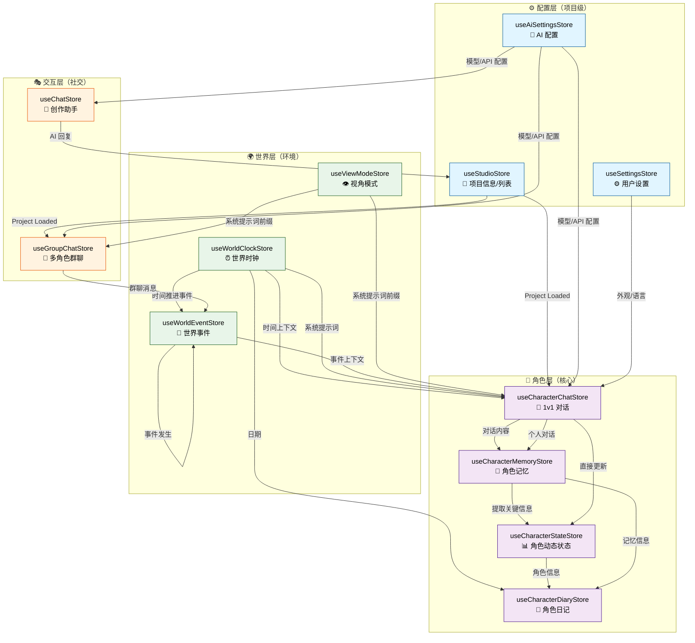

# 技术架构

## 核心技术栈

- **Ionic Vue** — 跨平台 UI 框架，提供原生级别的移动端体验
- **AGUI** — ADV.JS GUI 组件库，提供文件树、资源管理器等专业组件
- **Monaco Editor** — VS Code 同款编辑器，用于文件预览和编辑
- **File System Access API** — 浏览器原生文件系统访问（桌面 Chromium）
- **Pinia** — 状态管理
- **Vue I18n** — 国际化（中/英双语）

## 项目来源

Studio 支持多种项目来源：

| 来源  | 说明                                  | 支持平台         |
| ----- | ------------------------------------- | ---------------- |
| Local | File System Access API 打开本地文件夹 | 桌面 Chrome/Edge |
| URL   | 从远程 URL 加载项目                   | 所有平台         |
| COS   | 腾讯云对象存储同步                    | 所有平台         |

## 云同步

使用腾讯云 COS（对象存储）实现项目云同步：

- 手动推送/拉取
- 定时自动同步
- 编辑后自动保存到云端

## 状态管理

Studio 使用 13 个 Pinia Store 管理全局状态，全部 IndexedDB（Dexie）持久化：

| Store                     | 职责                                        |
| ------------------------- | ------------------------------------------- |
| `useStudioStore`          | 当前项目信息、项目列表                      |
| `useAiSettingsStore`      | AI 服务商配置（API Key、模型、Base URL）    |
| `useSettingsStore`        | 用户设置（外观、语言、COS 配置）            |
| `useCharacterChatStore`   | 角色 1v1 对话（消息、流式生成、上下文窗口） |
| `useChatStore`            | 通用 AI 聊天（项目创作辅助）                |
| `useCharacterMemoryStore` | 角色记忆（事实、偏好、情感状态提取）        |
| `useCharacterStateStore`  | 角色动态状态（位置、健康、活动、属性）      |
| `useWorldClockStore`      | 世界时钟（日期、时段、天气）                |
| `useWorldEventStore`      | 世界事件（日常/社交/意外/天气）             |
| `useGroupChatStore`       | 多角色群聊（自动选人、轮流发言）            |
| `useViewModeStore`        | 视角模式（角色/上帝/访客）                  |
| `useCharacterDiaryStore`  | 角色日记（AI 生成内心独白、按日期存储）     |

### Store 交互关系与数据流

下图展示了 13 个 Store 间的依赖关系和数据流向：

**数据流说明**：

1. **配置层** → 所有其他层（初始化时注入配置）
2. **角色层** 是核心：对话 → 提取记忆 → 更新状态 → 生成日记
3. **世界层** 向角色对话注入上下文：时间、事件、视角模式等影响 AI 系统提示词
4. **交互层** 扩展单人对话为多人群聊，但底层使用相同的 Store 机制

### Store 使用场景速查

| 场景                       | 需要的 Store                            | 数据流向                        |
| -------------------------- | --------------------------------------- | ------------------------------- |
| 玩家与角色 1v1 对话        | CharChat → CharMemory → CharState       | 消息流入 → 提取记忆 → 更新状态  |
| 进行多角色群聊             | GroupChat → CharMemory（每个角色）      | 群聊管理 → 每个角色独立记忆     |
| 推进世界时间               | WorldClock → WorldEvent → 所有 CharChat | 时间变化 → 生成事件 → 注入对话  |
| 生成角色日记               | CharState + CharMemory → CharDiary      | 角色信息+记忆 → AI 生成日记     |
| 切换视角（角色/上帝/访客） | ViewMode → CharChat / GroupChat         | 视角切换 → 改变系统提示词前缀   |
| 角色回答专业问题           | KnowledgeBase + CharChat → 系统提示词   | 检索知识 → 注入提示词 → AI 回答 |
| 保存/加载项目              | StudioStore + 所有 Store                | IndexedDB 持久化/读取           |
