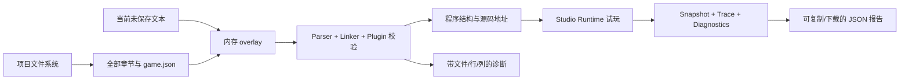
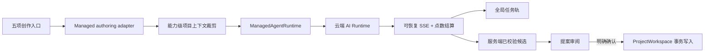

# 技术架构

## 核心技术栈

- **Ionic Vue** — 跨平台 UI 框架，提供原生级别的移动端体验
- **AGUI** — ADV.JS GUI 组件库，提供文件树、资源管理器等专业组件
- **Monaco Editor** — VS Code 同款编辑器，用于文件预览和编辑
- **File System Access API** — 浏览器原生文件系统访问（桌面 Chromium）
- **Pinia** — 状态管理
- **Vue I18n** — 国际化（中/英双语）

## 项目来源

Studio 支持多种项目来源：

| 来源  | 说明                                  | 支持平台         |
| ----- | ------------------------------------- | ---------------- |
| Local | File System Access API 打开本地文件夹 | 桌面 Chrome/Edge |
| URL   | 从远程 URL 加载项目                   | 所有平台         |
| COS   | 腾讯云对象存储同步                    | 所有平台         |

## Runtime 项目兼容层

Studio 按以下优先级发现 `.adv.md` 章节，并在命中第一组后停止，避免同时加载镜像副本：

1. `adv/chapters/**`；
2. `adv/**`；
3. `public/md/chapters/**`；
4. `public/md/**`。

前两种适合 Studio 原生创作项目，后两种兼容 CLI/Vite Demo。发现过程递归处理子目录，因此 `public/md/chapters/1/intro.adv.md` 可以直接进入 Studio 试玩。

Studio 不执行项目中的 `adv.config.ts`。需要在编辑器与试玩中共享的纯数据配置写入 `adv/settings/game.json`：

```json
{
  "title": "仓鼠：星海回声",
  "description": "完整能力示例",
  "variables": { "curiosity": 0, "starMatched": false },
  "requiredPlugins": {
    "star-map": "1.0.0",
    "civilization": "1.0.0"
  }
}
```

可执行插件使用明确的内置允许列表。当前 Studio 只装载随应用发布的 `star-map@1.0.0` 和 `civilization@1.0.0` 及其 Vue renderer，不根据项目文本动态 import 模块。CLI/Vite 项目仍从项目所有者信任的 `adv.config.ts` 静态生成插件 import。

这项限制是 Studio 的安全边界，而不是 Runtime 插件系统的能力上限：浏览器编辑器会读取不受信任的项目内容，因此只允许执行随 Studio 构建、经过审核的官方插件；未知插件仍参与编译校验并产生诊断，但不会被动态下载或执行。

## 创作与调试数据流

Studio 编辑器不会只编译当前文件。项目加载后，`useProjectContent` 持有全部章节；当前未保存的 textarea 内容作为 overlay 替换对应章节，再与 `adv/settings/game.json` 一起编译和链接：


```mermaid
flowchart LR
    FS["项目文件系统"] --> Content["全部章节与 game.json"]
    Buffer["当前未保存文本"] --> Overlay["内存 overlay"]
    Content --> Overlay
    Overlay --> Compiler["Parser + Linker + Plugin 校验"]
    Compiler --> Program["程序结构与源码地址"]
    Compiler --> Diagnostics["带文件/行/列的诊断"]
    Program --> Player["Studio Runtime 试玩"]
    Player --> Inspector["Snapshot + Trace + Diagnostics"]
    Inspector --> Report["可复制/下载的 JSON 报告"]
```

程序结构中的每个规范地址都保留来源文件位置，点击节点或诊断会在当前 textarea 中定位，或导航到另一个章节后再定位。刷新后直接进入 `/editor?file=...` 时，Editor 会先恢复最近项目并等待其文件系统完成加载，避免用空缓冲区覆盖诊断输入。

试玩 Inspector 与普通 ADV.JS 客户端共用 `@advjs/client` 的投影模型和组件，因此地址、变量、舞台、选择、checkpoint、pending activity 与 trace 的定义一致。Studio 只额外负责抽屉交互、国际化，以及把 Program ID/hash、快照、诊断和轨迹序列化为调试报告；报告不携带章节原文和 File System Access handle，但作者变量仍需在分享前人工检查。

## 本地项目与托管资源

Studio 保持 Local-First：章节、角色卡、设置与资源分片通过统一文件系统适配器读写本地项目。`adv/assets.json` 是唯一资源根，可以内联资源，也可以通过 `includes` 引用 `adv/assets/*.json`；Studio 将两种形式规范化为同一个 catalog。本地 Profile 解析为 Blob URL，正式游戏 Profile 解析为 HTTP URL。

二进制资源的托管发布走 CloudBase `advjsAssets`：账号鉴权 → 单对象短期 PUT → 服务端 HEAD 校验 → 私有内容寻址目录。浏览器不持有永久 COS 密钥。旧的“浏览器永久密钥直连 COS 同步整个项目”只保留代码兼容层，不再作为产品入口或推荐部署方式。

## 托管 AI 状态与数据流

Studio 生产版不再使用浏览器 Provider 配置 store。AI 状态分成两层：私有 workspace 模块 `@advjs/agent` 中框架无关的 `AgentRuntime` 负责协议、SSE 恢复和任务状态机；Pinia 只负责把当前任务、点数和提案审阅状态投影到界面。


```mermaid
flowchart LR
    UI["五项创作入口"] --> Authoring["Managed authoring adapter"]
    Authoring --> Context["能力级项目上下文裁剪"]
    Context --> Runtime["ManagedAgentRuntime"]
    Runtime --> Gateway["云端 AI Runtime"]
    Gateway --> Events["可恢复 SSE + 点数结算"]
    Events --> Rail["全局任务轨"]
    Events --> Candidate["服务端已校验候选"]
    Candidate --> Review["提案审阅"]
    Review -->|明确确认| Workspace["ProjectWorkspace 事务写入"]
```

核心职责：

| 模块                    | 职责                                    | 持久化边界                             |
| ----------------------- | --------------------------------------- | -------------------------------------- |
| `useStudioStore`        | 当前项目、项目列表和 workspace 生命周期 | 项目元数据/本地句柄                    |
| `useSettingsStore`      | 外观、语言等非敏感偏好                  | 本地设置                               |
| `useManagedAgentStore`  | 点数、active task、SSE 恢复和取消       | 服务端任务是真源                       |
| `useAgentProposalStore` | 候选预览、显式应用和撤销                | 未确认候选不写项目                     |
| `@advjs/agent`          | 版本协议、错误归一、流恢复和提案审阅    | 私有 workspace 包；不持有 Provider key |

模型、供应商、提示词、价格和安全策略都是服务端配置。生产构建同时扫描模块图和最终 JavaScript；旧 BYOK store、直连客户端或未批准供应商域名一旦进入 bundle 就会构建失败。暂未登记的聊天、抽取、Embedding、图片和 TTS 等能力保持隐藏或 fail closed。用户产品边界见 [Studio 托管 AI 与 Editor 本地 Agent](./ai-service)。
