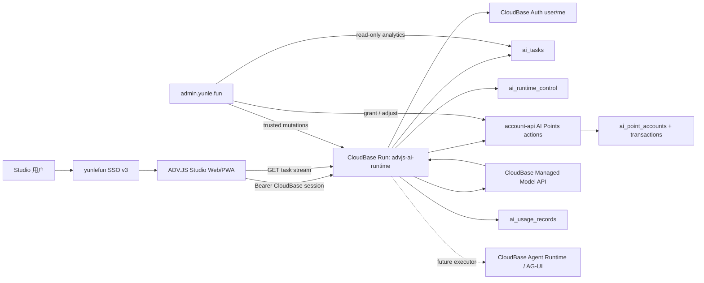
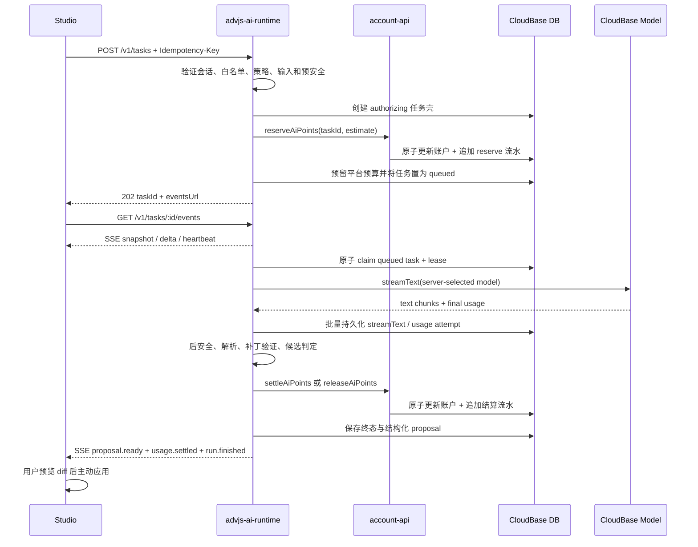

# ADV.JS Studio 托管 AI 与 Beta 点数账本技术设计

> 迁移说明（2026-08-18）：本文保留最初以 `www.yunle.fun/services/advjs-ai-runtime` 为目标的历史设计。共享平台 Runtime 现由 `YunLeFun/api/services/ai-runtime` 承载，ADV.JS v1 兼容层位于 `YunLeFun/api/packages/ai-runtime-advjs`；旧路径不再是当前部署目标。

## 1. 设计结论

首期采用以下架构：

- Studio 通过内部 `AgentRuntime` 契约调用云乐坊托管运行时，不再直接调用模型供应商。
- 云乐坊在 `www.yunle.fun` 仓库新增 TypeScript CloudBase Run Function-mode 服务 `advjs-ai-runtime`，负责 REST、SSE、任务编排和 CloudBase 模型调用。
- 现有 `ai-gateway` Event Function 保持兼容，不原地改运行时，也不承载 ADV.JS 长任务。
- 现有 `account-api` 增加 AI 点数领域模块，作为余额、预占、结算和人工调整的唯一写入口。
- AI 任务、流式文本和最终提案持久化在 CloudBase NoSQL；SSE 只是任务状态的实时投影。
- 首期仅使用 CloudBase 托管 Model API 执行确定性能力；CloudBase Agent Runtime 通过执行器接口预留，但默认关闭。
- 第三方计量、订阅和可观测产品不进入关键链路。

该方案比把现有 Event Function 改造成流式接口多一个独立服务，但避免了三类结构性问题：Event Function 不能直接提供真正的 SSE 运行时、函数运行时不能原地切换、长任务不能把客户端连接生命周期当作任务生命周期。

## 2. 当前事实与约束

### 2.1 ADV.JS Studio

- `apps/studio/src/utils/aiAuthoring/agentRegistry.ts` 目前只是五个生成器的浅层注册表。
- 生成器、聊天、角色聊天、群聊和多个内容页面直接依赖 `useAiSettingsStore` 与 `streamChat`。
- `useAiSettingsStore` 在浏览器保存供应商、模型和多个 API Key。
- `useAuthStore` 仍使用旧式 CloudBase 登录态探测，需要迁移到 `auth.getSession()`。
- Studio 仍有独立短信登录页面，并直接访问 CloudBase 数据、资产和协作能力。
- Editor 已在建设 `ProjectWorkspace` 接口和浏览器/本地适配器；Agent 提案应复用 `ProjectSourcePatch` 语义，而不是另造文件修改协议。

### 2.2 云乐坊服务端

- `www.yunle.fun/cloudfunctions/ai-gateway` 是 Event Function，现有普通用户路径为余额预检、模型生成、成功后扣云币。
- 现有普通路径可能在模型成功但扣费失败时仍返回结果，不满足 AI 点数的强一致结算要求。
- `account-api` 已有成熟的 CloudBase 事务、稳定文档 ID、幂等流水和受信内部 action 模式。
- `@yunlefun/sso` v3 已具备顶层重定向、PKCE、nonce、一次性授权码和 CloudBase custom ticket。
- `admin` 已遵守“钱包只读、余额写操作调用 account-api”的边界。

### 2.3 CloudBase 运行时

- Event Function 适合 SDK 调用与短任务，不适合直接实现浏览器 SSE。
- HTTP Function 可以提供 SSE，但网关时限不适合作为长篇生成任务唯一生命周期。
- CloudBase Run 适合长连接、SSE 和 Agent 服务，并允许使用最小实例降低冷启动。
- CloudBase Model API 的 `streamText()` 可提供文本流，最终 `usage` 用于实际成本计算。
- `ai.createModel()` 接收的是 GroupName；首期使用 `cloudbase`，具体模型由请求参数的 `model` 字段指定。

## 3. 总体架构



### 3.1 请求主链路



## 4. 仓库与模块边界

### 4.1 `YunYouJun/advjs`

建议新增：

```text
apps/studio/src/agent/
├── core/
│   ├── contracts.ts          # 无 Vue/Pinia/CloudBase 的版本化契约与解析器
│   ├── errors.ts             # 稳定客户端错误
│   ├── run-session.ts        # 事件泵与终态结果
│   └── task-store.ts         # 框架无关的恢复、增量和取消状态
├── managed/
│   ├── runtime.ts            # 云乐坊 Gateway runtime
│   └── transport.ts          # authenticated REST/fetch SSE + resume
├── byok-dev/
│   └── runtime.ts            # 仅显式 dev/test import 的本地适配器
├── capabilities/
│   └── catalog.ts            # 五项语义输入与元数据，不含 prompt
├── proposals/
│   └── candidate.ts          # 只读提案候选
└── index.ts                  # 生产入口，不导出 byok-dev
```

现有 `aiAuthoring/agentRegistry.ts` 迁移为能力目录，不再直接绑定生成器。现有生成器按能力逐个改造成 `AgentRuntime` 消费者；在所有入口迁移完成前保留旧代码和特性开关。

### 4.2 `YunLeFun/www.yunle.fun`

建议新增：

```text
services/advjs-ai-runtime/
├── src/
│   ├── server.ts             # REST/SSE 与精确 CORS
│   ├── auth.ts               # CloudBase access token 验证
│   ├── task-service.ts       # 创建、查询、取消、恢复
│   ├── worker.ts             # lease claim 与恢复循环
│   ├── billing-port.ts       # account-api 受信调用
│   ├── budget-store.ts       # 平台预算预留/结算
│   ├── model-executor.ts     # CloudBase streamText
│   ├── agent-executor.ts     # 后续 AG-UI 适配，首期关闭
│   ├── pricing.ts            # 整数成本计算
│   ├── safety.ts             # 前置/后置安全策略
│   ├── capabilities/         # ADV.JS 服务端 prompt、schema、parser
│   └── repositories/         # CloudBase NoSQL 适配
└── package.json

cloudfunctions/account-api/
├── ai-points.js              # AI 点数领域服务
├── ai-points-routing.js      # 登录态/内部/管理员 action
└── index.js                  # 只增加路由，不嵌入领域实现
```

根工作区增加 `services/*`，使运行时使用统一 pnpm、测试和依赖策略。

现有 `cloudfunctions/ai-gateway` 不在首期重写；它继续服务已有应用。等 ADV.JS 路径稳定后，再评估是否把通用能力迁入新运行时。

### 4.3 `YunYouJun/admin`

建议新增：

```text
server/types/ai-runtime.ts
server/api/ai-runtime/**
server/utils/ai-runtime.ts
app/pages/ai-runtime/index.vue
```

后台允许直接读取 AI 任务、用量和流水集合做查询与聚合；所有余额、赠送、退款和调账写操作必须调用 `account-api`；模型、熔断和能力开关必须调用 `advjs-ai-runtime` 的受信管理接口并产生审计记录。

## 5. Studio 内部 Agent 契约

### 5.1 核心接口

核心契约只依赖 TypeScript 数据结构和 `ProjectSourcePatch`：

```ts
export type AgentCapabilityId
  = | 'generate-outline'
    | 'generate-chapter-draft'
    | 'suggest-plot'
    | 'simulate-roleplay'
    | 'check-consistency'

export interface AgentRequest<TInput> {
  capability: AgentCapabilityId
  clientRequestId: string
  input: TInput
  locale: string
  project: {
    id: string
    revision: string
    files: Record<string, string>
  }
}

export interface AgentRuntime {
  start: <TInput>(request: AgentRequest<TInput>) => Promise<AgentRun>
  resume: (taskId: string, cursor?: string) => Promise<AgentRun>
  getTask: (taskId: string) => Promise<AgentTaskSnapshot>
  cancel: (taskId: string) => Promise<void>
}

export interface AgentRun {
  taskId: string
  events: AsyncIterable<AgentEvent>
  result: Promise<AgentResult>
}

export interface AgentResult {
  taskId: string
  proposal?: {
    summary: string
    patches: readonly ProjectSourcePatch[]
    diagnostics: readonly AgentDiagnostic[]
  }
  usage: AgentUsageSummary
}
```

### 5.2 契约原则

- 核心层不知道 Pinia、Vue、CloudBase、DeepSeek、AG-UI 或 HTTP。
- 能力输入是语义化数据，不允许生产客户端传入供应商、模型、系统提示词或价格。
- 项目上下文只发送该能力需要的文件，并受服务端大小和路径白名单限制。
- 结果统一为只读提案；`AgentRuntime` 没有写文件方法。
- `applyProposal` 在用户确认后调用项目工作区，并在副本上先执行 `applyProjectPatches` 与重新编译。
- `@advjs/agent` 仍不发布；只有 Editor 本地运行时和 Studio 云端运行时都稳定后才提取。

### 5.3 服务端能力注册表

服务端为每个 capability 固定维护：

- 输入 schema 与最大尺寸；
- 允许读取的项目路径模式；
- prompt builder 与 `promptVersion`；
- 输出 schema/parser；
- `maxOutputTokens`、temperature 和重试策略；
- 执行器类型 `model | agent`；
- 前置与后置安全策略；
- 价格估算参数和能力开关。

首期五个能力全部配置为 `model`。Embedding 作为独立内部能力接入相同 Gateway，但不暴露给最终用户选择模型。

## 6. API 设计

公共前缀：`/v1`。所有用户接口要求 `Authorization: Bearer <CloudBase access token>`，并校验精确 Origin。

### 6.1 创建任务

```http
POST /v1/tasks
Idempotency-Key: <clientRequestId>
Content-Type: application/json
```

请求：

```ts
interface CreateTaskRequest {
  capability: AgentCapabilityId
  protocolVersion: 1
  locale: string
  input: unknown
  project: {
    id: string
    revision: string
    files: Record<string, string>
  }
}
```

响应：

```ts
interface CreateTaskResponse {
  taskId: string
  status: 'authorizing' | 'queued'
  reservedMicroPoints: number
  eventsUrl: string
}
```

同一用户和 `Idempotency-Key` 重试时必须返回同一个任务，不得再次预占。

### 6.2 查询与恢复

```http
GET /v1/tasks/:taskId
GET /v1/tasks/:taskId/events
```

SSE 使用 authenticated `fetch()` 而不是原生 `EventSource`，因为需要携带 Authorization。恢复请求携带 `Last-Event-ID` 或 `?cursor=`。

### 6.3 取消

```http
POST /v1/tasks/:taskId/cancel
Idempotency-Key: <cancelRequestId>
```

取消只改变服务端任务状态并触发 `AbortSignal`；它不回滚已生成的供应商用量。

### 6.4 点数查询

```http
GET /v1/points/me
GET /v1/points/me/transactions?cursor=<cursor>
```

运行时只代理本人查询；写操作仍走受信的 `account-api` 内部 action。

### 6.5 管理接口

```http
GET  /internal/v1/policy
POST /internal/v1/policy
POST /internal/v1/tasks/:taskId/reconcile
POST /internal/v1/runtime/sweep
```

管理接口使用独立服务凭证、精确 audience 和审计，不复用普通用户 token。

## 7. SSE 与任务恢复

### 7.1 领域事件

```ts
type AgentEvent
  = | { type: 'run.started', taskId: string }
    | { type: 'text.delta', taskId: string, delta: string, offset: number }
    | { type: 'state.snapshot', task: AgentTaskSnapshot }
    | { type: 'proposal.ready', proposal: AgentProposal }
    | { type: 'usage.settled', usage: AgentUsageSummary }
    | { type: 'run.finished', taskId: string }
    | { type: 'run.failed', taskId: string, error: AgentError }
    | { type: 'heartbeat', at: number }
```

这些是 ADV.JS 领域事件，不把 CloudBase SDK 或 AG-UI 类型直接暴露给 Studio。后续 Agent 执行器负责把 `RUN_STARTED`、`TEXT_MESSAGE_CONTENT`、`STATE_SNAPSHOT` 等 AG-UI 事件映射到该联合类型。

### 7.2 首期持久化策略

首期不增加逐事件集合。`ai_tasks` 保存：

- 累积 `streamText`；
- `streamRevision` 与字符 offset；
- 最新状态、候选提案和结算摘要。

Worker 每 250–500ms 或累计约 1 KiB 批量更新一次。SSE 连接轮询任务版本，并根据客户端 offset 从完整 `streamText` 中补发缺失片段。这样页面刷新、网络切换和重复连接都不会影响任务执行或产生重复扣费。

如果后续需要工具调用全历史、多人共同观察或高并发，再引入 `ai_task_events` 追加日志；首期不提前承担该复杂度。

## 8. 任务状态机

### 8.1 主状态

```text
authorizing -> queued -> running -> settling -> completed
      |          |          |          |
      v          v          v          v
    failed     cancelled   blocked   reconcile_required
                   \          /
                    -> failed
```

具体状态：

- `authorizing`：任务壳已建立，正在完成点数和平台预算预留。
- `queued`：所有预留完成，可被 Worker 领取。
- `running`：Worker 已持有租约，正在执行模型或解析。
- `settling`：用量已落库，正在结算或释放点数。
- `completed`：存在可用提案，账务已结算。
- `cancelled`：用户取消，账务已按已产生用量结算或释放。
- `blocked`：安全策略阻止交付且用户未被扣点。
- `failed`：没有可用候选且点数已释放。
- `reconcile_required`：供应商用量或账户结算结果不确定，保持预留并等待对账。

### 8.2 任务租约

Worker 使用 CloudBase 事务领取任务：

```text
status = queued
或 status = running 且 leaseExpiresAt < now
```

领取时写入 `leaseOwner`、`leaseExpiresAt` 和 `attempt`。执行期间续租；实例退出后其他实例可恢复。每个模型 attempt 写稳定用量记录，恢复时不会重复结算已经确认的 attempt。

CloudBase Run 首期建议 `MinNum = 1`，降低冷启动并保证队列恢复循环持续运行；真实部署仍需要单独确认成本。

### 8.3 用户并发

`ai_point_accounts.activeTask` 是并发 1 的权威锁。预占事务发现未过期的其他 active task 时拒绝新任务；任务结算或释放时原子清除。过期 active task 由 sweep/reconcile 流程恢复，而不是由客户端直接覆盖。

## 9. 数据模型

所有新增集合均为 server-only/`ADMINONLY`。浏览器不得直接读写。

### 9.1 `ai_point_accounts`

```ts
interface AiPointAccountDocument {
  _id: string
  userId: string
  access: 'beta' | 'disabled'
  availableMicroPoints: number
  reservedMicroPoints: number
  lifetimeGrantedMicroPoints: number
  lifetimeChargedMicroPoints: number
  activeTask?: {
    taskId: string
    reservedMicroPoints: number
    expiresAt: number
  }
  daily: {
    dateKey: string
    acceptedTasks: number
    reservedMicroPoints: number
    chargedMicroPoints: number
  }
  version: number
  createdAt: number
  updatedAt: number
}
```

不保存积分批次、到期时间或 cost basis。首次赠送额度来自运行时策略配置，通过 `beta_grant` 流水发放，不在代码里写死。

### 9.2 `ai_point_transactions`

```ts
type AiPointTransactionType
  = 'beta_grant'
    | 'reserve'
    | 'settle'
    | 'release'
    | 'refund'
    | 'adjust'

interface AiPointTransactionDocument {
  _id: string
  userId: string
  appId: string
  scope: string
  taskId?: string
  type: AiPointTransactionType
  availableDelta: number
  reservedDelta: number
  chargedMicroPoints: number
  availableAfter: number
  reservedAfter: number
  idempotencyKey: string
  actor: 'system' | 'admin'
  reason?: string
  meta: Record<string, string | number | boolean>
  createdAt: number
}
```

`_id` 由用户、类型和幂等键稳定派生。交易完成后不可修改；退款、纠正和补偿使用新流水。

### 9.3 `ai_usage_records`

每个上游 attempt 一条记录：

```ts
interface AiUsageRecordDocument {
  _id: string
  taskId: string
  userId: string
  appId: string
  capability: AgentCapabilityId
  attempt: number
  providerGroup: string
  model: string
  providerRequestId?: string
  usage: {
    inputTokens: number
    outputTokens: number
    cachedInputTokens?: number
    reasoningTokens?: number
    totalTokens: number
  }
  pricingSnapshot: {
    version: string
    billingUnit: number
    inputMicroCnyPerUnit: number
    outputMicroCnyPerUnit: number
    cachedInputMicroCnyPerUnit?: number
    reasoningMicroCnyPerUnit?: number
    userRateBps: number
  }
  providerCostMicroCny: number
  userChargeMicroPoints: number
  billingResponsibility: 'user' | 'platform' | 'pending'
  outcome: 'success' | 'retry' | 'error' | 'cancelled' | 'blocked'
  createdAt: number
}
```

自动重试、平台失败、解析失败和安全拦截可以产生真实供应商成本，但其 `billingResponsibility` 必须是 `platform`。

### 9.4 `ai_tasks`

```ts
interface AiTaskDocument {
  _id: string
  userId: string
  appId: 'advjs-studio'
  scope: string
  capability: AgentCapabilityId
  protocolVersion: 1
  clientRequestId: string
  projectId: string
  projectRevision: string
  requestHash: string
  request: Record<string, unknown>
  status: AiTaskStatus
  billingStatus: 'none' | 'reserved' | 'settled' | 'released' | 'reconcile_required'
  reservedMicroPoints: number
  promptVersion: string
  policyVersion: string
  pricingVersion: string
  executor: 'model' | 'agent'
  streamText: string
  streamRevision: number
  candidate?: {
    summary: string
    patches: ProjectSourcePatch[]
    diagnostics: AgentDiagnostic[]
  }
  usageSummary?: {
    providerCostMicroCny: number
    chargedMicroPoints: number
  }
  cancelRequestedAt?: number
  leaseOwner?: string
  leaseExpiresAt?: number
  startedAt?: number
  completedAt?: number
  expiresAt: number
  createdAt: number
  updatedAt: number
}
```

任务请求只保存该能力必需的项目片段，不保存整个项目归档。请求、流式文本和候选结果首期默认保留 7 天并由 sweep 删除；账务记录不保存正文。

### 9.5 `ai_runtime_control`

同一集合保存两类文档：

```ts
interface AiRuntimePolicyDocument {
  _id: 'policy:active'
  enabled: boolean
  version: string
  betaOnly: true
  initialGrantMicroPoints: number
  perUserDailyTaskLimit: 20
  perUserDailyChargeLimitMicroPoints: 500_000
  globalDailyProviderCapMicroCny: 50_000_000
  providerGroup: 'cloudbase'
  model: string
  pricing: PricingSnapshot
  capabilities: Record<AgentCapabilityId, CapabilityPolicy>
  updatedBy: string
  updatedAt: number
}

interface AiRuntimeDailyBudgetDocument {
  _id: `budget:${string}`
  dateKey: string
  reservedProviderCostMicroCny: number
  actualProviderCostMicroCny: number
  version: number
  updatedAt: number
}
```

平台预算对单次任务按“单次最大估算 × 最大自动尝试次数”预留；用户点数只为最多一个用户应付 attempt 预留。这样自动重试由平台承担，也不会绕过 ¥50 硬上限。

### 9.6 索引

| 集合                    | 索引                                                                         |
| ----------------------- | ---------------------------------------------------------------------------- |
| `ai_point_accounts`     | `userId` 唯一                                                                |
| `ai_point_transactions` | `userId + createdAt DESC`；`taskId + createdAt`；`idempotencyKey`            |
| `ai_usage_records`      | `taskId + attempt` 唯一；`userId + createdAt DESC`；`model + createdAt DESC` |
| `ai_tasks`              | `userId + status + createdAt DESC`；`status + leaseExpiresAt`；`expiresAt`   |
| `ai_runtime_control`    | 仅稳定 `_id` 访问                                                            |

## 10. 点数计算与事务

### 10.1 单位

```text
1 AI 点 = 1000 microPoints
1 microPoint = ¥0.000001 的用户计价单位
1 云币 = 100 AI 点 = 100,000 microPoints
```

所有金额必须是非负安全整数，所有乘除使用整数算法。禁止使用 JavaScript 浮点小数保存账务值。

### 10.2 成本公式

对每个互斥 usage bucket：

```text
bucketCostMicroCny = ceil(usage × priceMicroCnyPerUnit / billingUnit)
providerCostMicroCny = sum(bucketCostMicroCny)
userChargeMicroPoints = ceil(providerCostMicroCny × userRateBps / 10,000)
```

Beta 默认：

```text
userRateBps = 10,000
fixedCapabilityFee = 0
minimumCharge = 0
```

即用户点数按实际供应商成本 1:1 映射，不额外加价。未来如果调整价格，只能新建 policy/pricing version；历史 usage 必须保留调用时快照。

### 10.3 预占事务

`reserveAiPointsForUser` 在一个 CloudBase 事务中：

1. 验证 `access === beta`。
2. 切换东八区 `dateKey` 并重置当日计数。
3. 检查 `activeTask`、每日任务数、每日已扣 + 已预留额度。
4. 检查可用余额。
5. `available -= estimate`，`reserved += estimate`。
6. 设置 `activeTask` 并更新当日预留。
7. 追加稳定 ID 的 `reserve` 流水。

重复请求读取已有流水并返回相同结果。

### 10.4 结算事务

若预占 `R`、用户实际应付 `A`：

```text
availableDelta = R - A
reservedDelta = -R
chargedMicroPoints = A
```

同一事务更新余额、当日预留/消费、生命周期累计、清除 active task 并写入 `settle` 流水。

若任务没有可用候选且应由平台承担，则执行 `release`：

```text
availableDelta = R
reservedDelta = -R
chargedMicroPoints = 0
```

### 10.5 不确定结算

- 如果取消后 CloudBase 未返回最终 usage，不猜测 Token，也不立即释放。
- 如果供应商调用完成但 account-api 响应丢失，先按幂等键重读结算结果。
- 仍无法确定时，任务进入 `reconcile_required`，保留预占并阻止该用户继续创建任务。
- sweep 根据 provider request ID、usage 记录和交易流水完成结算或释放。
- 自动恢复超过阈值后才进入人工处理，禁止静默吞掉账务错误。

### 10.6 计费责任矩阵

| 结果                           | 用户结算                        | 平台成本记录                |
| ------------------------------ | ------------------------------- | --------------------------- |
| 成功产生并通过验证的可用候选   | 按最终成功 attempt 的实际 usage | 正常记录                    |
| 用户取消且已经产生供应商 usage | 按取消前实际 usage              | 正常记录                    |
| 用户主动重新生成               | 新任务独立预占和结算            | 正常记录                    |
| 服务端自动重试                 | 用户最多承担最终成功 attempt    | 额外 attempt 标记为平台承担 |
| 上游失败且无可用候选           | 全额释放                        | 已发生用量由平台承担        |
| parser/schema/编译失败         | 全额释放                        | 已发生用量由平台承担        |
| 安全策略阻止交付               | 全额释放                        | 已发生用量由平台承担        |
| usage 或结算结果不确定         | 暂时保持预占                    | 进入对账，不猜测金额        |

## 11. 认证与授权

### 11.1 Studio SSO

1. 在 SSO Registry 注册 `advjs-studio-web`、精确生产/开发 HTTPS Origin 和 redirect URI。
2. 登录按钮调用 `startSsoRedirect()`。
3. 回跳调用 `consumeSsoRedirect()` 与 `adoptSsoCode()`，把 CloudBase custom ticket 采用到 Studio 当前持久化 CloudBase Auth 实例。
4. 登录判断只使用 `auth.getSession()` 的 `data.session`，并拒绝匿名用户。
5. 迁移期间保留已有 CloudBase 会话兼容，但新登录入口只展示云乐坊 SSO；Beta 白名单仍是托管 AI 的第二道授权。

首期选择持久化 CloudBase session，是因为 Studio 仍直接使用 CloudBase 数据、资产和协作。未来这些访问迁移到 BFF 后，再切换 `adoptSsoIdentityProof()` + host-only opaque session，并清除临时 CloudBase 会话。

### 11.2 Runtime 用户验证

- Studio 从 `auth.getSession()` 读取 access token，经 Authorization header 发送。
- Runtime 调用 CloudBase Auth `user/me` 校验 token，不接受客户端传入 uid。
- Runtime 校验非匿名身份、账户状态、Beta access 与精确 Origin。
- CORS 只允许登记的 Studio Origin，并返回 `Vary: Origin`；不使用 `*`。

### 11.3 服务间权限

- Runtime 调用 `account-api` 使用独立 `ADVJS_AI_ACCOUNT_API_TOKEN`。
- Admin 调用 Runtime 管理接口使用独立 audience/凭证。
- Runtime 使用 CloudBase server API Key 或受管凭证访问 Node SDK，凭证只放部署环境变量。
- 数据库安全规则拒绝浏览器直接访问所有新增集合。
- 日志只记录 taskId、requestId、模型、状态和用量，不记录完整 prompt、作品正文、token 或密钥。

## 12. 模型与 Agent 路由

### 12.1 首期 Model Executor

- 部署前必须查询资源点套餐/资源包状态；存量环境同时兼容检查旧 Token Credits。CloudBase 已于 2026-06-18 下架旧 Token 资源包，资源点套餐可抵扣大模型 Token。
- 必须通过 `DescribeAIModels` 验证 `cloudbase` GroupName 和目标 model 已启用。
- 若需启用模型，先通过 `DescribeManagedAIModelList` 获取精确模型 ID、规格和 `ModelChargingInfo`，并在单独上线确认后更新。
- 运行时代码使用 `ai.createModel('cloudbase')`，具体模型来自服务器 policy。
- `streamText()` 的最终 `usage` 是每次 attempt 的实际用量真源。

### 12.2 后续 Agent Executor

只有满足以下任一条件的能力才迁入 CloudBase Agent Runtime：

- 需要多轮工具调用；
- 需要跨步骤持久状态；
- 需要服务端工具执行或客户端工具暂停/继续；
- 使用 AG-UI state snapshot/delta 能显著简化交互。

Agent Executor 将 AG-UI 事件归一化为 ADV.JS `AgentEvent`，任务、账本、限额和安全流程不变。Studio 不直接连接第二个 Agent endpoint。

## 13. 安全与结果判定

### 13.1 双阶段安全

- 前置检查：拒绝明确禁止的请求，避免无意义供应商成本。
- 后置检查：在提案交付前检查生成结果。
- 被安全策略阻止且无可用候选时，usage 记为平台承担，用户预占全额释放。
- 客户端只收到稳定原因码，如 `CONTENT_BLOCKED_MINOR`、`CONTENT_BLOCKED_NON_CONSENSUAL`、`CONTENT_BLOCKED_POLICY`。

### 13.2 可用候选定义

只有同时满足以下条件才算可用候选并向用户结算：

1. 上游调用成功并有非空结果；
2. capability parser/schema 验证通过；
3. 生成的路径在白名单内；
4. 在项目副本上应用补丁成功；
5. ADV.JS 重新编译没有新增阻断性错误；
6. 后置安全检查通过。

用户是否点击“应用”不影响结算。

## 14. 界面设计规格

本节只约束新增 AI 与点数交互，不重做 Studio 整体视觉系统。

```text
DESIGN SPECIFICATION
====================
1. Purpose Statement:
   让创作者清楚看到 AI 正在做什么、预计/实际消耗、生成结果会修改哪些文件，
   并始终由用户决定是否应用。界面必须让等待、恢复、失败和账务状态可理解。
2. Aesthetic Direction:
   Industrial/utilitarian authoring console，叠加 ADV.JS「紫幕金章」品牌语言。
3. Color Palette:
   Royal Purple #7C3AED（既有品牌主色，明确覆盖通用禁用紫色规则）
   Adventure Gold #F59E0B（点数/成本强调）
   Ink #111827（正文）
   Canvas #FAFAFA / Night #0F0F1A（明暗背景）
   Emerald #10B981 与 Red #EF4444（成功/风险）
4. Typography:
   复用现有 --adv-font-family；代码与 diff 使用 Fira Code / SF Mono fallback。
   这是既有产品设计系统的窄范围覆盖，不在本功能另引字体。
5. Layout Strategy:
   桌面端使用右侧任务轨道 + 主区非对称 diff；移动端使用底部任务 sheet。
   消耗与状态固定在任务轨道，提案摘要和文件 diff 占主视觉区域。
```

### 14.1 Studio 交互面

1. **登录页**：主操作变为“使用云乐坊账号继续”，不再把短信表单作为默认入口。
2. **AI 任务轨道**：展示排队、运行、恢复、取消、失败、完成和实际点数；不展示模型选择。
3. **提案审查**：文件列表、摘要、逐文件 diff、诊断、应用和撤销；默认不自动应用。
4. **AI 服务设置**：替换供应商/API Key 表单，只展示登录状态、AI 点数、当日额度、服务状态和消费记录入口。

### 14.2 状态文案

- 预占显示为“暂时冻结，完成后按实际用量结算”。
- 断线显示为“实时连接已断开，任务仍在云端继续”，随后自动恢复。
- 平台失败明确显示“未扣 AI 点数”。
- 结果成功显示实际 AI 点数，不暴露供应商成本和内部价格系数。
- 熔断显示“今日测试额度已用尽”，不提示用户反复重试。

### 14.3 图标与可访问性

- 继续使用项目现有 Ionicons/Iconify，不使用 emoji 作为状态图标。
- 状态不能只依赖颜色，必须有文字与图标。
- 流式区域使用 `aria-live="polite"`，但对高频 token 做节流，避免读屏器持续打断。
- 所有主要操作保持至少 44px 触控区域，并支持 `prefers-reduced-motion`。

## 15. Admin 控制面

首期页面包含：

- 总开关、模型/能力开关、策略版本和更新时间；
- 今日供应商实际成本、已预留成本、¥50 上限；
- 用户任务数、AI 点数消耗、模型和能力维度统计；
- `reconcile_required` 任务队列；
- 用户赠送、退款和人工调整入口；
- 任务详情、usage attempts 和关联流水。

写操作规则：

- 赠送/退款/调账调用 `account-api`，并强制填写原因。
- Kill switch、模型和能力开关调用 Runtime 内部管理接口。
- 所有管理写操作记录管理员、请求 ID、变更前后摘要和时间。
- 后台不得直接更新 `ai_point_accounts.availableMicroPoints`。

## 16. 错误模型

客户端只依赖稳定错误码：

| 类别      | 示例                                                       | 是否重试                   |
| --------- | ---------------------------------------------------------- | -------------------------- |
| 身份      | `AUTH_REQUIRED`、`BETA_ACCESS_REQUIRED`                    | 登录/申请后重试            |
| 余额/额度 | `POINTS_INSUFFICIENT`、`USER_DAILY_LIMIT`                  | 否                         |
| 平台预算  | `PLATFORM_DAILY_LIMIT`、`AI_DISABLED`                      | 否                         |
| 并发      | `ACTIVE_TASK_EXISTS`                                       | 恢复现有任务               |
| 内容      | `CONTENT_BLOCKED_*`                                        | 修改内容后新建任务         |
| 上游      | `MODEL_RATE_LIMITED`、`MODEL_UNAVAILABLE`                  | 由服务端自动重试或稍后重试 |
| 账务      | `BILLING_RECONCILE_REQUIRED`                               | 等待对账，不新建任务       |
| 协议      | `INVALID_CAPABILITY_INPUT`、`PROTOCOL_VERSION_UNSUPPORTED` | 升级客户端/修正输入        |

服务端错误消息不得包含供应商密钥、完整上游响应、内部 prompt 或数据库结构。

## 17. 测试策略

### 17.1 `advjs`

- 核心 Agent 契约与能力映射单元测试。
- authenticated fetch SSE 分帧、断线、cursor 恢复和重复事件测试。
- managed/byok-dev 两种 runtime 的契约测试。
- 提案在项目副本校验、确认应用和撤销测试。
- SSO 回跳、`getSession()` 非匿名判断和旧会话迁移测试。
- UI 测试覆盖登录、预占、流式、取消、失败、恢复、应用与点数展示。

### 17.2 `www.yunle.fun`

- `ai-points` 纯领域测试：赠送、预占、结算、释放、退款、幂等、并发、跨日和安全整数。
- 任务状态机与 Worker lease 恢复测试。
- 平台预算并发预留与释放测试。
- 价格 bucket、向上取整和 pricing snapshot 测试。
- 自动重试平台承担、用户取消、解析失败、安全阻止和不确定结算测试。
- 使用 fake model executor；普通 CI 不产生真实模型费用。
- API 合约测试验证客户端不可覆盖模型、价格、promptVersion 或 uid。

### 17.3 `admin`

- 查询过滤、聚合与权限测试。
- 赠送/调整必须走 account-api 的接口测试。
- Kill switch 与 reconcile 操作的确认和审计测试。

### 17.4 跨仓库验收

- 使用版本化 JSON fixture 验证 Studio 与 Runtime DTO 一致。
- Staging 完成一次真实 SSO、创建任务、SSE 断线恢复、生成提案、结算和应用流程。
- 真实模型 smoke test 必须使用独立测试额度并显式启用，不能在默认 CI 运行。

## 18. 迁移与发布顺序

### Phase A：账本与协议底座

- account-api 增加 AI 点数领域模块和纯测试。
- 新增资源 manifest、权限和索引脚本，但只运行 dry-run/manifest。
- 建立 Studio/Runtime DTO fixture。

### Phase B：Runtime 本地闭环

- 新建 `advjs-ai-runtime`，使用 fake executor 完成任务、SSE、lease、取消和账务编排。
- 接入 CloudBase Model Executor，但生产模型与资源仍保持关闭。

### Phase C：Studio 内部抽象

- 引入 `AgentRuntime`，先迁移五个 AI authoring 能力。
- 生产构建使用 managed runtime；BYOK 仅保留为本地开发适配器。
- 新增任务轨道、提案 diff 和点数展示。

### Phase D：SSO 与 Admin

- 注册 `advjs-studio-web` 并迁移登录状态判断。
- Admin 增加 AI 控制面、账本查询和调账入口。

### Phase E：受控 Beta 上线

- 单独确认并创建 CloudBase 集合、索引、安全规则和服务凭证。
- 完成资源点/存量 Token Credits 与模型启用 preflight，向用户展示实际模型价格后再确认。
- 部署 Runtime，保持 kill switch 关闭；先做管理员 smoke test。
- 发放小规模 Beta 点数、开启白名单和 ¥50 平台硬上限。
- 逐能力开启，出现异常时服务端关闭，不回滚客户端。

### Phase F：后续演进

- 迁移聊天、Embedding 等剩余文本能力。
- 为真正 Agentic 能力接入 CloudBase Agent Runtime。
- 当 Studio 不再直接访问 CloudBase 时迁移至 BFF opaque session。
- 正式开放云币兑换前增加积分批次和消费优先级。
- 有足够观测需求后再接 Langfuse 下游 exporter。

## 19. 方案取舍

| 方案                          | 决策          | 原因                                                |
| ----------------------------- | ------------- | --------------------------------------------------- |
| 原地改现有 `ai-gateway`       | 不采用        | Event Function 运行时与现有消费者不适合无损改成 SSE |
| 新 HTTP Function 直接生成     | 不采用        | 长任务仍受请求/网关生命周期约束                     |
| CloudBase Run Function mode   | 采用          | 适合 SSE、长任务、Worker lease 和未来 Agent Runtime |
| 所有调用统一进 Agent Runtime  | 不采用        | 确定性生成增加不必要的运行时和调试复杂度            |
| 浏览器直连模型                | Studio 不采用 | 暴露 BYOK/供应商边界，无法统一限额、价格和安全      |
| Orb/OpenMeter/Lago 等计费真源 | 不采用        | 与现有云币/account-api 重叠，并增加关键依赖         |
| 首期积分批次                  | 不采用        | Beta 只有一种赠送额度，暂时没有消费优先级问题       |
| 独立任务事件集合              | 首期不采用    | 累积流文本 + offset 已满足 Beta 恢复需求            |

## 20. 上线门禁

进入生产资源操作前必须再次确认：

1. CloudBase canonical EnvId 和 region；
2. 资源点套餐/资源包与存量 Token Credits 状态；
3. `cloudbase` GroupName、目标模型启用状态与实时价格；
4. SSO client registry 的 production/development 精确 Origin；
5. 新集合权限、索引与数据保留脚本；
6. Runtime 的公开 ingress、CORS、服务凭证和最小实例成本；
7. `initialGrantMicroPoints` 的 Beta 初始值；
8. Kill switch 默认关闭 AI，完成 smoke test 后才开启；
9. 生产部署、模型启用、积分发放和流量切换分别确认，不合并授权。
